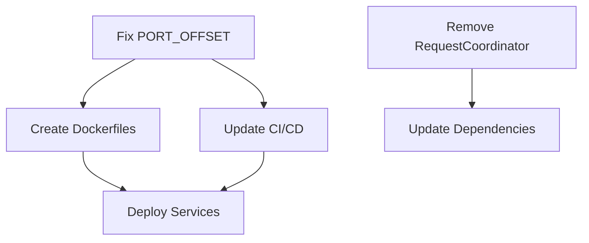

# Multi-Agent Collaboration Protocol
**Version 1.0 - Cursor Background Agent Framework**

---

## Executive Summary

This protocol establishes a formal methodology for orchestrating multiple independent Cursor Background Agents to analyze complex problems collaboratively, eliminating single-agent blind spots and producing rigorously vetted, comprehensive solutions. The protocol leverages parallel processing, systematic verification, and structured conflict resolution to achieve superior analytical outcomes.

---

## Prerequisites

### Environmental Setup
1. **Repository Configuration**
   - Ensure GitHub repository has read-write access enabled
   - Create dedicated collaboration branch: `multi-agent-analysis-[timestamp]`
   - Establish shared memory-bank directory: `/memory-bank/multi-agent/`

2. **Agent Provisioning**
   - Minimum 2 Background Agents (recommended: 3 for tie-breaking)
   - Each agent assigned unique identifier: `AGENT_ALPHA`, `AGENT_BETA`, `AGENT_GAMMA`
   - All agents must have identical tool access and capabilities

3. **Communication Infrastructure**
   ```json
   {
     "collaboration_config": {
       "session_id": "MA-[YYYYMMDD-HHMMSS]",
       "agents": ["ALPHA", "BETA", "GAMMA"],
       "memory_path": "/memory-bank/multi-agent/",
       "output_format": "structured_json",
       "verification_required": true
     }
   }
   ```

---

## PHASE 1: Parallel Independent Analysis

### 1.1 Problem Distribution Protocol

**Objective:** Ensure identical problem presentation without cross-contamination

**Step 1: Create Master Problem Statement**
```markdown
File: /memory-bank/multi-agent/MASTER_PROBLEM_[SESSION_ID].md

# Problem Statement [IMMUTABLE]
Version: 1.0
Hash: [SHA-256 of content]
Timestamp: [ISO-8601]

## Context
[Detailed problem context]

## Objectives
1. [Specific objective 1]
2. [Specific objective 2]
...

## Constraints
- [Constraint 1]
- [Constraint 2]
...

## Success Criteria
- [Measurable criterion 1]
- [Measurable criterion 2]
...

## DO NOT INCLUDE
- Previous analyses
- Suggested approaches
- Leading questions
```

**Step 2: Deploy to Agents**
```bash
# For each agent in parallel
for AGENT in ALPHA BETA GAMMA; do
  cp MASTER_PROBLEM_[SESSION_ID].md /memory-bank/multi-agent/${AGENT}/input/
  echo "PHASE: INDEPENDENT_ANALYSIS" > /memory-bank/multi-agent/${AGENT}/status.txt
  echo "START_TIME: $(date -Iseconds)" >> /memory-bank/multi-agent/${AGENT}/status.txt
done
```

### 1.2 Required Output Structure

Each agent MUST produce output in this exact format:

```json
{
  "agent_id": "AGENT_[NAME]",
  "analysis_version": "1.0",
  "timestamp": "ISO-8601",
  "problem_hash": "SHA-256 of master problem",
  
  "findings": {
    "critical_issues": [
      {
        "id": "CI-001",
        "severity": "BLOCKER|HIGH|MEDIUM|LOW",
        "description": "...",
        "evidence": ["file:line", "measurement", "observation"],
        "confidence": 0.95
      }
    ],
    "root_causes": [
      {
        "id": "RC-001",
        "hypothesis": "...",
        "supporting_evidence": [],
        "contradicting_evidence": [],
        "confidence": 0.85
      }
    ],
    "recommendations": [
      {
        "id": "REC-001",
        "action": "...",
        "priority": 1,
        "dependencies": ["REC-002"],
        "risk_assessment": "...",
        "estimated_effort": "hours|days|weeks"
      }
    ]
  },
  
  "methodology": {
    "tools_used": ["grep", "web_search", "codebase_analysis"],
    "search_patterns": ["pattern1", "pattern2"],
    "files_analyzed": ["path1", "path2"],
    "assumptions": ["assumption1", "assumption2"]
  },
  
  "limitations": {
    "uncovered_areas": ["area1", "area2"],
    "time_constraints": "...",
    "tool_limitations": "..."
  }
}
```

### 1.3 Isolation Enforcement

**Critical Rules:**
- Agents work in separate subdirectories
- No access to other agents' work during Phase 1
- No shared state except the master problem
- Time-boxed execution (recommended: 30-60 minutes)

---

## PHASE 2: Synthesis and Verification

### 2.1 Collection and Normalization

**Lead Agent Selection:**
- Rotate lead role per session OR
- Designate permanent synthesis agent OR
- Human operator performs synthesis

**Step 1: Aggregate Reports**
```python
# Synthesis script template
import json
import hashlib
from pathlib import Path

def collect_analyses(session_id):
    reports = {}
    for agent in ['ALPHA', 'BETA', 'GAMMA']:
        report_path = f"/memory-bank/multi-agent/{agent}/output/analysis.json"
        with open(report_path) as f:
            reports[agent] = json.load(f)
    
    # Verify all analyzed same problem
    problem_hashes = {r['problem_hash'] for r in reports.values()}
    assert len(problem_hashes) == 1, "Agents analyzed different problems!"
    
    return reports
```

### 2.2 Consensus-Conflict-Complement (CCC) Analysis

**Step 2: Generate CCC Matrix**

```json
{
  "consensus": {
    "unanimous": [
      {
        "finding": "PORT_OFFSET undefined",
        "agents": ["ALPHA", "BETA", "GAMMA"],
        "confidence_avg": 0.97,
        "evidence_overlap": 0.95
      }
    ],
    "majority": [
      {
        "finding": "docker.sock security risk",
        "agents": ["ALPHA", "BETA"],
        "dissenting": ["GAMMA"],
        "confidence_avg": 0.88
      }
    ]
  },
  
  "conflicts": [
    {
      "topic": "RTAP_ENABLED behavior",
      "agent_positions": {
        "ALPHA": "Bug exists - legacy agents activate",
        "BETA": "No bug - working as designed",
        "GAMMA": "Partial bug - edge case only"
      },
      "resolution_required": true
    }
  ],
  
  "complementary": [
    {
      "finding": "RequestCoordinator in 20 files",
      "discovered_by": ["BETA"],
      "missed_by": ["ALPHA", "GAMMA"],
      "criticality": "MEDIUM"
    }
  ]
}
```

### 2.3 Verification Procedures

**For Consensus Items:**
- Mark as **VERIFIED** if unanimous with confidence > 0.90
- Mark as **PROBABLE** if majority with confidence > 0.75
- All others require Phase 3 resolution

**For Complementary Items:**
- Assign follow-up verification to non-discovering agents
- If verified by ≥1 other agent → **CONFIRMED**
- If not reproducible → **REQUIRES_INVESTIGATION**

---

## PHASE 3: Conflict Resolution

### 3.1 Conflict Classification

```python
CONFLICT_TYPES = {
    "FACTUAL": "Disagreement on observable facts",
    "INTERPRETIVE": "Same facts, different conclusions",
    "METHODOLOGICAL": "Different analysis approaches",
    "SCOPE": "Different understanding of problem boundaries"
}
```

### 3.2 Resolution Strategies

**Strategy A: Evidence-Based Arbitration**
```markdown
1. Each conflicting agent provides:
   - Primary evidence (direct observations)
   - Reproduction steps
   - Confidence justification

2. Arbitration criteria:
   - Direct evidence > indirect inference
   - Multiple sources > single source
   - Reproducible > non-reproducible
   - Recent > historical
```

**Strategy B: Third-Agent Tie-Breaking**
```markdown
1. Present conflict to AGENT_GAMMA with:
   - Original problem
   - Both positions with evidence
   - Specific question to resolve

2. Tie-breaker must:
   - Independently verify both positions
   - Provide new evidence if possible
   - Declare winner with justification
```

**Strategy C: Specialized Expert Agent**
```markdown
1. Deploy domain-specific agent for complex conflicts
2. Example: Security-specialized agent for docker.sock assessment
3. Expert opinion weighted 2x in final resolution
```

### 3.3 Conflict Documentation

```json
{
  "conflict_id": "CONF-001",
  "resolution": {
    "method": "TIE_BREAKER|EVIDENCE|EXPERT|DEFERRED",
    "outcome": "ALPHA position confirmed",
    "justification": "...",
    "dissenting_notes": "BETA maintains objection based on...",
    "action": "Include both perspectives with ALPHA as primary"
  }
}
```

---

## PHASE 4: Final Plan Consolidation

### 4.1 Integration Framework

**Step 1: Priority Scoring Matrix**
```python
def calculate_priority(finding):
    score = 0
    score += SEVERITY_WEIGHTS[finding['severity']]  # BLOCKER=100, HIGH=75, etc.
    score *= finding['confidence']
    score *= (1 + 0.1 * finding['agent_agreement_count'])
    return score
```

**Step 2: Dependency Graph Construction**


### 4.2 Final Output Structure

```markdown
# Consolidated Action Plan
Session: MA-[SESSION_ID]
Generated: [TIMESTAMP]
Participating Agents: ALPHA, BETA, GAMMA

## Executive Summary
- Total Issues Identified: X
- Consensus Items: Y (Z%)
- Conflicts Resolved: A
- Estimated Total Effort: B days

## Critical Path Actions

### Priority 0: Immediate Blockers
| Action | Consensus | Confidence | Owner | Dependencies |
|--------|-----------|------------|-------|--------------|
| Define PORT_OFFSET | Unanimous | 98% | DevOps | None |

### Priority 1: Security Critical
| Action | Consensus | Confidence | Owner | Dependencies |
|--------|-----------|------------|-------|--------------|
| Harden docker.sock | Majority | 91% | Security | PORT_OFFSET |

### Priority 2: Technical Debt
[...]

## Detailed Implementation

### Action 1: Define PORT_OFFSET globally
**Problem:** [Synthesized from all agents]
**Solution:** [Consensus approach]
**Implementation Steps:**
1. [Specific step with file:line reference]
2. [Verification command]
3. [Rollback procedure]

**Dissenting Opinions:** [If any]
**Risk Mitigation:** [Consolidated from all agents]

## Appendices

### A. Conflict Resolutions
[Detailed conflict resolution documentation]

### B. Complementary Findings
[Items discovered by single agents, later verified]

### C. Deferred Items
[Items requiring more investigation]

### D. Agent Performance Metrics
- ALPHA: X findings, Y confirmed, Z false positives
- BETA: X findings, Y confirmed, Z false positives  
- GAMMA: X findings, Y confirmed, Z false positives
```

---

## Implementation Checklist

### For Human Operators

- [ ] Create master problem statement (immutable)
- [ ] Deploy to agents in parallel
- [ ] Set execution time limit
- [ ] Collect analysis reports
- [ ] Run CCC analysis
- [ ] Resolve conflicts using appropriate strategy
- [ ] Generate consolidated plan
- [ ] Review dissenting opinions
- [ ] Approve final action plan

### For Automated Orchestration

```bash
#!/bin/bash
# Multi-agent orchestration script

SESSION_ID="MA-$(date +%Y%m%d-%H%M%S)"
AGENTS=("ALPHA" "BETA" "GAMMA")

# Phase 1: Deploy
for agent in "${AGENTS[@]}"; do
    deploy_problem_to_agent "$agent" "$SESSION_ID" &
done
wait

# Phase 2: Collect
python3 synthesize_reports.py --session "$SESSION_ID"

# Phase 3: Resolve
python3 resolve_conflicts.py --session "$SESSION_ID" --strategy "TIE_BREAKER"

# Phase 4: Consolidate
python3 generate_final_plan.py --session "$SESSION_ID" --output "FINAL_PLAN_${SESSION_ID}.md"
```

---

## Success Metrics

### Effectiveness Indicators
- **Coverage**: >95% of problem space analyzed
- **Consensus Rate**: >70% findings in agreement
- **False Positive Rate**: <5% after verification
- **Blind Spot Detection**: ≥1 complementary finding per agent

### Quality Gates
- No single agent's findings dominate >60% of final plan
- All BLOCKER issues have unanimous or majority consensus
- Every conflict has documented resolution rationale
- Final plan is executable without ambiguity

---

## Revision History

| Version | Date | Changes | Author |
|---------|------|---------|--------|
| 1.0 | 2024-12-28 | Initial protocol release | Background Agent |

---

*End of Protocol Document*