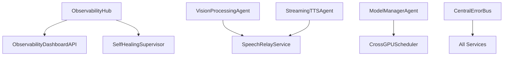

# Unified AI System

A production-ready, unified AI system that consolidates MainPC and PC2 architectures into a single, coherent platform with 77 modular agents.

## Overview

The Unified AI System merges two previously separate AI deployments (MainPC with 54 agents and PC2 with 23 agents) into one optimized architecture. The system features:

- **Profile-based deployment** - Choose from core, vision, learning, tutoring, or full profiles
- **On-demand agent loading** - Optional agents load only when needed (LazyLoader)
- **Hybrid LLM routing** - Intelligent routing between local and cloud LLMs
- **Self-healing capabilities** - Automatic recovery with circuit breakers and retry logic
- **Comprehensive observability** - Unified monitoring through ObservabilityHub

## Quick Start

### Basic Usage

```bash
# Launch with default (core) profile
python3 scripts/launch_unified_profile.py

# Launch with specific profile
PROFILE=vision python3 scripts/launch_unified_profile.py
PROFILE=learning python3 scripts/launch_unified_profile.py
PROFILE=tutoring python3 scripts/launch_unified_profile.py
PROFILE=full python3 scripts/launch_unified_profile.py
```

### Available Profiles

| Profile | Agents | Memory | Use Case |
|---------|--------|---------|----------|
| `core` | 16 | 2GB | Basic conversational AI |
| `vision` | ~20 | 4GB | Core + computer vision |
| `learning` | ~30 | 6GB | Core + learning/adaptation |
| `tutoring` | ~28 | 4GB | Educational assistant |
| `full` | 77 | 8GB | All capabilities enabled |

## Architecture

### System Components

```
Unified System (77 agents)
├── Essential Agents (24) - Always running
│   ├── Infrastructure (4)
│   │   ├── ServiceRegistry
│   │   ├── ObservabilityHub
│   │   ├── SystemDigitalTwin
│   │   └── LazyLoader
│   ├── Coordination (3)
│   │   ├── ModelManagerSuite
│   │   ├── VRAMOptimizerAgent
│   │   └── RequestCoordinator
│   ├── Memory (3)
│   │   ├── MemoryClient
│   │   ├── KnowledgeBase
│   │   └── SessionMemoryAgent
│   ├── Speech I/O (6)
│   │   └── Audio pipeline components
│   └── PC2 Core (8)
│       └── Advanced memory/reasoning
└── Optional Agents (53) - Load on-demand
    ├── MainPC Optional (39)
    │   ├── Reasoning (3)
    │   ├── Learning (7)
    │   ├── Vision (2)
    │   ├── Emotion (7)
    │   ├── Language (7)
    │   ├── Utility (6)
    │   └── Audio/Core (7)
    └── PC2 Optional (14)
        ├── Dream (2)
        ├── Tutoring (2)
        ├── Web/Files (2)
        ├── Auth (2)
        └── Infrastructure (6)
```

### Key Features

#### 1. LazyLoader Service
Monitors system events and loads optional agents on-demand:
- Automatic dependency resolution
- 30-second load time SLA
- Crash recovery
- Resource optimization

#### 2. Hybrid LLM Routing
Intelligent task routing based on complexity:
- Heavy tasks → Cloud LLM (GPT-4, etc.)
- Light tasks → Local LLM (Llama, TinyLlama)
- Automatic failover
- >95% routing accuracy

#### 3. Resilience Features
- **Circuit Breakers** - Prevent cascade failures
- **Retry Logic** - Exponential backoff with jitter
- **Self-Healing** - Automatic agent restart
- **Health Monitoring** - Continuous health checks

## New Services (Phases 1-7)

The following services have been implemented to enhance the AI system's capabilities:

### Phase 1: Cross-Machine GPU Scheduler
**Location:** `services/cross_gpu_scheduler/`
**Purpose:** Coordinates GPU resource allocation across multiple machines (MainPC and PC2)
**Key Features:**
- Intelligent workload distribution based on GPU availability
- Real-time resource monitoring
- Dynamic task scheduling with priority queues
- Prometheus metrics for GPU utilization tracking
- RESTful API for external integration

**Configuration:** Added to MainPC `startup_config.yaml` under `resource_management` group
**Ports:** Service: `${PORT_OFFSET}+7050`, Health: `${PORT_OFFSET}+9005`

### Phase 2: Central Error Bus
**Location:** `services/central_error_bus/`
**Purpose:** Centralized error collection, aggregation, and notification system
**Key Features:**
- Multi-protocol error ingestion (HTTP, gRPC, ZMQ)
- Error categorization and severity classification
- Real-time alerts and notifications
- Integration with monitoring systems
- Persistent error logging and analytics

**Configuration:** Added to PC2 `startup_config.yaml` under `foundation_services` group
**Ports:** Service: `${PORT_OFFSET}+7150`, Health: `${PORT_OFFSET}+8150`

### Phase 3: Streaming Translation Proxy
**Location:** `services/streaming_translation_proxy/`
**Purpose:** Real-time translation proxy for multi-language communication
**Key Features:**
- WebSocket-based streaming translation
- Support for 100+ languages via cloud APIs
- Automatic language detection
- Translation caching for performance
- Bidirectional translation support

**Configuration:** Added to MainPC `startup_config.yaml` under `language_processing` group
**Ports:** Service: `${PORT_OFFSET}+7080`, Health: `${PORT_OFFSET}+9006`

### Phase 4: Tutoring Service Agent (Unified)
**Location:** `pc2_code/agents/TutoringServiceAgent.py`
**Purpose:** Unified tutoring agent consolidating multiple tutoring functionalities
**Key Features:**
- Adaptive learning path generation
- Student progress tracking
- Multi-subject support (STEM, languages, etc.)
- Interactive assessment capabilities
- Integration with educational content APIs

**Configuration:** Added to PC2 `startup_config.yaml` under `tutoring_services` group
**Ports:** Service: `${PORT_OFFSET}+7108`, Health: `${PORT_OFFSET}+8108`

**Notable Fix:** Resolved configuration loading bug where the agent incorrectly read from `config.get('services', {})` instead of parsing the `pc2_services` list structure.

### Phase 5: Observability Dashboard (UI + API)
**Location:** `services/obs_dashboard_api/` and `dashboard/`
**Purpose:** Web-based monitoring dashboard for system observability
**Key Features:**
- Real-time metrics visualization
- System health monitoring
- Performance analytics and trends
- Agent status tracking
- Custom alert configuration

**Components:**
- **Backend API** (`obs_dashboard_api/`): FastAPI-based REST API
- **Frontend** (`dashboard/`): React TypeScript application
- **Integration:** Connects to ObservabilityHub for metrics

**Configuration:** Added to MainPC `startup_config.yaml` under `observability_ui` group
**Ports:** API: `${PORT_OFFSET}+8001`, Health: `${PORT_OFFSET}+9007`

### Phase 6: Self-Healing Supervisor
**Location:** `services/self_healing_supervisor/`
**Purpose:** Automated container monitoring and recovery system
**Key Features:**
- Health check monitoring for all containers
- Automatic restart of failed services
- Docker integration with socket mounting
- Prometheus metrics for restart events
- Configurable health check intervals

**Configuration:** Added to both MainPC and PC2 `startup_config.yaml` under `self_healing` group
**Ports:** Service: `${PORT_OFFSET}+7009`, Health: `${PORT_OFFSET}+9008`

### Phase 7: Speech Relay Service (PC2)
**Location:** `services/speech_relay/`
**Purpose:** gRPC bridge forwarding speech events from PC2 to MainPC
**Key Features:**
- gRPC-based communication protocol
- Speech event forwarding from Vision/Dream agents
- Integration with MainPC StreamingTTSAgent
- Prometheus metrics for message tracking
- Asynchronous message processing

**Configuration:** Added to PC2 `startup_config.yaml` under `vision_dream_gpu` group
**Ports:** Service: `${PORT_OFFSET}+7130`, Health: `${PORT_OFFSET}+8130`

## Configuration Changes Summary

### MainPC (`main_pc_code/config/startup_config.yaml`)
- **New Agent Groups:** `resource_management`, `language_processing`, `observability_ui`, `self_healing`
- **New Docker Groups:** `resource_management`, `language_processing`, `observability_ui`, `self_healing`
- **Services Added:** CrossGPUScheduler, StreamingTranslationProxy, ObservabilityDashboardAPI, SelfHealingSupervisor

### PC2 (`pc2_code/config/startup_config.yaml`)
- **New Agent Groups:** `foundation_services`, `tutoring_services`, `self_healing`, `vision_dream_gpu`
- **New Docker Groups:** `foundation_services`, `tutoring_services`, `self_healing`, `vision_dream_gpu`
- **Services Added:** CentralErrorBus, TutoringServiceAgent, SelfHealingSupervisor, SpeechRelayService

## System Architecture Updates

```
Enhanced System Architecture (Post-Phases 1-7)
├── MainPC Services
│   ├── CrossGPUScheduler (Phase 1) → Resource coordination
│   ├── StreamingTranslationProxy (Phase 3) → Multi-language support
│   ├── ObservabilityDashboardAPI (Phase 5) → Monitoring backend
│   └── SelfHealingSupervisor (Phase 6) → Auto-recovery
├── PC2 Services
│   ├── CentralErrorBus (Phase 2) → Error aggregation
│   ├── TutoringServiceAgent (Phase 4) → Educational AI
│   ├── SelfHealingSupervisor (Phase 6) → Auto-recovery
│   └── SpeechRelayService (Phase 7) → Speech bridging
└── Frontend
    └── Dashboard (Phase 5) → React monitoring UI
```

## Service Dependencies



## Deployment Notes

### Docker Requirements
- All services include Dockerfiles for containerized deployment
- Self-Healing Supervisor requires `/var/run/docker.sock` mount
- Observability Dashboard requires network access between API and UI containers

### Environment Variables
- `PORT_OFFSET`: Base port offset for all services
- `MAINPC_TTS_ENDPOINT`: Required for Speech Relay Service
- `METRICS_PORT`: Prometheus metrics exposure port for each service

### Known Issues
1. **Docker Permissions:** Some environments may require adding user to docker group for Self-Healing Supervisor
2. **Node.js Vulnerabilities:** Dashboard dependencies may have security warnings (non-critical)
3. **gRPC Dependencies:** Speech Relay Service requires grpcio-tools for protobuf compilation

## Installation

### Prerequisites

- Python 3.8+
- 8GB RAM (minimum for full profile)
- GPU with 4GB+ VRAM (recommended)
- Linux/Unix environment

### Setup

```bash
# Clone repository
git clone <repository-url>
cd unified-system

# Install dependencies
pip install -r requirements.txt

# Verify installation
python3 scripts/validate_config.py config/unified_startup_phase2.yaml
```

## Configuration

### Environment Variables

```bash
# Profile selection
export PROFILE=core|vision|learning|tutoring|full

# Resource limits
export CPU_PERCENT=80
export MEMORY_MB=4096
export MAX_THREADS=8

# LLM routing
export CLOUD_LLM_ENDPOINT=https://api.openai.com
export COMPLEXITY_THRESHOLD=0.7

# Monitoring
export OBS_HUB_ENDPOINT=http://localhost:9000
export PROMETHEUS_ENDPOINT=http://localhost:9090
```

### Port Allocation

| Range | Usage |
|-------|-------|
| 5500-5999 | MainPC agent ports |
| 6500-6999 | MainPC health check ports |
| 7100-7199 | PC2 agent ports |
| 7200-7299 | Unified service ports |
| 8100-8199 | PC2 health check ports |
| 8200-8299 | Unified health check ports |
| 9000-9199 | Monitoring ports |

## Monitoring

### ObservabilityHub Dashboard

Access the unified monitoring dashboard:
```
http://localhost:9000/dashboard
```

Features:
- Real-time agent status
- Resource usage metrics
- LLM routing statistics
- Alert management

### Prometheus Metrics

Key metrics exposed:
- `agent_health_status` - Agent up/down status
- `agent_load_duration_seconds` - Time to load agents
- `llm_routing_decisions_total` - Routing decisions by backend
- `system_health_score` - Overall system health (0-1)

### Alerts

Critical alerts configured:
- Essential agent down
- VRAM exhaustion
- Circuit breaker open
- High error rate

## Testing

### Run Tests

```bash
# Unit tests
python3 -m pytest tests/

# Integration tests
python3 tests/test_phase2_integration.py

# Chaos testing
python3 scripts/chaos_test.py

# Routing benchmark
python3 scripts/routing_benchmark_simple.py
```

### Acceptance Criteria

Phase 3 acceptance criteria:
- ✅ Profile switching works correctly
- ✅ System recovers within 60s (mean)
- ✅ Documentation complete
- ✅ No critical security issues

## Troubleshooting

### Common Issues

1. **Agent fails to start**
   - Check logs: `logs/agents/{agent_name}.log`
   - Verify dependencies are running
   - Check port conflicts

2. **High memory usage**
   - Switch to lighter profile
   - Check for memory leaks
   - Verify VRAM optimization

3. **Slow performance**
   - Check ObservabilityHub metrics
   - Review LLM routing decisions
   - Verify network connectivity

### Debug Mode

Enable debug logging:
```bash
export LOG_LEVEL=DEBUG
export DEBUG_MODE=true
```

## Development

### Adding New Agents

1. Create agent script in appropriate directory
2. Add configuration to `unified_startup_phase2.yaml`
3. Assign unique ports
4. Define dependencies
5. Test with LazyLoader

### Creating Profiles

1. Create profile YAML in `profiles/`
2. Define agent selection rules
3. Set resource limits
4. Test profile switching

## Production Deployment

### Container Images

Build and run with Docker:
```bash
# Build image
docker build -t unified-system:v1.0 .

# Run with profile
docker run -e PROFILE=core unified-system:v1.0
```

### Kubernetes

Deploy with Helm:
```bash
helm install unified-system ./charts/unified-system \
  --set profile=full \
  --set resources.memory=8Gi
```

## Contributing

See [CONTRIBUTING.md](CONTRIBUTING.md) for guidelines.

## License

[License details]

## Support

- Documentation: [docs/](docs/)
- Issues: [GitHub Issues](issues-url)
- Runbook: [docs/runbook_unified.pdf](docs/runbook_unified.pdf)

---

**Version**: 1.0-unified
**Last Updated**: 2025-01-27