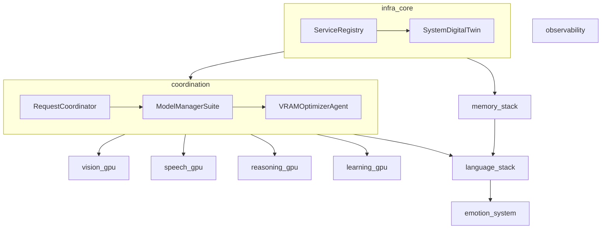
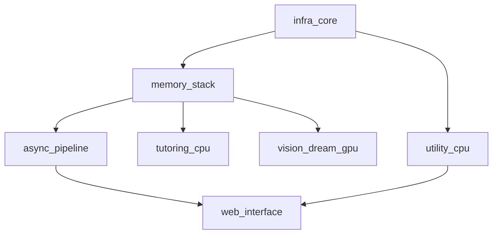

# Production Deployment Overview

> Generated: 2025-07-31

## 1. Logical Grouping Rationale
A functional-cohesion approach was applied to minimise blast-radius and align GPU / CPU utilisation with hardware capabilities.

### MainPC (RTX-4090)
| Group | Purpose | GPU? | Key Agents |
| ----- | ------- | ---- | ---------- |
| infra_core | discovery, state | ❌ | ServiceRegistry, SystemDigitalTwin |
| coordination | routing, model lifecycle | ✅ | RequestCoordinator, ModelManagerSuite, VRAMOptimizerAgent |
| observability | telemetry | ❌ | ObservabilityHub |
| memory_stack | memory services | ❌ | MemoryClient, SessionMemoryAgent, KnowledgeBase |
| language_stack | dialogue & NLU | ❌ | see docker_groups |
| reasoning_gpu | advanced reasoning | ✅ | ChainOfThoughtAgent, GoTToTAgent, CognitiveModelAgent |
| learning_gpu | self-training | ✅ | Learning* agents, LocalFineTunerAgent |
| vision_gpu | vision | ✅ | FaceRecognitionAgent |
| speech_gpu | STT/TTS & audio | ✅ | STTService, TTSService, audio pipeline |
| utility_cpu | misc utilities | ❌ | CodeGenerator, Executor, PredictiveHealthMonitor |
| emotion_system | emotion modelling | ❌ | EmotionEngine & related |

### PC2 (RTX-3060)
| Group | Purpose | GPU? | Key Agents |
| ----- | ------- | ---- | ---------- |
| infra_core | observability & RM | ❌ | ObservabilityHub, ResourceManager |
| memory_stack | memory orchestration | ❌ | MemoryOrchestratorService, CacheManager |
| async_pipeline | async processing | ❌ | AsyncProcessor, TaskScheduler |
| tutoring_cpu | tutoring | ❌ | TutorAgent, TutoringAgent |
| vision_dream_gpu | vision & dream | ✅ | VisionProcessingAgent, Dream* |
| utility_cpu | support utils | ❌ | UnifiedUtilsAgent, FileSystemAssistantAgent |
| web_interface | UI | ❌ | UnifiedWebAgent |

## 2. Dependency Mapping Diagrams

### MainPC

### PC2

## 3. Resource Allocation Recommendations

### MainPC
* GPU0 allocated to coordination (40%), vision (10%), speech (10%), reasoning (20%), learning (20%) via CUDA MPS or MIG segmentation.
* Memory limits per compose service as declared (total < 32 GB system RAM).
* CPU shares set to prevent starvation—GPU groups 4 vCPUs, CPU groups 2-4 vCPUs.

### PC2
* Single RTX-3060 (12 GB) shared between vision_dream_gpu (70%) and coordination overhead (30%).
* RAM caps ensure < 12 GB usage to avoid swap.

## 4. Startup Sequence Optimisation
1. infra_core
2. coordination (MainPC) / memory_stack (PC2)
3. observability
4. memory_stack → language_stack → emotion_system (MainPC)
5. vision/speech/reasoning/learning groups (GPU)
6. utility & web layers

Compose `depends_on` entries follow this order.

## 5. Health-Check Strategy
* All services expose `/health` JSON endpoint.
* Global defaults: interval 30 s, timeout 10 s, retries 3.
* ObservabilityHub aggregates and publishes Prometheus metrics; liveness probes feed orchestrator alerting.

## 6. Cross-System Communication
* ObservabilityHub cross-machine sync enabled (`mainpc_hub_endpoint` env var).
* gRPC traffic between SystemDigitalTwin (MainPC) and MemoryOrchestratorService (PC2) via VPN overlay network `agent_net`.
* Ports whitelisted in firewall: 8200-8300, 9100-9200.

## 7. Next Steps
* Implement health-probe script in `scripts/health_probe.py` for container CMD.
* Configure GitHub Actions to build & push images referenced in compose files.
* Load-test speech & vision concurrency to fine-tune GPU fractions.