# Error Bus Architecture

## Overview

The Error Bus is a central component of our distributed AI system's error management architecture. It uses an event-driven approach based on ZMQ's PUB/SUB pattern to decouple error reporting from error processing.

## Architecture Diagram

```mermaid
graph TD
    subgraph "Main PC"
        RC[RequestCoordinator]
        MO[ModelOrchestrator]
        SDT[SystemDigitalTwin]
        PHM[PredictiveHealthMonitor]
        MC[MemoryClient]
        SMA[SessionMemoryAgent]
        LM[LearningManager]
        SSR[StreamingSpeechRecognition]
        STTS[StreamingTTSAgent]
        SIH[StreamingInterruptHandler]
        MMA[ModelManagerAgent]
        VRAM[VRAMOptimizerAgent]
        GGUF[GGUFModelManager]
        OtherAgents[...70+ Other Agents]
    end

    subgraph "PC2"
        SHM[SystemHealthManager]
        MOS[MemoryOrchestratorService]
        RCA[RemoteConnectorAgent]
        PLA[PerformanceLoggerAgent]
        UWA[UnifiedWebAgent]
        TA[TutoringAgent]
        FSAA[FileSystemAssistantAgent]
    end

    ErrorBus[Error Bus<br>ZMQ PUB/SUB<br>Port 7150<br>Topic: ERROR:]

    RC -->|publish errors| ErrorBus
    MO -->|publish errors| ErrorBus
    SDT -->|publish errors| ErrorBus
    PHM -->|publish errors| ErrorBus
    MC -->|publish errors| ErrorBus
    SMA -->|publish errors| ErrorBus
    LM -->|publish errors| ErrorBus
    SSR -->|publish errors| ErrorBus
    STTS -->|publish errors| ErrorBus
    SIH -->|publish errors| ErrorBus
    MMA -->|publish errors| ErrorBus
    VRAM -->|publish errors| ErrorBus
    GGUF -->|publish errors| ErrorBus
    OtherAgents -->|publish errors| ErrorBus

    MOS -->|publish errors| ErrorBus
    RCA -->|publish errors| ErrorBus
    PLA -->|publish errors| ErrorBus
    UWA -->|publish errors| ErrorBus
    TA -->|publish errors| ErrorBus
    FSAA -->|publish errors| ErrorBus

    ErrorBus -->|subscribe| SHM

    classDef mainPC fill:#f9f,stroke:#333,stroke-width:2px
    classDef pc2 fill:#bbf,stroke:#333,stroke-width:2px
    classDef errorBus fill:#fbb,stroke:#f00,stroke-width:3px
    
    class RC,MO,SDT,PHM,MC,SMA,LM,SSR,STTS,SIH,MMA,VRAM,GGUF,OtherAgents mainPC
    class SHM,MOS,RCA,PLA,UWA,TA,FSAA pc2
    class ErrorBus errorBus
```



## Key Components

### 1. Error Bus
- **Technology**: ZMQ PUB/SUB pattern
- **Port**: 7150
- **Topic**: "ERROR:"
- **Purpose**: Central message bus for all error reports

### 2. Error Publishers (All Agents)
- All agents in the system (80+) have been updated to publish errors to the Error Bus
- Each agent implements a `report_error` method with the following signature:
  ```python
  def report_error(self, error_type, message, severity="ERROR", context=None):
      error_data = {
          "error_type": error_type,
          "message": message,
          "severity": severity,
          "context": context or {}
      }
      try:
          msg = json.dumps(error_data).encode('utf-8')
          self.error_bus_pub.send_multipart([b"ERROR:", msg])
      except Exception as e:
          print(f"Failed to publish error to Error Bus: {e}")
  ```

### 3. Error Subscriber (SystemHealthManager)
- The SystemHealthManager agent on PC2 subscribes to all error messages
- It analyzes error patterns and determines appropriate responses
- It implements recovery strategies based on error severity
- It consolidates functionality from the former UnifiedErrorAgent, RCA_Agent, and SelfHealingAgent

## Benefits

1. **Decoupled Architecture**: Error reporting is now decoupled from error processing
2. **Improved Scalability**: Agents can report errors without blocking or waiting for responses
3. **Centralized Error Management**: All errors are processed by a single SystemHealthManager
4. **Enhanced Monitoring**: SystemHealthManager can analyze error patterns across the entire system
5. **Simplified Agent Code**: Agents have a simple, consistent way to report errors

## Implementation Details

### Error Data Format
```json
{
  "error_type": "string",
  "message": "string",
  "severity": "string",
  "context": {}
}
```

### Error Severity Levels
- **CRITICAL**: System-threatening errors that require immediate attention
- **ERROR**: Standard errors that affect functionality but don't threaten the system
- **WARNING**: Potential issues that don't immediately affect functionality
- **INFO**: Informational messages about potential issues

### Recovery Strategies
The SystemHealthManager implements several recovery strategies based on error severity:
1. **Restart Agent**: Restart the failing agent
2. **Reset State**: Clear the agent's state and reinitialize
3. **Failover**: Switch to a backup implementation
4. **Graceful Degradation**: Continue operation with reduced functionality
5. **Alert**: Notify human operators for critical issues 