# Error Bus Architecture

## Overview

The Error Bus is a central component of our distributed AI system's error management architecture. It uses an event-driven approach based on ZMQ's PUB/SUB pattern to decouple error reporting from error processing.

## Architecture Diagram

```mermaid
graph TD
    subgraph "Main PC"
        RC[RequestCoordinator]
        MO[ModelOrchestrator]
        SDT[SystemDigitalTwin]
        PHM[PredictiveHealthMonitor]
        MC[MemoryClient]
        SMA[SessionMemoryAgent]
        LM[LearningManager]
        SSR[StreamingSpeechRecognition]
        STTS[StreamingTTSAgent]
        SIH[StreamingInterruptHandler]
        MMA[ModelManagerAgent]
        VRAM[VRAMOptimizerAgent]
        GGUF[GGUFModelManager]
        OtherAgents[...70+ Other Agents]
    end

    subgraph "PC2"
        SHM[SystemHealthManager]
        MOS[MemoryOrchestratorService]
        RCA[RemoteConnectorAgent]
        PLA[PerformanceLoggerAgent]
        UWA[UnifiedWebAgent]
        TA[TutoringAgent]
        FSAA[FileSystemAssistantAgent]
    end

    ErrorBus[Error Bus<br>ZMQ PUB/SUB<br>Port 7150<br>Topic: ERROR:]

    RC -->|publish errors| ErrorBus
    MO -->|publish errors| ErrorBus
    SDT -->|publish errors| ErrorBus
    PHM -->|publish errors| ErrorBus
    MC -->|publish errors| ErrorBus
    SMA -->|publish errors| ErrorBus
    LM -->|publish errors| ErrorBus
    SSR -->|publish errors| ErrorBus
    STTS -->|publish errors| ErrorBus
    SIH -->|publish errors| ErrorBus
    MMA -->|publish errors| ErrorBus
    VRAM -->|publish errors| ErrorBus
    GGUF -->|publish errors| ErrorBus
    OtherAgents -->|publish errors| ErrorBus
    
    RCA -->|publish errors| ErrorBus
    MOS -->|publish errors| ErrorBus
    PLA -->|publish errors| ErrorBus
    UWA -->|publish errors| ErrorBus
    TA -->|publish errors| ErrorBus
    FSAA -->|publish errors| ErrorBus
    
    ErrorBus -->|subscribe| SHM

    %% SystemDigitalTwin Integration
    SHM -->|query agents| SDT
    SDT -->|agent registry| SHM
    SHM -->|get agent info| SDT
    SDT -->|script paths & ports| SHM
```



## Key Components

### Error Bus
- **Technology**: ZeroMQ (ZMQ) PUB/SUB pattern
- **Port**: 7150
- **Topic**: "ERROR:"
- **Purpose**: Decouples error reporting from error processing, allowing for a scalable error management system

### SystemHealthManager
- **Location**: PC2
- **Port**: 7117
- **Responsibilities**:
  - Subscribes to the Error Bus to receive all error reports
  - Analyzes error patterns and determines appropriate responses
  - Monitors agent health via heartbeats
  - Scans log files for error patterns
  - Implements recovery strategies based on error severity
  - Dynamically discovers agents via SystemDigitalTwin

### SystemDigitalTwin Integration
- **Purpose**: Enables dynamic agent discovery and intelligent recovery
- **Functionality**:
  - SystemHealthManager queries SystemDigitalTwin for registered agents
  - SystemHealthManager periodically updates its agent registry from SystemDigitalTwin
  - When recovery is needed, SystemHealthManager gets detailed agent information (script paths, ports, etc.)
  - Recovery actions use agent-specific information for more intelligent restarts

## Error Reporting Protocol

All agents in the system use a standardized error reporting protocol:

1. Each agent initializes a ZMQ PUB socket connected to the Error Bus endpoint
2. When an error occurs, the agent publishes a message to the "ERROR:" topic
3. The message contains standardized error information:
   ```python
   {
       "action": "report_error",
       "source": "<agent_name>",
       "error_type": "<error_type>",
       "severity": "<low|medium|high|critical>",
       "reason": "<error_description>",
       "details": {
           # Additional error-specific information
       },
       "standardized_format": {
           "message_type": "error_report",
           "source": "<agent_name>",
           "timestamp": "<ISO timestamp>",
           "error_data": {
               "error_id": "<unique_id>",
               "error_type": "<error_type>",
               "severity": "<low|medium|high|critical>",
               "details": {
                   "description": "<error_description>",
                   # Additional error-specific information
               }
           }
       }
   }
   ```

## Benefits of the Architecture

1. **Decoupled Components**: Error reporting is decoupled from error processing
2. **Scalability**: New agents can be added without modifying the error management system
3. **Reduced Network Traffic**: No direct request-response cycle for each error report
4. **Centralized Error Analysis**: All errors are processed in one place, enabling pattern detection
5. **Dynamic Agent Discovery**: SystemHealthManager automatically discovers and monitors agents
6. **Intelligent Recovery**: Recovery actions use detailed agent information from SystemDigitalTwin 