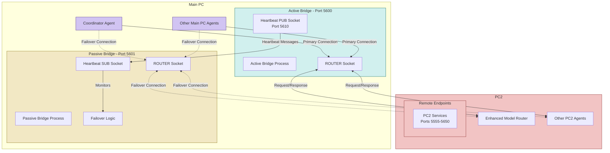

# Redundant ZMQ Bridge - Design Document

## Overview

This document describes the architecture and implementation for a redundant ZMQ bridge system that eliminates the single point of failure identified in the current architecture. The new system uses an active-passive configuration with automatic failover to ensure continuous operation even if one bridge instance fails.

## Architecture Diagram



## Components

### 1. Bridge Instances

- **Active Bridge (Primary)**: Runs on port 5600 (the current bridge port), handling all normal traffic
- **Passive Bridge (Secondary)**: Runs on port 5601, monitoring the active bridge and ready to take over

### 2. Heartbeat Mechanism

The heartbeat mechanism ensures that the passive bridge can detect if the active bridge has failed.

#### 2.1 Active Bridge Heartbeat Sender

- The active bridge includes a dedicated PUB socket on port 5610
- Sends timestamped heartbeat messages at regular intervals (every 1 second)
- Heartbeat messages include:
  - Current timestamp
  - Bridge identity (active)
  - Status information
  - Load metrics

#### 2.2 Passive Bridge Heartbeat Monitor

- The passive bridge includes a SUB socket connected to the active bridge's heartbeat PUB socket
- Monitors for incoming heartbeats
- If no heartbeats are received for a configurable duration (default: 3 seconds):
  - Assumes active bridge has failed
  - Initiates failover sequence

### 3. Failover Logic

The failover logic ensures a smooth transition when the active bridge fails.

#### 3.1 Passive-to-Active Transition

When the passive bridge detects that the active bridge has failed:

1. Logs the failover event
2. Attempts to bind to the primary port (5600)
   - If binding succeeds, it now becomes the active bridge
   - If binding fails (e.g., if the active bridge is still running but not sending heartbeats), it continues operating as a passive bridge on port 5601
3. Starts sending heartbeats on its own heartbeat port (5611)
4. Broadcasts a failover notification to connected clients

#### 3.2 Client Failover

Client components (like CoordinatorAgent and EnhancedModelRouter) need to detect and handle bridge failures:

1. Client attempts to connect to the primary bridge (port 5600)
2. If the connection fails or times out:
   - Client logs the failure
   - Attempts to connect to the secondary bridge (port 5601)
3. Client continues to periodically attempt reconnection to the primary bridge
4. If primary bridge becomes available again, client switches back

## Client Connection Configuration

### MainPC Clients (CoordinatorAgent)

The CoordinatorAgent and other MainPC clients that communicate with PC2 services will be modified to:

1. Maintain a list of bridge endpoints (primary and failover)
2. Implement connection monitoring
3. Add automatic reconnection logic
4. Add circuit breaker pattern to prevent request flooding during outages

### PC2 Clients (EnhancedModelRouter)

PC2 services like EnhancedModelRouter will be modified to:

1. Maintain a list of bridge endpoints to connect back to MainPC
2. Implement connection monitoring
3. Add automatic reconnection logic
4. Add circuit breaker pattern

## Implementation Details

### Bridge Startup and Configuration

The redundant bridge system will:

1. Accept command-line parameters for active/passive mode
2. Read configuration from a shared config file
3. Support dynamic reconfiguration

### Heartbeat Protocol

Heartbeat messages will use a simple, efficient format:

```json
{
  "type": "heartbeat",
  "timestamp": 1623456789.123,
  "instance": "active",
  "port": 5600,
  "uptime": 3600,
  "load": 0.25
}
```

### Failover Protocol

When failover occurs, a notification message is broadcast:

```json
{
  "type": "failover_notification",
  "timestamp": 1623456789.123,
  "new_active_port": 5601,
  "old_active_port": 5600
}
```

### Error Handling and Logging

The bridge will include:

1. Comprehensive error logging
2. Automatic error recovery
3. Performance metrics
4. Health monitoring

## Configuration Parameters

The redundant bridge system will be configurable with the following parameters:

| Parameter                | Default                 | Description                               |
| ------------------------ | ----------------------- | ----------------------------------------- |
| `mode`                   | required                | Either "active" or "passive"              |
| `primary_port`           | 5600                    | Port for the active bridge                |
| `secondary_port`         | 5601                    | Port for the passive bridge               |
| `heartbeat_interval`     | 1.0                     | Seconds between heartbeats                |
| `heartbeat_timeout`      | 3.0                     | Seconds without heartbeat before failover |
| `max_reconnect_attempts` | 5                       | Max reconnection attempts                 |
| `reconnect_delay`        | 5.0                     | Seconds between reconnection attempts     |
| `main_pc_addr`           | tcp://192.168.1.27:5601 | Main PC endpoint                          |
| `pc2_addr`               | tcp://192.168.1.2:5602  | PC2 endpoint                              |

## Security Considerations

1. The bridge will validate message formats
2. The bridge will implement rate limiting to prevent DoS attacks
3. The heartbeat mechanism will include a simple authentication token

## Testing Strategy

1. Normal operation testing
2. Active bridge failure testing
3. Network interruption testing
4. Load testing
5. Long-running stability testing

## Deployment

The active and passive bridges should be deployed on separate physical or virtual machines to provide true redundancy. If this is not possible, they should at least run as separate processes.

## Monitoring and Maintenance

Both bridge instances will expose monitoring endpoints that provide:

1. Current status
2. Uptime
3. Message throughput
4. Error rates
5. Connected clients

## PC2 Memory Services

- Unified Memory Reasoning Agent (port 5596)
- DreamWorld Agent (port 5598-PUB)
- Other PC2 memory services
