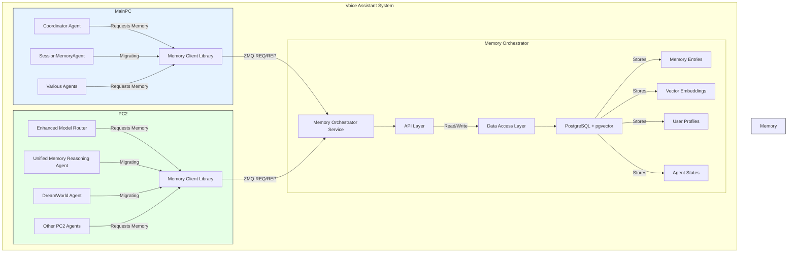

```mermaid
graph TD
    subgraph "Voice Assistant System"
        subgraph "MainPC"
            A[Coordinator Agent] --> |Requests Memory| B[Memory Client Library]
            C[SessionMemoryAgent] --> |Migrating| B
            D[Various Agents] --> |Requests Memory| B
        end
        
        subgraph "PC2"
            E[Enhanced Model Router] --> |Requests Memory| F[Memory Client Library]
            G[Unified Memory Reasoning Agent] --> |Migrating| F
            H[DreamWorld Agent] --> |Migrating| F
            I[Other PC2 Agents] --> |Requests Memory| F
        end
        
        subgraph "Memory Orchestrator"
            B --> |ZMQ REQ/REP| J[Memory Orchestrator Service]
            F --> |ZMQ REQ/REP| J
            J --> K[API Layer]
            K --> |Read/Write| L[Data Access Layer]
            L --> M[PostgreSQL + pgvector]
            M --> |Stores| N[Memory Entries]
            M --> |Stores| O[Vector Embeddings]
            M --> |Stores| P[User Profiles]
            M --> |Stores| Q[Agent States]
        end
    end

    style Memory Orchestrator fill:#f9f9f9,stroke:#333,stroke-width:1px
    style MainPC fill:#e6f3ff,stroke:#333,stroke-width:1px
    style PC2 fill:#e6ffe6,stroke:#333,stroke-width:1px
``` 