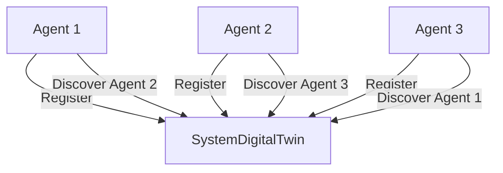

# Service Discovery Implementation

## Overview

The service discovery mechanism allows agents in the distributed AI system to dynamically register themselves with a central registry and discover other agents at runtime. This mechanism replaces static configuration files and eliminates the need for hard-coded IP addresses and ports.

## Architecture

The service discovery system consists of the following components:

1. **SystemDigitalTwin (Registry Server)**: Acts as the central registry where all agents can register their connection details.
2. **Service Discovery Client**: A utility that agents use to register themselves and discover other agents.
3. **Agent Integration**: The pattern for integrating service discovery into existing agents.



## Key Components

### SystemDigitalTwin Enhancements

The `SystemDigitalTwin` agent has been enhanced to act as the central service registry:

- Added a new `service_registry` dictionary to store service information
- Implemented handlers for two new commands:
  - `REGISTER`: Stores an agent's connection details in the registry
  - `DISCOVER`: Returns the connection details for a requested agent

The registry stores each service as a dictionary containing at minimum:
- `name`: The agent/service name
- `location`: Where the agent is running (MainPC/PC2)
- `ip`: The IP address of the agent
- `port`: The ZMQ port of the agent
- Additional metadata as provided during registration

### Service Discovery Client

A new utility module `service_discovery_client.py` provides a clean API for interacting with the service registry:

- `register_service()`: Registers a service with the registry
- `discover_service()`: Retrieves service information from the registry
- `get_service_address()`: Helper to get a formatted ZMQ address string

The client handles all the ZMQ communication details, including secure ZMQ if enabled.

## Integration Examples

### Registering an Agent

```python
from main_pc_code.utils.service_discovery_client import register_service

# Register the current agent
register_response = register_service(
    name="MyAgentName",
    location="PC2",  # Optional, auto-detected if not provided
    ip="192.168.1.101",  # Optional, auto-detected if not provided
    port=5555,
    additional_info={  # Optional metadata
        "api_version": "1.0",
        "supports_secure_zmq": True
    }
)

print(f"Registration response: {register_response}")
```

### Discovering an Agent

```python
from main_pc_code.utils.service_discovery_client import discover_service, get_service_address

# Full discovery with all service info
service_info = discover_service("TargetAgentName")
if service_info.get("status") == "SUCCESS":
    target_info = service_info.get("payload")
    print(f"Found service at {target_info.get('ip')}:{target_info.get('port')}")

# Simplified address discovery
address = get_service_address("TargetAgentName")
if address:
    print(f"Connect to service at: {address}")
```

## Protocol Details

### REGISTER Command

Request format:
```json
{
  "command": "REGISTER",
  "payload": {
    "name": "AgentName",
    "location": "MainPC|PC2",
    "ip": "192.168.1.100",
    "port": 5555,
    "additional_field1": "value1",
    "additional_field2": "value2"
  }
}
```

Response format:
```json
{
  "status": "SUCCESS",
  "message": "Service AgentName registered successfully"
}
```

Error response:
```json
{
  "status": "ERROR",
  "message": "Error message explaining the issue"
}
```

### DISCOVER Command

Request format:
```json
{
  "command": "DISCOVER",
  "payload": {
    "name": "AgentName"
  }
}
```

Success response:
```json
{
  "status": "SUCCESS",
  "payload": {
    "name": "AgentName",
    "location": "MainPC|PC2",
    "ip": "192.168.1.100",
    "port": 5555,
    "additional_field1": "value1",
    "additional_field2": "value2"
  }
}
```

Not found response:
```json
{
  "status": "NOT_FOUND",
  "message": "Service 'AgentName' not registered"
}
```

Error response:
```json
{
  "status": "ERROR",
  "message": "Error message explaining the issue"
}
```

## Security Considerations

- The service discovery mechanism integrates with the secure ZMQ implementation from Instruction #7.
- Only authenticated clients can register or discover services.
- The registry does not authenticate the validity of registration information; it's assumed that authenticated clients are trusted.

## Testing and Verification

A test script at `scripts/test_service_discovery.py` can be used to verify the service discovery mechanism works correctly:

```bash
python scripts/test_service_discovery.py
```

This script tests:
1. Service registration
2. Service discovery
3. Getting a formatted service address
4. Handling non-existent services

## Future Enhancements

- Automatic service heartbeat and expiration
- Service versioning and compatibility checking
- Service capability discovery
- Load balancing across multiple instances of the same service 