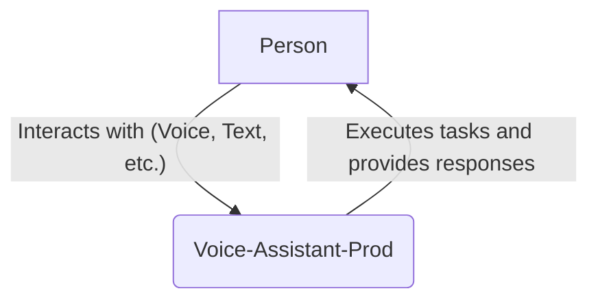
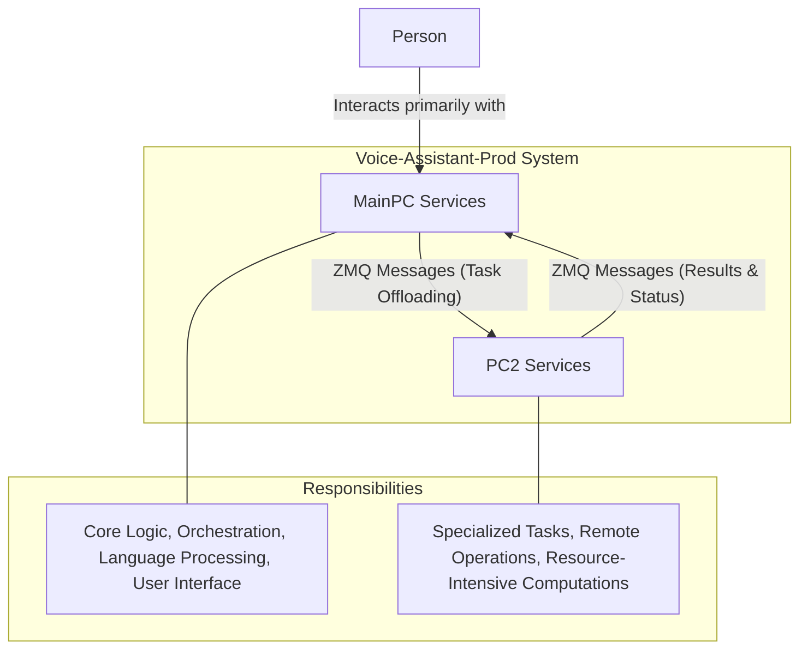
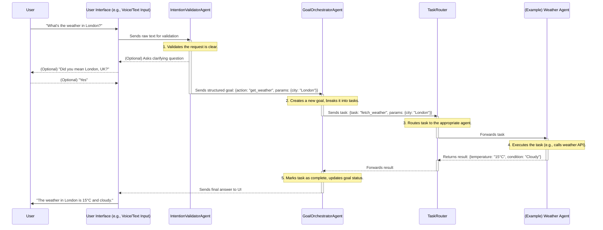
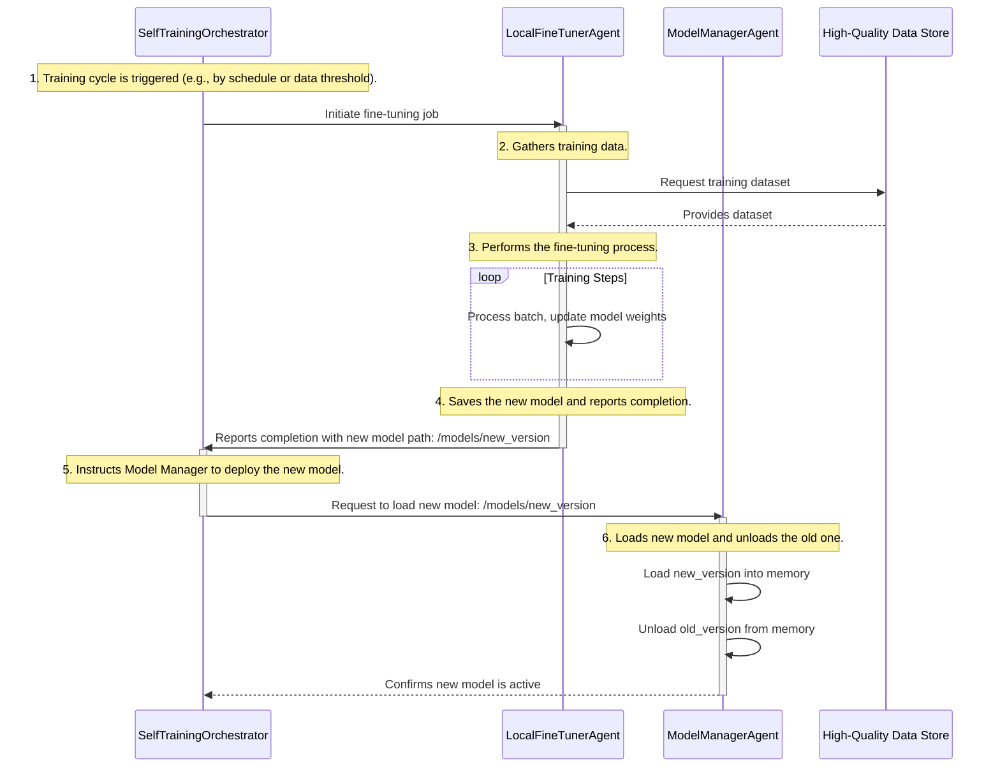

# Voice-Assistant-Prod: System Design Document

---

## 1. Introduction

This document provides a comprehensive architectural overview of the **Voice-Assistant-Prod** system. It is a living document intended for developers, architects, and system administrators to understand the system's design, components, and operational workflows.

### Design Philosophy

The system is built upon a **distributed, multi-agent architecture**. This design was chosen for several key reasons:

-   **Modularity & Scalability:** Each agent is a self-contained unit with a specific responsibility. This allows for independent development, testing, and scaling of individual components without affecting the entire system.
-   **Resilience:** If one agent fails, the rest of the system can continue to operate, and the failed agent can be restarted independently. This prevents a single point of failure.
-   **Flexibility:** The architecture allows for the distribution of agents across different physical or virtual machines (MainPC and PC2), enabling optimized resource utilization (e.g., running GPU-intensive tasks on a dedicated machine).

All system configuration is centralized in `config/source_of_truth_config.yaml`, which serves as the master blueprint for the entire ecosystem.

---

## 2. System Context

The System Context diagram illustrates the highest-level view of the system, showing how it interacts with users.

-   **User:** The primary actor who interacts with the system.
-   **Voice-Assistant-Prod:** The complete system, which encapsulates all agents and services. It receives user commands, processes them, and returns results.

---

## 3. Container View

The Container View diagram breaks down the system into its main deployable units. This shows how responsibilities are split between the two primary machines.

-   **MainPC Services:** This is the primary brain of the operation. It handles user interaction, orchestrates tasks, and runs the majority of the core logic.
-   **PC2 Services:** This container runs on a separate machine and is responsible for specialized, often resource-intensive, tasks that are offloaded from the MainPC.
-   **Communication:** The two containers communicate asynchronously via **ZeroMQ (ZMQ)** messages, ensuring a decoupled and robust connection.

---

## 4. Component View (MainPC)

This section provides a detailed profile for each agent running on the MainPC. Each profile outlines the agent's purpose, responsibilities, and key interactions.

### Core Services

#### 1. TaskRouter
-   **Purpose:** Acts as the central message bus and dispatcher for the entire system.
-   **Responsibilities:**
    -   Receives incoming requests from various agents.
    -   Routes requests to the appropriate destination agent based on predefined rules or dynamic logic.
    -   Ensures reliable message delivery and decouples agents from each other.
-   **Interactions & Dependencies:** Interacts with nearly all agents that need to communicate with others.
-   **Configuration Pointer:** `port: 8570`
-   **Code Reference:** `src/core/task_router.py`

#### 2. GoalOrchestratorAgent
-   **Purpose:** Manages the lifecycle of user-defined goals, from planning to execution and completion.
-   **Responsibilities:**
    -   Receives high-level goals from the user interface or other agents.
    -   Breaks down complex goals into smaller, actionable tasks.
    -   Delegates tasks to specialized agents (e.g., planning, execution agents).
    -   Monitors the status of active goals and reports progress.
-   **Interactions & Dependencies:** `TaskRouter`
-   **Configuration Pointer:** `port: 7001`
-   **Code Reference:** `agents/GoalOrchestratorAgent.py`

#### 3. ModelManagerAgent
-   **Purpose:** Manages the loading, unloading, and access to various AI models.
-   **Responsibilities:**
    -   Maintains a registry of available models (e.g., LLMs, translation models, TTS models).
    -   Loads models into memory upon request from other agents.
    -   Optimizes memory usage by unloading models that are no longer in use.
    -   Provides a unified interface for agents to request model inference.
-   **Interactions & Dependencies:** Any agent that requires AI model processing.
-   **Configuration Pointer:** `port: 5570`
-   **Code Reference:** `agents/model_manager_agent.py`

#### 4. IntentionValidatorAgent
-   **Purpose:** Analyzes user input to understand and validate their true intention before execution.
-   **Responsibilities:**
    -   Receives raw user input (text or transcribed voice).
    -   Clarifies ambiguity by asking follow-up questions if necessary.
    -   Transforms the validated intention into a structured command for the `GoalOrchestratorAgent`.
-   **Interactions & Dependencies:** `TaskRouter`
-   **Configuration Pointer:** `port: 5701`
-   **Code Reference:** `agents/IntentionValidatorAgent.py`

### Personality & Proactivity

#### 5. DynamicIdentityAgent
-   **Purpose:** Manages the AI's personality, tone, and identity to ensure consistency and adaptability.
-   **Responsibilities:**
    -   Maintains the core personality traits of the assistant.
    -   Adjusts the communication style based on the user's mood or the context of the conversation.
    -   Provides a consistent "voice" for the AI across all interactions.
-   **Interactions & Dependencies:** `TaskRouter`
-   **Configuration Pointer:** `port: 5702`
-   **Code Reference:** `agents/DynamicIdentityAgent.py`

#### 6. EmpathyAgent
-   **Purpose:** Enables the AI to understand and respond to user emotions.
-   **Responsibilities:**
    -   Analyzes user input for emotional cues (e.g., from text or tone).
    -   Works with the `EmotionEngine` to classify the user's emotional state.
    -   Influences the AI's response generation to be more empathetic and appropriate.
-   **Interactions & Dependencies:** `EmotionEngine`
-   **Configuration Pointer:** `port: 5703`
-   **Code Reference:** `agents/EmpathyAgent.py`

#### 7. ProactiveAgent
-   **Purpose:** Allows the AI to initiate conversations or suggest actions without explicit user commands.
-   **Responsibilities:**
    -   Monitors user behavior and system context for opportunities to be helpful.
    -   Suggests relevant information, tasks, or reminders.
    -   Initiates actions based on patterns or predictive models (e.g., "I see you have a meeting in 15 minutes, should I prepare the notes?").
-   **Interactions & Dependencies:** `TaskRouter`
-   **Configuration Pointer:** `port: 5624`
-   **Code Reference:** `agents/ProactiveAgent.py`

#### 8. PredictiveLoader
-   **Purpose:** Improves system performance by pre-loading models or data that are likely to be needed soon.
-   **Responsibilities:**
    -   Analyzes user context and recent activity to predict future needs.
    -   Sends requests to the `ModelManagerAgent` to load specific models into memory before they are explicitly requested.
    -   Pre-fetches data that might be relevant to an anticipated user query.
-   **Interactions & Dependencies:** `TaskRouter`
-   **Configuration Pointer:** `port: 5617`
-   **Code Reference:** `agents/predictive_loader.py`

### Advanced Reasoning & GPU Services

#### 9. EnhancedModelRouter
-   **Purpose:** An intelligent router that selects the best AI model for a given task based on complexity, context, and resource availability.
-   **Responsibilities:**
    -   Analyzes incoming requests to determine the most suitable model (e.g., a small, fast model for simple queries vs. a large, powerful model for complex reasoning).
    -   Considers a model's current load and the user's priority to make routing decisions.
-   **Purpose:** Implements the Chain of Thought (CoT) reasoning technique to solve multi-step problems.
-   **Responsibilities:** Breaks down a complex problem into a sequence of logical, intermediate steps to find a solution.
-   **Configuration:**
    -   **Script:** `FORMAINPC/ChainOfThoughtAgent.py`
    -   **Port:** `5612`

#### 3. GOT_TOTAgent
-   **Purpose:** Implements advanced reasoning strategies like Graph of Thoughts (GoT) or Tree of Thoughts (ToT).
-   **Responsibilities:** Explores and evaluates multiple reasoning paths simultaneously to solve highly complex problems.
-   **Configuration:**
    -   **Script:** `FORMAINPC/GOT_TOTAgent.py`
    -   **Port:** `5646`

#### 4. ModelManagerAgent
-   **Purpose:** Manages the lifecycle of AI models.
-   **Responsibilities:** Loads, unloads, and manages different versions of AI models.
-   **Configuration:**
    -   **Script:** `agents/model_manager_agent.py`
    -   **Port:** `5570`

#### 5. GoalOrchestratorAgent
-   **Purpose:** The master agent that oversees the fulfillment of a user's goal.
-   **Responsibilities:** Decomposes a high-level goal into concrete tasks and sends them to the `TaskRouter` for execution.
-   **Dependencies:** `TaskRouter`
-   **Configuration:**
    -   **Script:** `agents/GoalOrchestratorAgent.py`
    -   **Port:** `7001`

### 2.2 PC2 Core (`pc2_core`)

This is the cognitive and memory hub of the system, running on PC2. It manages memory, learning, and system stability.

#### 1. EpisodicMemoryAgent
-   **Purpose:** Stores and retrieves memories of specific events and conversations (episodes).
-   **Responsibilities:** Logs user interactions and system actions as time-stamped memories.
-   **Dependencies:** `UnifiedMemoryReasoningAgent`
-   **Configuration:**
    -   **Script:** `agents/_referencefolderpc2/EpisodicMemoryAgent.py`
    -   **Port:** `5596`

#### 2. EnhancedContextualMemory
-   **Purpose:** Provides a deeper, more contextual understanding of the user's state.
-   **Responsibilities:** Enriches episodic memories with additional context, such as inferred intent or emotional state.
-   **Dependencies:** `EpisodicMemoryAgent`
-   **Configuration:**
    -   **Script:** `agents/_referencefolderpc2/enhanced_contextual_memory.py`
    -   **Port:** `5596`

#### 3. LearningAdjusterAgent
-   **Purpose:** Dynamically adjusts the AI's learning strategies.
-   **Responsibilities:** Monitors performance and feedback to optimize learning parameters for better outcomes.
-   **Dependencies:** `EnhancedContextualMemory`
-   **Configuration:**
    -   **Script:** `agents/_referencefolderpc2/LearningAdjusterAgent.py`
    -   **Port:** `5597`

#### 4. DreamWorldAgent
-   **Purpose:** Simulates scenarios and consolidates memories during idle time.
-   **Responsibilities:** Replays and analyzes past interactions to reinforce learning and discover new insights, similar to a 'dream' state.
-   **Dependencies:** `EpisodicMemoryAgent`
-   **Configuration:**
    -   **Script:** `agents/_referencefolderpc2/DreamWorldAgent.py`
    -   **Port:** `5599`

#### 5. SelfHealingAgent
-   **Purpose:** Autonomously detects and attempts to recover from system errors.
-   **Responsibilities:** Monitors agent health and can trigger restarts or fallback procedures.
-   **Configuration:**
    -   **Script:** `agents/_referencefolderpc2/self_healing_agent.py`
    -   **Port:** `5614`

#### 6. PerformanceMonitor
-   **Purpose:** Tracks system performance metrics.
-   **Responsibilities:** Logs CPU, memory, and latency for all agents to identify bottlenecks.
-   **Configuration:**
    -   **Script:** `agents/_referencefolderpc2/performance_monitor.py`
    -   **Port:** `5614`

#### 7. FilesystemAssistant
-   **Purpose:** Provides a safe interface for the AI to interact with the local filesystem.
-   **Responsibilities:** Handles file read, write, and search operations based on requests from other agents.
-   **Configuration:**
    -   **Script:** `agents/_referencefolderpc2/filesystem_assistant_agent.py`
    -   **Port:** `5606`

#### 8. TieredResponder
-   **Purpose:** Implements a multi-level response generation strategy.
-   **Responsibilities:** Chooses the appropriate response method, from a simple cached answer to a complex, reasoned reply.
-   **Configuration:**
    -   **Script:** `agents/_referencefolderpc2/tiered_responder.py`
    -   **Port:** `5617`

#### 9. CacheManager
-   **Purpose:** Provides a fast, in-memory cache for frequently accessed data.
-   **Responsibilities:** Stores and retrieves data to reduce latency and database load. Likely interfaces with a Redis instance.
-   **Configuration:**
    -   **Script:** `agents/_referencefolderpc2/cache_manager.py`
    -   **Port:** `6379`

#### 10. AsyncProcessor
-   **Purpose:** Offloads long-running tasks to be processed in the background.
-   **Responsibilities:** Manages a queue of asynchronous jobs, preventing the main system from blocking.
-   **Configuration:**
    -   **Script:** `agents/_referencefolderpc2/async_processor.py`
    -   **Port:** `5615`

#### 11. TutoringAgent
-   **Purpose:** The core agent for the AI's tutoring subsystem.
-   **Responsibilities:** Manages the logic of a tutoring session, such as tracking progress and generating questions.
-   **Configuration:**
    -   **Script:** `agents/_referencefolderpc2/tutoring_agent.py`
    -   **Port:** `5568`

#### 12. TutoringService
-   **Purpose:** Provides the specific content and curriculum for the tutoring system.
-   **Responsibilities:** Works with the `TutoringAgent` to deliver educational material.
-   **Dependencies:** `TutoringAgent`
-   **Configuration:**
    -   **Script:** `agents/_referencefolderpc2/tutoring_service_agent.py`
    -   **Port:** `5568`

### 2.3 Communication Layer (`communication`)

This layer manages the connection and routing of information between MainPC and PC2.

#### 1. RemoteConnectorAgent
-   **Purpose:** Establishes and maintains the fundamental connection between MainPC and PC2.
-   **Responsibilities:** Handles low-level connection logic, heartbeats, and ensures a stable communication channel.
-   **Configuration:**
    -   **Script:** `agents/_referencefolderpc2/remote_connector_agent.py`
    -   **Port:** `5557`

#### 2. AdvancedRouter
-   **Purpose:** A sophisticated router that directs traffic between the two machines.
-   **Responsibilities:** Understands the topology of the entire system (both PCs) and routes messages to the correct agent, regardless of its location.
-   **Dependencies:** `RemoteConnectorAgent`
-   **Configuration:**
    -   **Script:** `agents/_referencefolderpc2/advanced_router.py`
    -   **Port:** `5598`

#### 3. UnifiedMemoryReasoningAgent
-   **Purpose:** Acts as a gateway and reasoning layer for all memory-related queries.
-   **Responsibilities:** Receives memory requests, queries the appropriate memory agents (like `EpisodicMemoryAgent`), and synthesizes the results into a coherent response.
-   **Dependencies:** `RemoteConnectorAgent`
-   **Configuration:**
    -   **Script:** `agents/_referencefolderpc2/UnifiedMemoryReasoningAgent.py`
    -   **Port:** `5596`
-   **Purpose:** Simulates a cognitive model of the user to anticipate needs and personalize interactions.
-   **Responsibilities:** Builds and maintains a profile of the user's preferences, habits, and knowledge.
-   **Configuration:**
    -   **Script:** `FORMAINPC/CognitiveModelAgent.py`
    -   **Port:** `5641`

#### 2. EmotionEngine
-   **Purpose:** The central processing unit for all emotion-related data.
-   **Responsibilities:** Maintains a model of the user's current emotional state and provides emotional context to other agents.
-   **Configuration:**
    -   **Script:** `agents/emotion_engine.py`
    -   **Port:** `5575`

#### 3. LearningAdjusterAgent
-   **Purpose:** Dynamically adjusts the AI's learning rate and strategies based on performance and feedback.
-   **Responsibilities:** Modifies learning parameters to optimize for better outcomes over time.
-   **Configuration:**
    -   **Script:** `FORMAINPC/LearningAdjusterAgent.py`
    -   **Port:** `5643`

#### 4. LocalFineTunerAgent
-   **Purpose:** Manages the process of fine-tuning local models based on new data.
-   **Responsibilities:** Collects high-quality interaction data and initiates fine-tuning jobs on local models.
-   **Configuration:**
    -   **Script:** `FORMAINPC/LocalFineTunerAgent.py`
    -   **Port:** `5645`
    -   Collects high-quality interaction data suitable for training.
    -   Initiates fine-tuning jobs on local models (like TinyLlama) when enough data is gathered.
    -   Versions and manages the updated models.
-   **Interactions & Dependencies:** `SelfTrainingOrchestrator`, `ModelManagerAgent`.
-   **Configuration Pointer:** `port: 5645`
-   **Code Reference:** `FORMAINPC/LocalFineTunerAgent.py`

#### 16. SelfTrainingOrchestrator
-   **Purpose:** Orchestrates the entire self-training and self-improvement loop.
-   **Responsibilities:**
    -   Acts as the central controller for the learning subsystem.
    -   Decides when to trigger data collection, fine-tuning, or model adjustments.
    -   Coordinates the actions of the `LearningAdjusterAgent` and `LocalFineTunerAgent`.
-   **Interactions & Dependencies:** `LearningAdjusterAgent`, `LocalFineTunerAgent`.
-   **Configuration Pointer:** `port: 5644`
-   **Code Reference:** `FORMAINPC/SelfTrainingOrchestrator.py`

#### 17. CognitiveModelAgent
-   **Purpose:** Simulates a cognitive model of the user to anticipate needs and personalize interactions.
-   **Responsibilities:**
    -   Builds and maintains a profile of the user's preferences, habits, and knowledge.
    -   Uses this model to predict user intentions and provide more relevant, personalized assistance.
    -   Informs the `ProactiveAgent` and `PredictiveLoader` of potential user needs.
-   **Interactions & Dependencies:** `TaskRouter`, `ProactiveAgent`, `PredictiveLoader`.
-   **Configuration Pointer:** `port: 5641`
-   **Code Reference:** `FORMAINPC/CognitiveModelAgent.py`

### Emotion Subsystem

#### 18. EmotionEngine
-   **Purpose:** The central processing unit for all emotion-related data.
-   **Responsibilities:**
    -   Receives emotional cues from various sources (e.g., `ToneDetector`, text analysis).
    -   Maintains a model of the user's current emotional state.
    -   Provides emotional context to other agents, like the `EmpathyAgent`, to influence responses.
-   **Interactions & Dependencies:** `ToneDetector`, `EmpathyAgent`, `MoodTrackerAgent`.
-   **Configuration Pointer:** `port: 5575`
-   **Code Reference:** `agents/emotion_engine.py`

#### 19. MoodTrackerAgent
-   **Purpose:** Tracks the user's mood over longer periods to understand trends and baseline emotional states.
-   **Responsibilities:**
    -   Logs emotional data points over time.
    -   Identifies long-term mood patterns (e.g., is the user generally more cheerful in the mornings?).
    -   Provides historical emotional context to the `EmotionEngine`.
-   **Interactions & Dependencies:** `EmotionEngine`
-   **Configuration Pointer:** `port: 5704`
-   **Code Reference:** `agents/mood_tracker_agent.py`

#### 20. HumanAwarenessAgent
-   **Purpose:** Maintains an awareness of the human user's state beyond just emotions, such as cognitive load or focus.
-   **Responsibilities:**
    -   Infers if the user is busy, distracted, or focused.
    -   Advises other agents (like `ProactiveAgent`) on the appropriateness of interrupting the user.
    -   Helps the AI decide the best time and manner for interaction.
-   **Interactions & Dependencies:** `EmotionEngine`
-   **Configuration Pointer:** `port: 5705`
-   **Code Reference:** `agents/human_awareness_agent.py`

#### 21. EmotionSynthesisAgent
-   **Purpose:** Generates appropriate emotional expressions for the AI's own responses.
-   **Responsibilities:**
    -   Determines the appropriate emotional tone for the AI's generated text or speech.
    -   Selects expressive cues (e.g., specific wording, tone of voice for TTS) to match the desired emotion.
    -   Ensures the AI's responses are not just factually correct but also emotionally resonant.
-   **Interactions & Dependencies:** `EmotionEngine`
-   **Configuration Pointer:** `port: 5706`
-   **Code Reference:** `agents/emotion_synthesis_agent.py`

### Utilities & System Monitoring

#### 22. ConsolidatedTranslator
-   **Purpose:** Provides a unified interface for various translation services.
-   **Responsibilities:**
    -   Acts as a wrapper for one or more translation models (like `NLLBAdapter`).
    -   Can be configured to select the best translator based on language pair or quality requirements.
-   **Interactions & Dependencies:** `NLLBAdapter` or other translation services.
-   **Configuration Pointer:** `port: 5563`
-   **Code Reference:** `FORMAINPC/consolidated_translator.py`

#### 23. ToneDetector
-   **Purpose:** Analyzes the user's voice to detect emotional tone.
-   **Responsibilities:**
    -   Processes audio streams to extract features like pitch, speed, and volume.
    -   Classifies the user's tone (e.g., happy, sad, angry, neutral).
    -   Sends this information to the `EmotionEngine` for deeper analysis.
-   **Interactions & Dependencies:** `EmotionEngine`.
-   **Configuration Pointer:** `port: 5625`
-   **Code Reference:** `agents/tone_detector.py`

#### 24. VoiceProfiler
-   **Purpose:** Creates and manages voice profiles for different users.
-   **Responsibilities:**
    -   Identifies who is speaking through voice recognition.
    -   Loads the corresponding user profile, preferences, and cognitive model.
    -   Enables a personalized experience for multiple users.
-   **Interactions & Dependencies:** `CognitiveModelAgent`.
-   **Configuration Pointer:** `port: 5626`
-   **Code Reference:** `agents/voice_profiling_agent.py`

#### 25. ChitChatAgent
-   **Purpose:** Handles non-task-oriented, conversational interactions (small talk).
-   **Responsibilities:**
    -   Provides engaging and natural responses to conversational queries.
    -   Maintains the flow of a friendly conversation without needing to accomplish a specific goal.
-   **Interactions & Dependencies:** LLM Services.
-   **Configuration Pointer:** `port: 5627`
-   **Code Reference:** `agents/chitchat_agent.py`

#### 26. UnifiedSystemAgent
-   **Purpose:** Acts as a single point of contact for system-wide commands and queries.
-   **Responsibilities:**
    -   Handles meta-commands like "system status," "restart agent X," or "what are you doing?"
    -   Provides a unified view of the entire system's state.
-   **Interactions & Dependencies:** `PerformanceMonitoringAgent`, `PredictiveHealthMonitor`.
-   **Configuration Pointer:** `port: 5628`
-   **Code Reference:** `agents/unified_system_agent.py`

#### 27. PerformanceMonitoringAgent
-   **Purpose:** Monitors the performance metrics of all agents.
-   **Responsibilities:**
    -   Tracks metrics like CPU/GPU usage, memory consumption, and request latency for each agent.
    -   Logs performance data for analysis and identifies potential bottlenecks.
-   **Interactions & Dependencies:** All agents.
-   **Configuration Pointer:** `port: 5632`
-   **Code Reference:** `agents/performance_monitoring_agent.py`

#### 28. PredictiveHealthMonitor
-   **Purpose:** Proactively monitors system health and predicts potential failures.
-   **Responsibilities:**
    -   Performs regular health checks on all agents.
    -   Analyzes trends in performance and error logs to predict future issues.
    -   Can trigger alerts or automated recovery procedures.
-   **Interactions & Dependencies:** All agents.
-   **Configuration Pointer:** `port: 5633`
-   **Code Reference:** `agents/predictive_health_monitor.py`

---

## 5. Architectural Patterns & Core Mechanics

This section details the core, cross-cutting mechanics and design patterns that are fundamental to the operation and development of the entire system.

### 5.1 The `BaseAgent` Contract

All agents in the system are expected to inherit from `src/core/base_agent.py`. This base class provides a standardized contract and a set of common functionalities, ensuring consistency and reducing boilerplate code.

-   **Purpose:** To provide a common foundation for all agents.
-   **Key Responsibilities:**
    -   **Socket Initialization:** Automatically initializes the main ZMQ `REP` socket for receiving requests and a secondary `REP` socket for health checks. Includes retry logic for port binding.
    -   **Health Check Loop:** Runs a dedicated thread to respond to health check pings, allowing for system-wide monitoring.
    -   **Graceful Shutdown:** Implements signal handlers (`SIGINT`, `SIGTERM`) to ensure that ZMQ sockets and other resources are properly closed upon termination.
    -   **Background Initialization:** Provides a `_background_init` method that can be overridden by child classes to perform long-running initializations without blocking the main thread.

### 5.2 Configuration-Driven Startup

The entire system is designed to be configured and launched from a single source of truth, eliminating hardcoded values and promoting flexibility.

-   **Source of Truth:** `config/source_of_truth_config.yaml` defines every agent, its script, port, dependencies, and host assignment.
-   **Local Startup:** The `start_ai_system.py` script reads the SOT file, launching each `MainPC` agent as a separate subprocess. It dynamically constructs command-line arguments (e.g., `--dependency_port XXXX`) to inject dependency information into each agent upon startup.
-   **Docker Deployment:** The `generate_compose_from_sot.py` script reads the *same* SOT file to generate a `docker-compose.yml`. It intelligently selects `MainPC` services and injects the same dependency arguments into the `command` section for each service, ensuring consistency between local and containerized environments.

### 5.3 Communication Protocol

Inter-agent communication is standardized using the ZeroMQ (ZMQ) library, which provides fast and reliable messaging.

-   **Pattern:** The primary pattern used is **Request-Reply (REQ/REP)**.
    -   An agent needing a service (the "client") creates a `REQ` socket and connects to the service provider.
    -   The agent providing the service (the "server") creates a `REP` socket and binds to its designated port.
-   **Message Format:** While not strictly enforced, the convention is to use JSON-formatted strings for messages to ensure interoperability and readability.
-   **Decoupling:** This pattern decouples agents. A client does not need to know the internal workings of the server, only its address (host and port) and the request format.

### 5.4 System-Wide Health Checks

A consistent health check mechanism is built into the `BaseAgent` to allow for robust system monitoring.

-   **Mechanism:** Every agent, upon initialization, opens a secondary port (typically `port + 1`) dedicated to health checks.
-   **Request/Response:** A monitoring service can send a `REQ` message (e.g., `{"status": "ping"}`) to this port. The agent's health check thread will immediately respond with a `REP` message (e.g., `{"status": "pong"}`).
-   **Purpose:** This allows a monitoring agent (like `PredictiveHealthMonitor`) or an external tool to quickly verify if an agent is alive and responsive, without interfering with its main task-processing loop.

---

## 6. Key Workflows & Scenarios

This section illustrates how various agents collaborate to accomplish common tasks. The diagrams and descriptions provide a dynamic view of the system in action.

### 6.1 Scenario: Processing a Simple User Command

This workflow describes how a user's command (e.g., "What's the weather like in London?") is processed by the system.

**Sequence Diagram:**

**Step-by-Step Explanation:**

1.  **Input & Validation:** The user gives a command. The `IntentionValidatorAgent` receives the raw input, ensures it's understandable, and converts it into a structured goal.
2.  **Orchestration:** The `GoalOrchestratorAgent` receives the structured goal. It creates a plan and breaks the goal down into one or more specific tasks.
3.  **Routing:** The `GoalOrchestratorAgent` sends the task to the `TaskRouter`. The `TaskRouter` acts as a switchboard, identifying the correct agent to handle the task (in this case, a hypothetical `WeatherAgent`) and forwards the message.
4.  **Execution:** The specialized agent (the `WeatherAgent`) receives the task, performs the required action (e.g., calls an external API), and returns the result to the `TaskRouter`.
5.  **Response Aggregation:** The `TaskRouter` sends the result back to the `GoalOrchestratorAgent`, which marks the task as complete. Once the entire goal is fulfilled, it formulates a final answer and sends it back to the User Interface to be presented to the user.

### 6.2 Scenario: The Self-Training Loop

This workflow demonstrates how the system improves itself by fine-tuning a local model based on collected data.

**Sequence Diagram:**

**Step-by-Step Explanation:**

1.  **Trigger:** The `SelfTrainingOrchestrator` initiates a training cycle. This can be triggered by a schedule, a manual command, or when a sufficient amount of high-quality interaction data has been collected.
2.  **Initiation:** The orchestrator commands the `LocalFineTunerAgent` to begin a new fine-tuning job.
3.  **Data Collection & Training:** The `LocalFineTunerAgent` gathers the curated training data and begins the computationally intensive process of fine-tuning a local AI model.
4.  **Completion:** Once the training is complete, the `LocalFineTunerAgent` saves the newly trained model artifact and reports back to the `SelfTrainingOrchestrator` with the path to the new model.
5.  **Deployment:** The `SelfTrainingOrchestrator` instructs the `ModelManagerAgent` to deploy the new model.
6.  **Activation:** The `ModelManagerAgent` loads the new, improved model into memory and updates its internal registry. It may also unload the old model to conserve resources. The system now uses the fine-tuned model for future tasks, completing the improvement loop.

