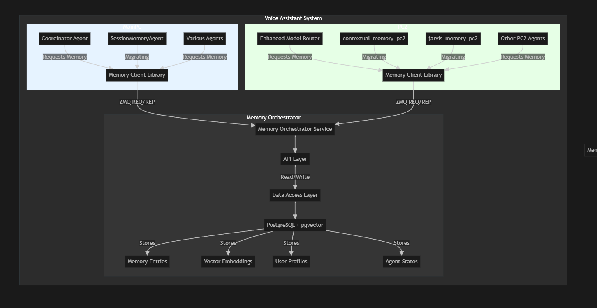

# Memory Orchestrator Design Summary

## Overview

The Memory Orchestrator is a centralized service designed to unify the currently fragmented memory systems in the voice assistant architecture. It provides a consistent interface for storing, retrieving, and searching memory across all assistant components, regardless of which physical machine they run on.

## System Architecture

The Memory Orchestrator consists of:

1. **API Service**: A ZMQ-based service exposing a REQ/REP interface on port 5570
2. **Database**: PostgreSQL with pgvector extension for vector similarity search
3. **Client Libraries**: Simplified interfaces for agents to interact with the service

## Key Design Documents

This design encompasses three main documents:

1. [**Memory Orchestrator API**](memory_orchestrator_api.md): Defines the service interface and communication protocol
2. [**Memory Database Schema**](memory_db_schema.md): Specifies the database structure and relationships
3. [**Memory Migration Strategy**](../planning/memory_migration.md): Outlines the phased approach for transitioning to the new system

## Core Features

The Memory Orchestrator provides:

- **Unified Storage**: All memory types (conversations, contexts, preferences) in one system
- **Standardized CRUD Operations**: Consistent interface for memory manipulation
- **Semantic Search**: Vector-based similarity search for contextual memory retrieval
- **Batch Operations**: Efficient multi-entry read/write capabilities
- **Session Management**: Tracking and organizing memories by interaction sessions
- **Cross-Component Access**: Any agent can access relevant memories regardless of location

## Data Model

The key entities in the system include:

- **Memory Entries**: Core storage unit for any type of memory content
- **Sessions**: Grouping of related memories within a user interaction
- **Vector Embeddings**: Semantic representations for similarity search
- **User Profiles**: User-specific data and preferences
- **Agent States**: Persistent state information for various agents

## Migration Approach

The migration strategy follows a four-phase approach:

1. **Setup & Co-existence**: Deploy new system alongside existing memory components
2. **Dual-Write**: Modify agents to write to both old and new systems simultaneously
3. **Read Migration**: Gradually shift read operations to the new system
4. **Decommission**: Complete the transition by removing old memory systems

## Technical Specifications

- **Protocol**: ZMQ REQ/REP with JSON message format
- **Database**: PostgreSQL 14+ with pgvector extension
- **Vector Dimensions**: 1536 (compatible with OpenAI embeddings)
- **Service Port**: 5570
- **Expected Throughput**: 100+ operations per second
- **Latency Target**: <50ms for typical operations, <200ms for semantic search

## Benefits

The Memory Orchestrator provides significant advantages:

1. **Improved Reliability**: Centralized storage with proper backup and replication
2. **Enhanced Context**: Better memory sharing between components
3. **Efficient Retrieval**: Optimized search capabilities including semantic similarity
4. **Simplified Development**: Consistent API across all voice assistant components
5. **Better Scalability**: Proper database design supporting larger memory volume

## Implementation Timeline

The migration is planned as an 8-week project:
- Weeks 1-2: Initial setup and data migration
- Weeks 3-4: Dual-write implementation
- Weeks 5-6: Read migration
- Weeks 7-8: Full cutover and optimization

## Conclusion

The Memory Orchestrator design addresses a critical vulnerability in the current system by consolidating fragmented memory components into a robust, centralized service. This will enhance the reliability, context-awareness, and overall capabilities of the voice assistant system.

## PC2 Memory Services

- Unified Memory Reasoning Agent (port 5596)
- DreamWorld Agent (port 5598-PUB)
- Other PC2 memory services 