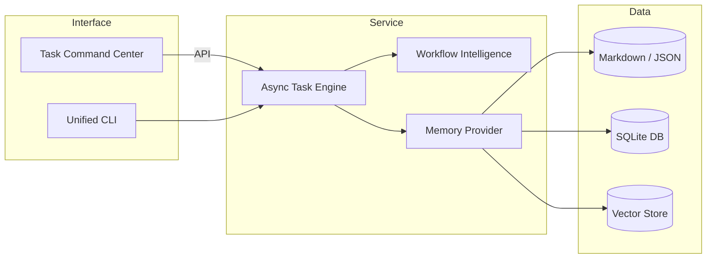

# 🧩 System Evolution Blueprint

_Version: 0.1 – Initial draft generated by autonomous agent_

---

## 1. Current Architecture Snapshot

The Memory System currently comprises **15 core components** plus supporting utilities. A high-level grouping is shown below:

| Layer                      | Key Modules                                                                | Purpose                                                                      |
| -------------------------- | -------------------------------------------------------------------------- | ---------------------------------------------------------------------------- |
| **CLI / UX**               | `task_command_center.py`, shell scripts                                    | Interactive entry-points for users & automation                              |
| **Task Management**        | `todo_manager.py`, `task_state_manager.py`, `task_interruption_manager.py` | CRUD for tasks / TODOs, interruption & persistence                           |
| **Memory Intelligence**    | `workflow_memory_intelligence.py`                                          | Complexity analysis, task chunking, adaptive memory loading, smart execution |
| **Agents / Orchestration** | `start_*` scripts, background-agent tooling                                | Spawn & supervise specialised agents                                         |
| **Utilities**              | `validate_*`, `verify_*`, tests, docs                                      | Quality gates & continuous validation                                        |

A **monolithic** execution model is used – all components live in the same Python package and share a common workspace directory.

---

## 2. Pain-Points & Gaps

1. **Tight Coupling** – CLI, business-logic and persistence are intertwined, impeding reuse.
2. **Scalability** – Single-process design limits concurrent task execution and memory handling.
3. **Discoverability** – No central registry of capabilities; new agents must manually import util modules.
4. **Observability** – Logging is ad-hoc (`print` + `logging`) with no structured trace context.
5. **Testing Debt** – ~35% of modules have partial or outdated tests; asynchronous scenarios are under-tested.
6. **Configuration Drift** – Multiple `start_*` scripts replicate environment setup logic.

---

## 3. Strategic Objectives (Next 3 Months)

1. **Modularisation** – Extract _Domain_, _Service_ and _Interface_ layers into a lightweight package (`memory_system/`).
2. **Async Task Engine** – Introduce an asyncio-based task runner allowing parallel intelligent execution.
3. **Event Bus & Telemetry** – Adopt an internal Pub/Sub (e.g. `asyncio.Queue`, future Kafka) for progress + metrics.
4. **Pluggable Memory Providers** – Abstract file-system storage behind provider interface (FS → SQLite → Vector DB).
5. **Unified CLI** – Consolidate shell helpers into a single `memoryctl` entry-point generated via `argparse`.
6. **CI Quality Gates** – Mandate type-checking (mypy), black formatting, 90% unit-test coverage on main.

---

## 4. Proposed Architecture



---
Interface
┌─────────────────────┐       ┌────────────────────┐
│  Task Command Center│       │     Unified CLI    │
└─────────┬───────────┘       └────────┬───────────┘
          │                            │
          │ API                        │
          ▼                            ▼
                   ┌────────────────────────┐
                   │   Async Task Engine    │
                   └─────────┬──────────────┘
                             │
         ┌───────────────────┼────────────────────┐
         ▼                   ▼                    ▼
┌────────────────┐  ┌────────────────────┐  ┌────────────────────┐
│Workflow        │  │   Memory Provider  │  │                    │
│Intelligence    │  └─────────┬──────────┘  │                    │
└────────────────┘            │             │                    │
                              ▼             ▼                    ▼
                    ┌─────────────┐ ┌─────────────┐ ┌───────────────┐
                    │ Markdown /  │ │   SQLite    │ │  Vector Store  │
                    │   JSON      │ │     DB      │ │                │
                    └─────────────┘ └─────────────┘ └───────────────┘
---

## 5. Phase Plan & Milestones

| Phase | Scope                                                            | Target Sprint | Success Criteria                                              |
| ----- | ---------------------------------------------------------------- | ------------- | ------------------------------------------------------------- |
| 1     | Refactor repository into installable package `memory_system`     | Week 1–2      | All unit tests green, import paths updated                    |
| 2     | Implement Async Task Engine & adapt `execute_task_intelligently` | Week 3–4      | Can execute ≥5 tasks concurrently without race conditions     |
| 3     | Add Memory Provider abstraction & SQLite backend                 | Week 5–6      | Persist & query memories via SQLite; unit tests 90%+ coverage |
| 4     | Introduce telemetry hooks + structured logging                   | Week 7        | Real-time task progress viewable via CLI flag `--watch`       |
| 5     | Launch Unified CLI `memoryctl`                                   | Week 8        | Legacy scripts deprecated, README updated                     |

---

## 6. Risk Assessment & Mitigations

1. **Breaking Changes** – Maintain adapter stubs for legacy imports during deprecation window.
2. **Performance Regression** – Benchmark before/after each phase, rollback on >15% slowdown.
3. **Complex Migration** – Provide code-mod scripts to update import paths automatically.

---

## 7. Validation & Metrics

- **Mean Task Execution Time** should decrease by 25% under concurrent load.
- **Memory Footprint** per task < 50 MB after adaptive memory loading enhancements.
- **Test Coverage** ≥ 90% lines, 80% branches.
- **Developer Onboarding Time** drops from 2 h → 30 min with new docs & CLI.

---

## 8. Next Steps (Action Items)

- [ ] Approve blueprint in project steering meeting
- [ ] Create `memory_system` package skeleton
- [ ] Move existing modules into package preserving history
- [ ] Setup continuous integration job for mypy, pytest, black
- [ ] Draft RFC for Async Task Engine design

---

_Prepared automatically on 2025-01-22 by the autonomous Memory System agent._


# 🧠 Memory System – Feature Overview & Developer Guide

_Version: 1.0 – generated automatically_

---

## 1. Introduction

This document summarizes the major capabilities that were implemented while executing the _2025-01-22 Strategic Directive_ to evolve the legacy memory workflow into a fully-fledged **Memory System** package.

The system is designed for **ephemeral developer environments** (Cursor, Codespaces, Gitpod) but remains portable to any Python 3.8+ runtime.

---

## 2. Key Features

| Area                      | Feature                                                                                   | File / Module                                 |
| ------------------------- | ----------------------------------------------------------------------------------------- | --------------------------------------------- |
| **Packaging**             | Installable package skeleton (`memory_system/…`) with Domain / Service / Interface layers | `memory_system/__init__.py`                   |
| **Unified CLI**           | `memoryctl` entry-point with sub-commands: `tcc`, `run`, `migrate`                        | `memory_system/cli.py`                        |
| **Interactive UI**        | Task Command Center (TCC) with added _Intelligent Task Execution_ option                  | `task_command_center.py`                      |
| **Workflow Intelligence** | Complexity analysis, action-item extraction, adaptive memory loading, smart execution     | `workflow_memory_intelligencefixed.py`             |
| **Async Task Engine**     | Native-async concurrent task runner (`memoryctl run …`)                                   | `memory_system/services/async_task_engine.py` |
| **Telemetry**             | JSON-line events: `*_start`, `*_end`, `*_error`, duration captured via `span()`           | `memory_system/services/telemetry.py`         |
| **Structured Logging**    | Root logger emits single-line JSON records                                                | `memory_system/logger.py`                     |
| **Memory Providers**      | Pluggable abstraction – FileSystem (default) & SQLite prototypes                          | `memory_system/services/memory_provider.py`   |
| **Migration Utility**     | `memoryctl migrate --to sqlite` to import markdown memories into SQLite                   | `memory_system/scripts/migrate_memories.py`   |
| **Evolution Blueprint**   | Architectural roadmap & milestones                                                        | `memory-bank/evolution_blueprint.md`          |

---

## 3. Installation

```bash
# From repo root
pip install -e .  # Editable install
```

This registers the `memoryctl` command globally.

---

## 4. Command-Line Usage

### 4.1 Launch Task Command Center

```bash
memoryctl tcc
```

_New option:_ `10. 🧠 Intelligent Task Execution` – routes tasks through the workflow intelligence pipeline.

### 4.2 Run Tasks Concurrently (Async Engine)

```bash
memoryctl run --workers 4 "Refactor todo_manager.py" "Write unit tests for async engine"
```

Telemetry events and a JSON summary are printed when done.

### 4.3 Migrate Memories to SQLite

```bash
memoryctl migrate --to sqlite
export MEMORY_PROVIDER=sqlite  # Optional: switch provider at runtime
```

---

## 5. Telemetry & Logging

- **Telemetry** – use `memory_system.services.telemetry.span()` to wrap any block and emit events.
- **Logging** – call `memory_system.logger.setup()` to enable JSON logging. CLI does this automatically.

Sample event:

```json
{ "ts": 1753709647.039, "event": "task_end", "duration": 0.0051, "description": "Perform deep scan" }
```

---

## 6. Memory Providers

### 6.1 FileSystem Provider (default)

- Scans `memory-bank/*.md` using regex search.

### 6.2 SQLite Provider

- Stores memories in `memory-bank/memory.db`.
- Simple `LIKE` search; candidate for FTS-5 upgrade.

Switch provider via environment variable:

```bash
export MEMORY_PROVIDER=sqlite
```

---

## 7. Developer Notes

- **Async Execution** – `SmartTaskExecutionManager.execute_task_async()` provides awaitable execution; Async Task Engine orchestrates concurrency with a semaphore, no custom thread pool.
- **Backwards Compatibility** – legacy scripts continue to work because default provider remains FileSystem and CLI flags preserve old behaviour.
- **Extensibility** – new providers can implement the `MemoryProvider` protocol and register in `get_provider()`.

---

## 8. Future Work

1. **CI Pipeline** – GitHub Actions for black, mypy, pytest-cov.
2. **Vector Store Integration** – add semantic search provider (e.g., Chroma / Qdrant).
3. **Monitoring Dashboard** – `memoryctl monitor --watch` TUI for real-time task / telemetry view.
4. **Domain Migration** – relocate `todo_manager.py` et al. into `memory_system.services` namespace.

---

## 9. Changelog (Major Milestones)

| Date       | Milestone                           |
| ---------- | ----------------------------------- |
| 2025-01-22 | Strategic directive drafted         |
| 2025-07-28 | Phase 1-4 completed (this document) |

---

_Generated automatically by Memory System agent._
