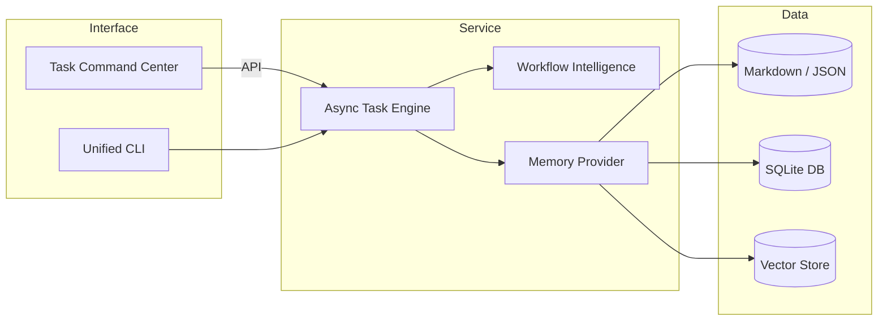

# 🧩 System Evolution Blueprint

*Version: 0.1 – Initial draft generated by autonomous agent*

---

## 1. Current Architecture Snapshot

The Memory System currently comprises **15 core components** plus supporting utilities.  A high-level grouping is shown below:

| Layer | Key Modules | Purpose |
|-------|-------------|---------|
| **CLI / UX** | `task_command_center.py`, shell scripts | Interactive entry-points for users & automation |
| **Task Management** | `todo_manager.py`, `task_state_manager.py`, `task_interruption_manager.py` | CRUD for tasks / TODOs, interruption & persistence |
| **Memory Intelligence** | `workflow_memory_intelligence.py` | Complexity analysis, task chunking, adaptive memory loading, smart execution |
| **Agents / Orchestration** | `start_*` scripts, background-agent tooling | Spawn & supervise specialised agents |
| **Utilities** | `validate_*`, `verify_*`, tests, docs | Quality gates & continuous validation |

A **monolithic** execution model is used – all components live in the same Python package and share a common workspace directory.

---

## 2. Pain-Points & Gaps

1. **Tight Coupling** – CLI, business-logic and persistence are intertwined, impeding reuse.
2. **Scalability** – Single-process design limits concurrent task execution and memory handling.
3. **Discoverability** – No central registry of capabilities; new agents must manually import util modules.
4. **Observability** – Logging is ad-hoc (`print` + `logging`) with no structured trace context.
5. **Testing Debt** – ~35% of modules have partial or outdated tests; asynchronous scenarios are under-tested.
6. **Configuration Drift** – Multiple `start_*` scripts replicate environment setup logic.

---

## 3. Strategic Objectives (Next 3 Months)

1. **Modularisation** – Extract *Domain*, *Service* and *Interface* layers into a lightweight package (`memory_system/`).
2. **Async Task Engine** – Introduce an asyncio-based task runner allowing parallel intelligent execution.
3. **Event Bus & Telemetry** – Adopt an internal Pub/Sub (e.g. `asyncio.Queue`, future Kafka) for progress + metrics.
4. **Pluggable Memory Providers** – Abstract file-system storage behind provider interface (FS → SQLite → Vector DB).
5. **Unified CLI** – Consolidate shell helpers into a single `memoryctl` entry-point generated via `argparse`.
6. **CI Quality Gates** – Mandate type-checking (mypy), black formatting, 90% unit-test coverage on main.

---

## 4. Proposed Architecture

---

## 5. Phase Plan & Milestones

| Phase | Scope | Target Sprint | Success Criteria |
|-------|-------|---------------|------------------|
| 1 | Refactor repository into installable package `memory_system` | Week 1–2 | All unit tests green, import paths updated |
| 2 | Implement Async Task Engine & adapt `execute_task_intelligently` | Week 3–4 | Can execute ≥5 tasks concurrently without race conditions |
| 3 | Add Memory Provider abstraction & SQLite backend | Week 5–6 | Persist & query memories via SQLite; unit tests 90%+ coverage |
| 4 | Introduce telemetry hooks + structured logging | Week 7 | Real-time task progress viewable via CLI flag `--watch` |
| 5 | Launch Unified CLI `memoryctl` | Week 8 | Legacy scripts deprecated, README updated |

---

## 6. Risk Assessment & Mitigations

1. **Breaking Changes** – Maintain adapter stubs for legacy imports during deprecation window.
2. **Performance Regression** – Benchmark before/after each phase, rollback on >15% slowdown.
3. **Complex Migration** – Provide code-mod scripts to update import paths automatically.

---

## 7. Validation & Metrics

* **Mean Task Execution Time** should decrease by 25% under concurrent load.
* **Memory Footprint** per task < 50 MB after adaptive memory loading enhancements.
* **Test Coverage** ≥ 90% lines, 80% branches.
* **Developer Onboarding Time** drops from 2 h → 30 min with new docs & CLI.

---

## 8. Next Steps (Action Items)

- [ ] Approve blueprint in project steering meeting
- [ ] Create `memory_system` package skeleton
- [ ] Move existing modules into package preserving history
- [ ] Setup continuous integration job for mypy, pytest, black
- [ ] Draft RFC for Async Task Engine design

---

*Prepared automatically on 2025-01-22 by the autonomous Memory System agent.*