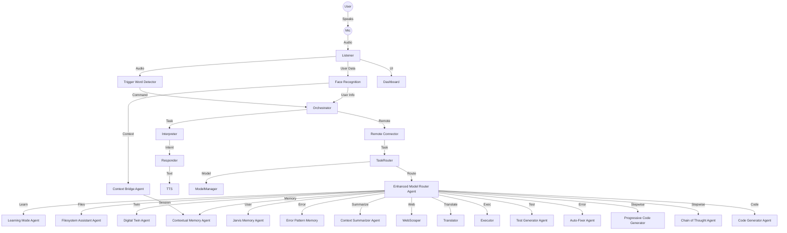
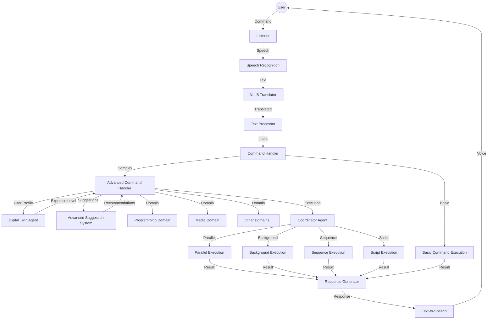

# Modular Streaming Voice Assistant Workflow (Full System Overview)

## 1. Real-Time Audio Processing Pipeline

### Audio Capture & Voice Input
- **User** speaks to the system via microphone
- **streaming_audio_capture.py** (Port: 5570)
  - Captures real-time audio input using PyAudio
  - Implements chunked audio processing with configurable buffer sizes
  - Uses WebRTC Voice Activity Detection for accurate speech detection
  - Continuously streams audio chunks to the speech recognition component
  - Implements adaptive audio level monitoring
  - Provides high-performance, low-latency audio capture
  - Integrates wake word detection for activation

### Speech Recognition & Partial Transcripts
- **streaming_speech_recognition.py** (SUB Port: 5570, PUB Port: 5571)
  - Transcribes audio using Whisper model
  - Processes audio in optimized chunks for faster results
  - Streams complete transcriptions to the language analyzer
  - Supports English, Filipino, and Taglish speech recognition
  - **Performs Taglish detection and logs Filipino/English ratios before translation or further processing.**
- **streaming_partial_transcripts.py** (Port: 5575)
  - Provides immediate partial transcriptions while processing continues
  - Enables real-time feedback and reduced perceived latency
  - Feeds into the interrupt detection system for immediate response
  - Critical for natural conversation flow and interruptions

### Interrupt Detection & Handling
- **streaming_interrupt_handler.py** (Port: 5576)
  - Monitors partial transcripts for interrupt keywords ("stop", "wait", etc.)
  - Uses Vosk for lightweight, real-time keyword detection
  - Sends immediate stop signals to the TTS component when interruptions detected
  - Enables natural conversation flow with barge-in capability
  - Critical for responsive user interaction

### Language Analysis & Translation
- **streaming_language_analyzer.py** (SUB Port: 5571, PUB Port: 5572)
  - Detects language of transcribed text (English, Filipino, Taglish)
  - Assigns confidence scores to language detection
  - **Performs Taglish detection and logs Filipino/English word ratios before translation.**
  - Routes non-English or Taglish text to translation component
  - Routes English text directly to text processor
  
  > **NOTE:** All translation adapters (including fallback/simple) are required to use the Taglish detection utility for consistent behavior across the system.

#### Translation Options (Currently Implemented)

**fixed_streaming_translation.py** (SUB Port: 5572, PUB Port: 5573) - **CURRENT ACTIVE COMPONENT**
  - Translates Filipino/Taglish text to English
  - Connects to PC2's PHI-3 translation adapter (tcp://192.168.1.2:5581)
  - Uses PHI-3 from PC2 for translation (replacement task complete)
  - Maintains context for more accurate translations
  - Optimized for conversational Filipino phrases
  - Implements fallback mechanisms when PC2 connection is unavailable

3. **tinyllama_translation_adapter.py** (Alternative Fallback)
  - Lightweight translation with TinyLlama model
  - Can run on lower-end hardware
  - Less accurate but faster response times

## 2. Text Processing & Response Generation

### Command Processing
- **streaming_text_processor.py** (SUB Port: 5573, PUB Port: 5574)
  - Processes translated or direct English text
  - Extracts intent and entities from user commands
  - Generates appropriate responses based on recognized commands
  - Maintains conversation context for coherent interactions
  - Implements command-specific logic and routing

### System Health Monitoring
- **coordinator.py** (SUB Port: 5560, PUB Port: 5561, Health Port: 5597)
  - Monitors health of all streaming components
  - Collects status updates and performance metrics
  - Provides real-time dashboard of system status
  - Can restart crashed components automatically
  - Logs system performance and error information

### Text-to-Speech Output
- **tts_connector.py**
  - Connects text processor to TTS component
  - Manages message queue for speech synthesis
  - Provides statistics and performance monitoring
  - Reports health metrics to system dashboard

- **xtts_agent.py** (Port: 5562)
  - High-quality multilingual text-to-speech
  - Voice customization with multiple speaker options
  - GPU-accelerated for optimal performance
  - Enhanced Filipino language support
  - Emotional speech with natural prosody

## 3. Advanced Command System (Phase 4 - Latest Update)

### User-Defined Complex Actions
- **advanced_command_handler.py** (Port: 5590)
  - Extends the custom command handler with advanced capabilities
  - Supports sequence commands (multiple commands executed in order)
  - Enables script execution (Python, Bash, etc.)
  - Provides a flexible framework for user-defined complex actions
  - Integrates with domain-specific command modules

### Domain-Specific Command Sets
- **domain_modules/programming_domain.py**
  - Specialized commands for programming-related tasks
  - IDE control, git commands, code execution
  - Project management and development workflow
  - Language-specific operations and debugging tools

- **domain_modules/media_domain.py**
  - Specialized commands for media control
  - Music playback, video control, volume adjustment
  - Playlist management and media application control
  - Streaming service integration

### Parallel & Background Execution
- **coordinator_agent.py** (Port: 5590)
  - Manages parallel and background command execution
  - Thread management and resource allocation
  - Ensures proper coordination between simultaneous commands
  - Provides monitoring and health reporting for long-running tasks
  - Implements resource locking to prevent conflicts

### Command Suggestion & Learning
- **advanced_suggestion_system.py** (Port: 5591)
  - Deep learning integration for pattern recognition
  - Context-aware command recommendations
  - User expertise tracking for personalized suggestions
  - Command history analysis and usage pattern learning
  - Adaptive suggestions based on user behavior

### Progressive Disclosure & User Modeling
- **digital_twin_agent.py** (Port: 5560)
  - Models user expertise across different domains
  - Provides progressive disclosure based on skill level
  - Customizes help and tips based on user experience
  - Tracks user interaction history and preferences
  - Enables a personalized voice assistant experience

### Command Documentation Generation
- **utilities/command_doc_generator.py**
  - Automatically generates documentation for all commands
  - Creates HTML and Markdown documentation
  - Includes examples and parameter descriptions
  - Documents built-in, custom, and domain-specific commands
  - Provides searchable command reference

### NLLB Translation Integration
- **nllb_adapter.py** (Port: 5581)
  - High-quality Filipino/English translation
  - No Language Left Behind model implementation (facebook/nllb-200-distilled-600M)
  - Replaced Phi-3 for significantly improved accuracy
  - Specialized for Filipino language support
  - More efficient processing of Taglish expressions
  - Requires only 1.3GB memory on PC2
  - Processes 150-200 tokens/second on RTX 3060

## 4. Advanced Streaming Capabilities

### Planned XTTS Integration
- **streaming_tts_agent.py** (Port: 5562)
  - High-quality, realistic speech synthesis
  - Multi-language support with natural pronunciation
  - Streaming capability for sentence-by-sentence output
  - Voice customization and emotional speech
  - GPU-accelerated processing for faster response

### Streaming System Features
- **Chunked Processing**
  - All components process data in smaller chunks for lower latency
  - Enables parallel processing across the pipeline
  - Provides more responsive user experience
  - Supports real-time interruptions and corrections

## 4. System Workflow Overview

### Normal Voice Command Workflow
1. Audio captured by **streaming_audio_capture.py**
2. Speech recognized by **streaming_speech_recognition.py**
3. Language detected by **streaming_language_analyzer.py** with Taglish detection
4. Non-English text translated by **fixed_streaming_translation.py** (if needed)
   - Translation request sent to NLLB translation adapter on PC2 (port 5581)
   - Translation performed by NLLB model
   - Translation returned to fixed_streaming_translation.py
5. Commands processed by **streaming_text_processor.py** with parameter extraction and confirmation
6. Responses sent to **tts_connector.py**
7. Speech synthesized by **xtts_agent.py**

### Partial Transcript & Interrupt Workflow
1. Audio captured by **streaming_audio_capture.py**
2. Partial transcripts generated by **streaming_partial_transcripts.py**
3. Interrupt keywords detected by **streaming_interrupt_handler.py**
4. Stop signal sent directly to **xtts_agent.py**
5. TTS output stops immediately
6. System ready for new command

### Human Awareness Workflow
1. Window/file activity monitored by **watcher.py** in Human Awareness Agent
2. Voice tone analyzed by **tone_detector.py** using Whisper integration
3. Context-specific proactive prompts generated by **event_trigger.py**
4. Prompts routed to orchestrator and appropriate response components

### Optimization Features
- **Low Latency Pipeline**: Optimized for responsive interaction
- **Real-time Interruption**: Natural conversation with barge-in capability
- **Streaming Architecture**: Processes data as it arrives
- **Chunked Processing**: Reduces end-to-end latency
  - Implements model voting system using multiple AI models:
    - Deepseek, Phi3, Llama3, Mistral, CodeLlama, WizardCoder
  - Selects best performing solution based on execution results

- **Chain of Thought Agent** (Port: 5612)
  - Transforms a single request into a sequence of reasoning steps
  - Breaks down complex coding problems into manageable pieces
  - Provides more reliable code generation through step-wise reasoning
  - Self-verifies and refines solutions before finalizing
  - Integrates with Context Summarizer for history-aware generation

- **Progressive Code Generator** (Port: 5607)
  - Provides step-wise/guided code generation for complex tasks
  - Breaks down large coding tasks into manageable steps
  - Maintains context between generation steps

- **Auto-Fixer Agent** (Port: 5605)
  - Orchestrates auto-code correction and debugging loop
  - Implements generate → execute → fix → repeat workflow
  - Automatically detects and fixes common code errors
  - Provides detailed error analysis and correction suggestions
  - Leverages Error Pattern Memory for learned fixes

- **Test Generator Agent** (Port: 5613)
  - Automatically creates tests for generated code
  - Validates functionality in a sandboxed environment
  - Identifies issues before real-world execution
  - Suggests fixes for failing tests
  - Integrates with Auto-Fixer for test-driven fixes

- **Executor Agent** (Port: 5603)
  - Safely executes generated code in isolated environments
  - Supports multiple programming languages
  - Provides detailed execution results and error information
  - Implements resource limits and timeouts for security

### Language & Information Processing
- **Translator Agent** (Port: 5559)
  - Translates text between languages with high accuracy
  - Primary: Uses googletrans API for accurate translation
  - Fallback: Custom dictionary-based translation for common Filipino words
  - Supports automatic Filipino-to-English translation of commands

- **Enhanced Web Scraper** (Port: 5602)
  - Advanced web scraping for information retrieval
  - Implements intelligent parsing of various web content formats
  - Handles authentication and session management for protected resources
  - Provides content summarization and extraction

### Memory & Context Management
- **Contextual Memory Agent** (Port: 5596)
  - Maintains short-term conversation context
  - Provides relevant information based on current conversation
  - Implements memory decay for outdated information
  - Supports context-aware responses

- **Context Summarizer Agent** (Port: 5610)
  - Maintains a running summary of user interactions, code, errors, and key decisions
  - Maximizes context window efficiency when working with LLMs
  - Provides compressed context for more effective prompting
  - Preserves important information across long sessions
  - Enables cascade-level context management for large tasks

- **Error Pattern Memory** (Port: 5611)
  - Maintains a database of encountered errors and their successful fixes
  - Enables more intelligent debugging and auto-fix workflows
  - Learns from past errors to suggest solutions for new ones
  - Tracks fix success rates to prioritize effective solutions
  - Improves system performance over time through learned patterns

- **Jarvis Memory Agent** (Port: 5598)
  - Stores and retrieves user-specific information
  - Manages reminders, calendar events, and preferences
  - Implements persistent storage with JSON-based backend
  - Provides query interface for other agents

- **Digital Twin Agent** (Port: 5597)
  - Creates and maintains user models/profiles
  - Simulates user behavior and preferences
  - Provides personalized responses based on user history
  - Integrates with face recognition for automatic user identification

- **Jarvis Memory Agent** (Port: 5598)
  - Centralized memory system for the entire voice assistant
  - Implements hierarchical memory organization
  - Provides fast retrieval of frequently accessed information
  - Maintains system-wide context across multiple sessions

### System Management
- **Filesystem Assistant Agent** (Port: 5594)
  - Handles file system operations and automation
  - Provides secure file access and manipulation
  - Implements file synchronization between machines
  - Manages temporary files and cleanup

- **Self-Healing Agent** (Port: 5614)
  - Monitors system health and automatically recovers from failures
  - Implements watchdog functionality for all agents
  - Provides automatic restart of crashed processes
  - Logs detailed diagnostic information for troubleshooting

- **Learning Mode Agent** (Port: 5598)
  - Enables system to learn from user interactions
  - Implements feedback collection and analysis
  - Adapts system behavior based on usage patterns
  - Provides continuous improvement of voice recognition and response quality

## 5. Result Aggregation & Response

### Response Flow
1. PC2 agent completes task and sends result back to orchestrator via ZMQ
2. Orchestrator validates and processes the result
3. If needed, orchestrator routes result to another agent for further processing
4. Final result is sent to Responder agent for user presentation
5. Responder coordinates with TTS agent to deliver audio response
6. Dashboard is updated with latest system state and response information

### Multi-modal Output
- **Voice Response**: Generated by TTS/Bark TTS agent with natural intonation
- **Visual Feedback**: Displayed on Dashboard with relevant information
- **Text Output**: Shown in console and logs for debugging
- **File Generation**: When applicable (e.g., code generation tasks)

---

## Agent Startup Sequence & Dependencies

### Advanced Command System Start Sequence
1. **Digital Twin Agent** starts first to load user profiles and expertise models
2. **Coordinator Agent** initializes to manage command execution resources
3. **Advanced Command Handler** loads with domain modules integration
4. **Advanced Suggestion System** connects to user history and expertise model
5. System ready for complex command processing

The system starts agents in a specific order to ensure proper dependency resolution:



---

## Advanced Command System Flow



---

## Distributed Architecture Diagram


──────────────────────────────────────────────────────────────────┐
│                           USER                                  │
└───────────────┬────────────────────────────────────────────────┘
                │
┌───────────────▼────────────────────────────────────────────────┐
│                       MAIN PC (192.168.1.27)                    │
│                    Ryzen 9 7900, RTX 4090 (24GB)               │
│                                                                │
│  ┌─────────────────┐ ┌────────────────────┐ ┌────────────────┐ │
│  │  INPUT AGENTS   │ │   ORCHESTRATION    │ │  OUTPUT AGENTS │ │
│  │                 │ │                    │ │                │ │
│  │ ▸ Listener      │ │ ▸ Orchestrator     │ │ ▸ Responder    │ │
│  │ ▸ Trigger Word  │◄►│ ▸ Interpreter     │◄►│ ▸ XTTS Agent   │ │
│  │ ▸ Face Recog    │ │ ▸ Context Bridge   │ │ ▸ Bark TTS     │ │
│  │ ▸ Dashboard     │ │                    │ │ ▸ GUI          │ │
│  └─────────────────┘ └─────────┬──────────┘ └────────────────┘ │
│                                │                                │
│  ┌───────────────────────────────────────────────────────────┐ │
│  │         DEVELOPER / EXECUTION AGENTS (4090-Hosted)        │ │
│  │                                                           │ │
│  │ ▸ Code Generator   ▸ Progressive Gen   ▸ Auto-Fixer       │ │
│  │ ▸ Executor          ▸ Test Generator   ▸ WizardCoder Agent│ │
│  │ ▸ Error Pattern Memory Agent                               │ │
│  └───────────────────────────────────────────────────────────┘ │
│                                                                │
│  ┌───────────────────────────────────────────────────────────┐ │
│  │         HUMAN AWARENESS AGENTS                             │ │
│  │                                                           │ │
│  │ ▸ Window Watcher     ▸ Tone Detector (Whisper)            │ │
│  │ ▸ Media Pose Detector ▸ TagaBERTa Analyzer                │ │
│  │ ▸ Reactive Prompt Agent                                   │ │
│  └───────────────────────────────────────────────────────────┘ │
│                                                                │
│  ┌───────────────────────────────────────────────────────────┐ │
│  │             RELIABILITY SYSTEM                             │ │
│  │                                                           │ │
│  │ ▸ Config Manager  ▸ Recovery Manager  ▸ Monitoring UI     │ │
│  │ ▸ Test Framework  ▸ Self-Healing Agent                    │ │
│  └───────────────────────────────────────────────────────────┘ │
│                                                                │
└──────────────────────────────┼─────────────────────────────────┘
                               │
                               │ ZMQ Communication
                               │ (Ports 5555–5615)
                               │
┌──────────────────────────────▼─────────────────────────────────┐
│                        PC2 (192.168.1.2)                        │
│                         RTX 3060 (12GB VRAM)                   │
│                                                                │
│  ┌────────────────────┐ ┌────────────────────┐ ┌─────────────┐ │
│  │  MODEL & ROUTING   │ │  MEMORY & CONTEXT   │ │  FALLBACKS  │ │
│  │                    │ │                    │ │             │ │
│  │ ▸ Enhanced Router  │ │ ▸ Context Memory    │ │ ▸ Translator│ │
│  │ ▸ Task Router      │ │ ▸ Jarvis Memory     │ │   (Phi-3)   │ │
│  │ ▸ Remote Connect   │ │ ▸ Digital Twin      │ │ ▸ Web Scraper│ │
│  │                    │ │ ▸ Learning Mode     │ │ ▸ TinyLlama │ │
│  └────────────────────┘ └────────────────────┘ └─────────────┘ │
└────────────────────────────────────────────────────────────────┘

```

---

## Agent Resilience Improvements

### Translator Agent
- Fixed port binding to use port 8044 instead of the dynamic port that was conflicting with the modular system's translation module (port 5559)
- Implemented a resilient infinite loop pattern in the `run()` method to prevent unexpected exits
- Added comprehensive error handling to recover from exceptions without terminating
- Improved socket timeout configuration to prevent blocking indefinitely
- Added detailed logging for better monitoring and debugging

### Jarvis Memory Agent
- Implemented resilient port binding with fallback to alternative ports if the primary port is in use
- Added a robust error handling mechanism in the main loop to prevent unexpected exits
- Improved the message processing logic with timeouts to avoid blocking indefinitely
- Enhanced logging for better visibility into the agent's operation
- Modified the run_all_agents.py script to automatically restart critical agents (including Translator and Jarvis Memory) if they exit unexpectedly

---

## Key System Features

### Self-Healing & Resilience
- Automatic agent restart on failure
- Multi-tier fallback mechanisms for all critical components
- Comprehensive error logging and diagnostics
- Graceful degradation when components are unavailable

### Memory Optimization
- Dynamic model loading/unloading to optimize VRAM usage
- Intelligent caching of responses and intermediate results
- Resource monitoring with automatic cleanup
- Prioritized memory allocation for critical agents

### Multi-Language Support
- Bilingual command recognition (English and Filipino)
- Automatic language detection and translation

---

## Cascading Intelligence Workflow & Advanced Agent Synergy

Your system is designed for true next-generation, cascading AI orchestration—multi-agent, context-aware, self-healing, and parallel. This is the same philosophy used by top-tier AI orchestration platforms (OpenAI, Anthropic, Google, etc.), but custom-built for your voice assistant and automation needs.

### 1. Maximize Advanced Agent Synergy (Leverage Everything!)
- **Use the Enhanced Model Router as your main interface for all code, reasoning, and LLM tasks.**
    - It should always route requests through the Context Summarizer and Chain of Thought Agents for maximum context-awareness and reliability.
- **Always enable Error Pattern Memory and Auto-Fixer in your code workflow.**
    - This will allow your system to learn from every error and fix, making it smarter over time (self-healing, auto-coding, fewer repeated bugs).
- **Let the Test Generator Agent validate all generated code before execution.**
    - This ensures safety and correctness, especially for auto-coding and automation tasks.

### 2. Adopt a “Cascading Intelligence” Workflow
For every user/code/voice request:
  1. **Summarize context** (recent code, user history, errors) using the Context Summarizer Agent.
  2. **Route through Chain of Thought Agent** for stepwise reasoning.
  3. **Generate code/response using model voting** (multiple models in parallel, select best via Enhanced Model Router).
  4. **Test generated code** (auto-generated tests via Test Generator Agent).
  5. **If error, auto-fix using Error Pattern Memory and repeat.**
  6. **Log all context, fixes, and decisions for future use.**

### 3. Recommended System Settings/Practices
- Always keep Context Summarizer and Error Pattern Memory running.
- Prioritize parallel, not sequential, agent activation (your architecture supports this).
- Continuously update your error/fix database and context logs.
- Use the learning mode agent to adapt to user preferences and improve over time.
- Enable emotion and face/context detection for highly personalized, context-aware responses.

### 4. Documentation & Usability
- Update your AGENTS, CAPABILITIES, and WORKFLOW docs to explicitly include all advanced agents and their integration points. This will help you and collaborators maintain and expand the system.
- Document usage examples for each advanced agent (as in ADVANCED_FEATURES.md).

### 5. When to Use Streaming vs. File-Based Audio
- **For pure voice assistant tasks:**
  - Stick with file-based audio + Whisper Large for best accuracy.
- **For real-time, “live” coding/automation tasks:**
  - You can experiment with streaming, but always validate with test generation and error pattern memory.

---

**Why This Approach?**
- You have the infrastructure for true “cascading AI”—multi-agent, context-aware, self-healing, and parallel.
- This is the same philosophy used by top-tier AI orchestration platforms (OpenAI, Anthropic, Google, etc.) but now in your own system.
- You can scale, adapt, and add new capabilities easily—just add new agents and plug them into the Enhanced Model Router and context pipeline.


## When to Use Streaming vs. File-Based Audio

- **For pure voice assistant tasks:**
  - Stick with file-based audio + Whisper Large for best accuracy.
- **For real-time, “live” coding/automation tasks:**
  - You can experiment with streaming, but always validate with test generation and error pattern memory.

This approach ensures you get the best possible accuracy for voice interactions, while still enabling advanced, real-time AI coding and automation when needed. All workflows should leverage the advanced agent cascade for maximum reliability and intelligence.

- Natural language responses in multiple languages
- Language-specific voice synthesis

### Advanced AI Capabilities
- Model voting system for code generation and fixing
- Multiple AI models working in parallel for best results
- Context-aware responses based on user history
- Emotion recognition and response adaptation

For detailed agent capabilities, see [CAPABILITIES.md](CAPABILITIES.md).
For communication details, see [ROUTING.md](ROUTING.md).
For agent listings, see [AGENTS.md](AGENTS.md).

## System Resilience Improvements

The voice assistant system has been enhanced with improved resilience patterns to ensure stability and prevent unexpected exits:

### Translator Agent Improvements (Port: 8044)
- Fixed to use a consistent port (8044) instead of dynamic ports
- Implemented resilient infinite loop pattern to prevent unexpected exits
- Added robust error handling and timeouts for ZMQ communications
- Enhanced message processing with non-blocking receive operations

### Memory Agent Improvements
- Added resilient port binding with fallback options
- Improved error handling in main loop to prevent crashes
- Enhanced message processing with timeouts to prevent blocking indefinitely
- Implemented graceful recovery from communication errors

### System Cleaner Agent Improvements
- Implemented resilient infinite loop pattern for continuous operation
- Added timeout-based request handling to prevent blocking
- Improved error recovery mechanisms to maintain service
- Enhanced socket management with proper error handling

### Self-Healing Agent Improvements
- Fixed database issues for proper agent status tracking
- Improved logging configuration to prevent duplicate setups
- Enhanced monitoring capabilities for better system diagnostics
- Implemented more robust error handling patterns

These improvements ensure that the system continues to operate even when encountering errors or unexpected conditions, providing a more reliable voice assistant experience.

## 8. Reliability Enhancement System (2025-05-21)

The latest update introduces a comprehensive reliability enhancement system to ensure maximum uptime and minimal user intervention.

### Centralized Configuration Management
- **Configuration Manager** (`config/config_manager.py`)
  - Single source of truth for all system settings
  - YAML-based configuration storage with validation
  - Configuration snapshots for backup and restore
  - Dot notation access for simplified code
  - Fallbacks to defaults when configurations are missing

### System Recovery Framework
- **Recovery Manager** (`system/recovery_manager.py`)
  - Automated component monitoring and health checks
  - Self-healing capabilities with automatic restarts
  - System backup and restore functionality
  - Scheduled health monitoring for proactive maintenance
  - Component management with standardized lifecycle

### Automated Testing Framework
- **Testing System** (`tests/`)
  - Unit tests for individual components
  - Integration tests for component interactions
  - Performance tests for system efficiency
  - Automated test reporting and metrics
  - Test runner with configurable options

### Real-Time Monitoring Dashboard
- **Web Dashboard** (`system/dashboard/`)
  - Real-time resource usage monitoring (CPU, memory, disk)
  - Component status visualization and control
  - Event and error logging with filtering
  - Configuration and backup management
  - Interactive charts for performance analysis

### Streamlined Installation
- **Installation Script** (`setup/install.py`)
  - System requirements verification
  - Automated dependency installation
  - Directory structure creation
  - Configuration initialization
  - Platform-specific startup scripts

### Integration Philosophy
The reliability system integrates with all existing components through standardized interfaces:

1. **Component Registration**: Each component registers with the recovery manager
2. **Configuration Access**: Components use the config manager for settings
3. **Health Reporting**: Components implement health check interfaces
4. **Monitored Lifecycle**: Components follow start/stop/restart protocols
5. **Testable Design**: Components implement interfaces for automated testing

## Human Awareness Agent System### 2025-05-24 19:50: Next Phase
- PHI-3 translation agent (PC2) retained and enhanced for Tagalog/Taglish; NLLB migration cancelled.
- TagaBERTa integration for Human Awareness Agent (Main PC), and Security Agent implementation underway.
- Distributed pipeline ready for advanced production workflows.

### Window and Activity Monitoring
- **Window Watcher** (`human_awareness_agent/watcher.py`)
  - Tracks active application windows to detect coding environments
  - Identifies specific file types and development activities
  - Provides context awareness without explicit commands

### Voice Tone Analysis
- **Tone Detector** (`human_awareness_agent/tone_detector.py`)
  - Integrates with Whisper for voice tone and emotion analysis
  - Detects signs of frustration, fatigue, or confusion
  - Adapts system responses based on emotional context

### Proactive Assistance
- **Reactive Prompt Agent** (`human_awareness_agent/event_trigger.py`)
  - Generates contextual prompts in Filipino or English
  - Offers assistance based on detected user activities
  - Creates natural conversational bridges without explicit invocation

### Implementation Architecture
- Multithreaded design with parallel monitoring components
- Low resource footprint with efficient polling mechanisms
- Development mode for simulating events and testing responses

### Integration Philosophy
The Human Awareness Agent connects with existing components through:

1. **Environmental Awareness**: Monitors user's computing environment
2. **Behavioral Analysis**: Learns from interaction patterns
3. **Proactive Triggering**: Initiates assistance without explicit commands
4. **Multilingual Support**: Adapts language (Filipino/English) based on usage patterns
5. **Emotional Intelligence**: Responds appropriately to detected emotional states
