# PC2 Architecture Diagram

This document provides a visual representation of the current PC2 component architecture and its interactions with Main PC components.

## Current System Architecture

```mermaid
graph TD
    %% Main PC Components
    subgraph MainPC["Main PC (Orchestrator)"]
        MMA["Model Manager Agent\n(Port 5556)"]
        fixedTranslation["fixed_streaming_translation.py"]
        codeGenAgent["Code Generator Agent on Main PC\n(Port 5604)"]
        executorAgent["Executor Agent\n(Port 5613)"]
    end
    
    %% PC2 Active Components - Translation Services
    subgraph PC2_Translation["PC2 Translation Services"]
        TranslatorAgent["TranslatorAgent\n(Port 5563)\n✅ ACTIVE"]
        NLLBAdapter["NLLB Translation Adapter\n(Port 5581)\n✅ ACTIVE"]
        TinyLlama["TinyLlama Service\n(Port 5615)\n✅ ACTIVE"]
        
        %% PC2 Internal dependencies
        TranslatorAgent -->|"Uses for\nneural translation"| NLLBAdapter
        TranslatorAgent -->|"Uses for\nfallback"| GoogleAPI["Google Translate API\n(External)"]
    end
    
    %% PC2 Active Components - Memory & Cognitive Services
    subgraph PC2_Memory["PC2 Memory & Cognitive Services"]
        MemoryBase["Memory Agent (Base)\n(Port 5590)\n✅ ACTIVE\n(Proactive reminders)"]
        ContextMem["Contextual Memory Agent\n(Port 5596)\n✅ ACTIVE"]
        DigitalTwin["Digital Twin Agent\n(Port 5597)\n✅ ACTIVE"]
        JarvisMem["Jarvis Memory Agent\n(Port 5598)\n⚠️ DEPRECATED"]
        LearningMode["Learning Mode Agent\n(Port 5599)\n✅ ACTIVE"]
        ErrorPattern["Error Pattern Memory\n(Port 5611)\n✅ ACTIVE"]
    end
    
    %% PC2 Active Components - Reasoning & Web Services
    subgraph PC2_Reasoning["PC2 Reasoning & Web Services"]
        ChainOfThought["Chain of Thought Agent\n(Port 5612)\n✅ ACTIVE"]
        RemoteConnector["Remote Connector Agent\n(Port 5557)\n✅ ACTIVE"]
        WebScraper["Enhanced Web Scraper\n(Port 5602)\n✅ ACTIVE"]
        WebAssistant["Autonomous Web Assistant\n(Port 5604)\n✅ ACTIVE"]
        FilesystemAssistant["Filesystem Assistant Agent\n(Port 5606)\n✅ ACTIVE"]
        EnhancedRouter["Enhanced Model Router\n(Ports 7602/7701)\n✅ ACTIVE"]
        SelfHealing["Self-Healing Agent\n(Ports 5614/5616)\n✅ ACTIVE"]
    end
    
    %% Service Interactions
    MMA -->|"Health checks\n(ZMQ REQ/REP)"| TranslatorAgent
    MMA -->|"Health checks\n(ZMQ REQ/REP)"| NLLBAdapter
    MMA -->|"Health checks\n(ZMQ REQ/REP)"| TinyLlama
    
    fixedTranslation -->|"Translation requests\n(ZMQ REQ/REP)"| TranslatorAgent
    codeGenAgent -.->|"May utilize"| TinyLlama
    
    %% Memory Service Interactions
    ContextMem -->|"Provides context"| ChainOfThought
    MemoryBase -->|"Core memory services"| ContextMem
    MemoryBase -->|"Core memory services"| JarvisMem
    MemoryBase -->|"Core memory services"| DigitalTwin
    
    %% Enhanced Router as central hub
    EnhancedRouter -->|"Routes to"| ChainOfThought
    EnhancedRouter -->|"Routes to"| WebAssistant
    EnhancedRouter -->|"Routes to"| WebScraper
    EnhancedRouter -->|"Routes to"| TranslatorAgent
    
    %% Deprecated components
    subgraph DeprecatedPC2["PC2 Deprecated Components\n⚠️ DO NOT START THESE"]
        PC2_MMA["PC2 Model Manager Agent\n(Replaced by Main PC MMA)"]
        OldTranslator["Original Translator Agent\n(Replaced by enhanced fixed version)"]
        LLMTranslator["LLM Translation Adapter\n(Replaced by NLLB Translation Adapter)"]
    end
    
    %% Legend styling
    classDef mainPC fill:#f9f,stroke:#333,stroke-width:2px;
    classDef pc2Translation fill:#bbf,stroke:#333,stroke-width:2px;
    classDef pc2Memory fill:#adf,stroke:#333,stroke-width:2px;
    classDef pc2Reasoning fill:#bdf,stroke:#333,stroke-width:2px;
    classDef external fill:#bfb,stroke:#333,stroke-width:2px;
    classDef deprecated fill:#f99,stroke:#f00,stroke-width:1px,stroke-dasharray: 5 5;
    
    class MMA,fixedTranslation,codeGenAgent,executorAgent mainPC;
    class TranslatorAgent,NLLBAdapter,TinyLlama,PC2_Translation pc2Translation;
    class MemoryBase,ContextMem,DigitalTwin,JarvisMem,LearningMode,ErrorPattern,PC2_Memory pc2Memory;
    class ChainOfThought,RemoteConnector,WebScraper,WebAssistant,FilesystemAssistant,EnhancedRouter,SelfHealing,PC2_Reasoning pc2Reasoning;
    class GoogleAPI external;
    class PC2_MMA,OldTranslator,LLMTranslator,DeprecatedPC2 deprecated;
```



## Translation Pipeline Flow

```mermaid
sequenceDiagram
    participant MainPC as Main PC
    participant Translator as TranslatorAgent (PC2)
    participant NLLB as NLLB Adapter (PC2)
    participant Google as Google Translate API
    
    MainPC->>+Translator: Translation Request
    Note over Translator: 1. Pattern Matching (confidence: 0.98)
    
    alt High Confidence Pattern Match
        Translator-->>-MainPC: Return Pattern Match Result
    else No Pattern Match
        Translator->>+NLLB: Neural Translation Request
        NLLB-->>-Translator: NLLB Result + Confidence Score
        
        alt NLLB Confidence > 0.85
            Translator-->>MainPC: Return NLLB Result
        else NLLB Confidence < Threshold
            Translator->>+Google: Google Translate Request
            Google-->>-Translator: Google Result
            Translator-->>-MainPC: Return Google Result
        end
    end
```

## Data Flow Description

1. **Translation Pipeline**:
   - Main PC's `fixed_streaming_translation.py` sends translation requests to PC2's `TranslatorAgent` (port 5563)
   - `TranslatorAgent` processes requests using a tiered approach with confidence scoring:
     - First: Pattern matching for common phrases/commands (threshold: 0.98)
     - Second: NLLB Translation Adapter for neural translation (threshold: 0.85/0.60)
     - Third: Google Translate API fallback (default confidence: 0.90)
   - Results are returned to Main PC with confidence scores, translation method used, and original text

2. **Health Monitoring**:
   - Main PC's Model Manager Agent (MMA) periodically checks the health of all PC2 services
   - Health checks now use the primary ZMQ ports for each service:
     - TranslatorAgent: Port 5563
     - NLLB Adapter: Port 5581
     - TinyLlama Service: Port 5615
   - Dedicated health check port (5559) has been deprecated

3. **TinyLlama Service**:
   - Operates independently to provide lightweight LLM capabilities
   - Available for direct queries from Main PC components
   - Self-manages model loading/unloading based on activity (idle timeout: 600 seconds)

## Key Design Patterns

1. **Tiered Processing with Confidence Scoring**:
   - Each translation tier provides configurable confidence scores
   - Pattern matching is prioritized for known commands/phrases
   - System automatically selects results based on confidence thresholds

2. **On-Demand Resource Management**:
   - Both NLLB and TinyLlama models load on-demand and unload after inactivity
   - Prevents unnecessary GPU memory usage

3. **Centralized Configuration**:
   - All components source settings from `config/system_config.py`
   - Thresholds, ports, and model parameters are configured centrally

4. **Robust Error Handling**:
   - All components implement comprehensive error handling
   - Translation system includes fallback mechanisms at multiple tiers

## PC2 Service Responsibilities

### Translation Services

| Component | Primary Responsibility | Secondary Functions |
|-----------|------------------------|---------------------|
| **TranslatorAgent** | Translate Taglish/Filipino to English | Pattern matching, caching, session tracking |
| **NLLB Adapter** | Neural machine translation | Confidence scoring, custom prompting |
| **TinyLlama Service** | Lightweight LLM inference | Fallback for Main PC code generation |

### Memory & Cognitive Services

| Component | Primary Responsibility | Secondary Functions |
|-----------|------------------------|---------------------|
| **Memory Agent (Base)** | Core memory management | Centralized memory operations |
| **Contextual Memory Agent** | Context management | Advanced summarization, conversation history |
| **Digital Twin Agent** | User modeling | Behavioral analysis, preference tracking |
| **Jarvis Memory Agent** | Long-term memory | Persistence across sessions |
| **Learning Mode Agent** | System adaptation | Continuous learning and improvement |
| **Error Pattern Memory** | Error tracking | Solution recommendations |

### Reasoning & Web Services

| Component | Primary Responsibility | Secondary Functions |
|-----------|------------------------|---------------------|
| **Chain of Thought Agent** | Multi-step reasoning | Complex problem solving |
| **Remote Connector Agent** | Model service gateway | Direct access to models |
| **Enhanced Web Scraper** | Content retrieval | Web data extraction |
| **Autonomous Web Assistant** | Web research | Task automation |
| **Filesystem Assistant Agent** | File operations | Filesystem management |
| **Enhanced Model Router** | Central intelligence hub | Task routing, orchestration |
| **Self-Healing Agent** | System monitoring | Health maintenance, recovery |

> **Note:** Maintain all active PC2 services as specified in this document. Only the specifically listed deprecated components should not be started.
