# PC2 Revised Architecture (May 31, 2025)

This document outlines the updated PC2 architecture based on the major architectural decisions made on May 31, 2025. It serves as the authoritative reference for all active and deprecated PC2 services.

## Architectural Overview

The voice assistant system operates across two physical machines:
- **Main PC**: Acts as the central orchestrator with the Model Manager Agent (MMA) as the primary control hub
- **PC2**: Acts as a specialized service provider for translation, memory, and reasoning capabilities

## Key Architectural Changes (May 31, 2025)

1. **Centralized Orchestration**:
   - Main PC MMA is now the ONLY central orchestrator
   - PC2 Model Manager Agent has been deprecated

2. **Consolidated Code Generation**:
   - ALL code generation tasks now handled by Main PC CodeGeneratorAgent
   - ALL code execution handled by Main PC ExecutorAgent
   - PC2 code-related agents have been deprecated and archived

3. **Streamlined Service Architecture**:
   - Essential services remain on PC2 (translation, memory, reasoning)
   - All services properly bound to 0.0.0.0 for network access
   - Standardized health check endpoints for all services

## Active PC2 Services

```mermaid
graph TD
    %% Main PC Components (Orchestrator)
    subgraph MainPC["Main PC (Orchestrator)"]
        MMA["Model Manager Agent\n(Port 5556)"]
        fixedTranslation["fixed_streaming_translation.py"]
        codeGenAgent["Code Generator Agent\n(Port 5604)"]
        executorAgent["Executor Agent\n(Port 5613)"]
    end
    
    %% PC2 Active Components - Translation Services
    subgraph PC2_Translation["PC2 Translation Services"]
        TranslatorAgent["TranslatorAgent\n(Port 5563)\n✅ ACTIVE"]
        NLLBAdapter["NLLB Translation Adapter\n(Port 5581)\n✅ ACTIVE"]
        TinyLlama["TinyLlama Service\n(Port 5615)\n✅ ACTIVE"]
        
        %% PC2 Internal dependencies
        TranslatorAgent -->|"Uses for\nneural translation"| NLLBAdapter
        TranslatorAgent -->|"Uses for\nfallback"| TinyLlama
        TranslatorAgent -->|"External fallback"| GoogleAPI["Google Translate API\n(External)"]
    end
    
    %% PC2 Active Components - Memory Services
    subgraph PC2_Memory["PC2 Memory Services"]
        MemoryBase["Memory Agent (Base)\n(Port 5590)\n✅ ACTIVE"]
        ContextMem["Contextual Memory Agent\n(Port 5596)\n✅ ACTIVE"]
        DigitalTwin["Digital Twin Agent\n(Port 5597)\n✅ ACTIVE"]
        JarvisMem["Jarvis Memory Agent\n(Port 5598)\n✅ ACTIVE"]
        ErrorPattern["Error Pattern Memory\n(Port 5611)\n✅ ACTIVE"]
    end
    
    %% PC2 Active Components - Reasoning Services
    subgraph PC2_Reasoning["PC2 Reasoning Services"]
        ContextSummarizer["Context Summarizer Agent\n(Port 5610)\n✅ ACTIVE"]
        ChainOfThought["Chain of Thought Agent\n(Port 5612)\n✅ ACTIVE"]
    end
    
    %% PC2 Deprecated Components
    subgraph PC2_Deprecated["PC2 Deprecated Components (Moved to deprecated_agents)"]
        PC2_MMA["Model Manager Agent\n(Port 5605)\n❌ DEPRECATED"]
        CodeGen["Code Generator Agent\n(Port 5602)\n❌ DEPRECATED"]
        Executor["Executor Agent\n(Port 5603)\n❌ DEPRECATED"]
        ProgCodeGen["Progressive Code Generator\n(Port 5604)\n❌ DEPRECATED"]
        WebScraper["Web Scraper Agent\n(Port 5601)\n❌ DEPRECATED"]
    end
    
    %% Main PC to PC2 Communication
    MMA -->|"Health checks\n& coordination"| TranslatorAgent
    MMA -->|"Health checks\n& coordination"| NLLBAdapter
    MMA -->|"Health checks\n& coordination"| TinyLlama
    MMA -->|"Health checks\n& coordination"| MemoryBase
    MMA -->|"Health checks\n& coordination"| ContextMem
    MMA -->|"Health checks\n& coordination"| DigitalTwin
    MMA -->|"Health checks\n& coordination"| JarvisMem
    MMA -->|"Health checks\n& coordination"| ErrorPattern
    MMA -->|"Health checks\n& coordination"| ContextSummarizer
    MMA -->|"Health checks\n& coordination"| ChainOfThought
    
    %% Cross-reference to deprecated services
    MMA -.->|"Replaced by"| PC2_MMA
    codeGenAgent -.->|"Replaced"| CodeGen
    codeGenAgent -.->|"Replaced"| ProgCodeGen
    executorAgent -.->|"Replaced"| Executor
```



## Detailed Service Inventory

### Active Essential Services

| Service Name | Port | Status | Primary Responsibility | 
|--------------|------|--------|------------------------|
| Translator Agent | 5563 | ✅ ACTIVE | Translate Taglish/Filipino to English |
| NLLB Translation Adapter | 5581 | ✅ ACTIVE | Neural machine translation with NLLB model |
| TinyLlama Service | 5615 | ✅ ACTIVE | Lightweight inference for fallback |
| Memory Agent (Base) | 5590 | ✅ ACTIVE | Core memory management & proactive reminders |
| Contextual Memory Agent | 5596 | ✅ ACTIVE | Context management and summarization |
| Digital Twin Agent | 5597 | ✅ ACTIVE | User modeling and behavioral analysis |
| Jarvis Memory Agent | 5598 | ❌ DEPRECATED | DO NOT START (logic merged into memory.py) |
| Context Summarizer Agent | 5610 | ✅ ACTIVE | Generate summaries of context |
| Error Pattern Memory | 5611 | ✅ ACTIVE | Track error patterns and solutions |
| Chain of Thought Agent | 5612 | ✅ ACTIVE | Multi-step reasoning capability |

**Note:** All proactive reminder broadcasting logic is now in `memory.py` (Memory Agent Base). The config flag `proactive_reminder_broadcast` in `system_config.py` enables or disables broadcasting. `send_proactive_event` is exposed at module level for testability. Do not start any deprecated memory agents.

### Deprecated Services (Moved to deprecated_agents)

| Service Name | Former Port | Status | Replacement |
|--------------|-------------|--------|-------------|
| Model Manager Agent | 5605 | ❌ DEPRECATED | Main PC MMA (Port 5556) |
| Code Generator Agent | 5602 | ❌ DEPRECATED | Main PC Code Generator (Port 5604) |
| Executor Agent | 5603 | ❌ DEPRECATED | Main PC Executor Agent (Port 5613) |
| Progressive Code Generator | 5604 | ❌ DEPRECATED | Main PC Code Generator (Port 5604) |
| Web Scraper Agent | 5601 | ❌ DEPRECATED | Pending functionality assessment |

**Note:** All proactive reminder broadcasting logic is now in `memory.py` (Memory Agent Base). The config flag `proactive_reminder_broadcast` in `system_config.py` enables or disables broadcasting. `send_proactive_event` is exposed at module level for testability. Do not start any deprecated memory agents.

## Service Management

### Starting Essential Services
```bash
# Use the dedicated batch script to start only essential services
.\start_essential_pc2_services.bat
```

### Verifying Services
```bash
# Check which services are properly bound to external interfaces
netstat -ano | findstr "LISTENING" | findstr /C:"0.0.0.0"

# Run health check on essential services
python pc2_health_check.py --essential
```

## Next Steps

1. **Main PC Configuration Updates**:
   - Update Main PC MMA configuration (system_config.py) to reflect new PC2 architecture
   - Remove deprecated PC2 services from monitoring
   - Verify health monitoring of remaining active PC2 services

2. **Performance Tools Integration**:
   - Continue with integration of AdvancedTimeoutManager and PerformanceMetricsCollector in fixed_streaming_translation.py on Main PC

---

*This document was created as part of the PC2 architecture streamlining effort on May 31, 2025.*
