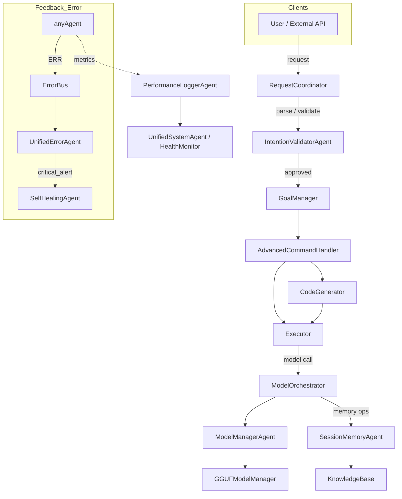
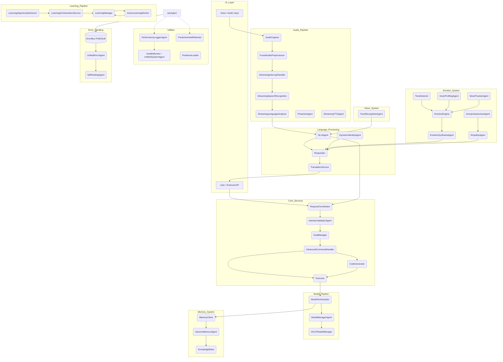
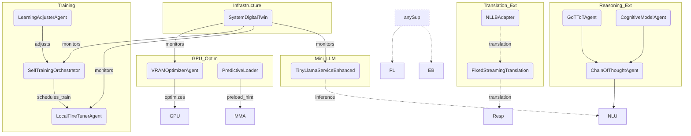

# Key Classes/Services

Ang seksyong ito ay naglilista at nagpapaliwanag ng bawat pangunahing class/service sa iyong system, pati na ang kanilang responsibilities at paano sila nag-iinteract sa iba. Naka-group ayon sa domain para malinaw at madaling maintindihan.

---

## core_services

### **SystemDigitalTwin**

- **Main Class:** `SystemDigitalTwin`
- **Role:** Digital “twin” o central model ng buong system state. Naglalaman ng pinaka-updated na impormasyon tungkol sa lahat ng agents, resources, at status ng system.
- **Responsibilities:**
  - Mag-serve ng real-time system status sa ibang agents.
  - Mag-track ng health, availability, at configuration ng bawat agent/service.
  - Mag-log ng system-wide events at state changes.
- **Interactions:**
  - Tumatanggap ng queries mula sa `RequestCoordinator`, `UnifiedSystemAgent`, at iba pang agents via ZMQ.
  - Nagbibigay ng system snapshot o state info kapag ni-request.

---

### **RequestCoordinator**

- **Main Class:** `RequestCoordinator`
- **Role:** Central dispatcher at orchestrator ng tasks at requests sa buong system. Siya ang tumutukoy kung aling agent/service ang dapat mag-handle ng isang request.
- **Responsibilities:**
  - Tumanggap ng mga external o internal requests (user commands, system events).
  - I-route ang mga requests sa tamang agent/service.
  - Mag-handle ng dependencies at sequencing ng multi-step tasks.
  - Mag-monitor ng status ng bawat request at magbigay ng feedback.
- **Interactions:**
  - Nakikipag-communicate sa lahat ng core at memory agents (hal. `SystemDigitalTwin`, `SessionMemoryAgent`, `MemoryClient`) via ZMQ.
  - Tumutukoy kung sino ang dapat sumagot sa isang request at nagmo-monitor ng completion.

---

### **UnifiedSystemAgent**

- **Main Class:** `UnifiedSystemAgent`
- **Role:** System supervisor at health/status monitor ng lahat ng agents at services. Siya ang “watchdog” at system-level manager.
- **Responsibilities:**
  - Mag-monitor ng health/status ng lahat ng agents/services.
  - Mag-initiate ng restart, recovery, o health check kapag may problema.
  - Mag-log at mag-report ng system-level events.
  - Mag-handle ng system-wide commands (e.g., shutdown, restart all, diagnostics).
- **Interactions:**
  - Nakikipag-ugnayan sa lahat ng core at memory agents para mag-monitor at mag-manage ng system health.
  - Nagpapadala ng alerts o commands kapag may anomaly na na-detect.

---

## memory_system

### **MemoryClient**

- **Main Class:** `MemoryClient`
- **Role:** Gateway para sa lahat ng memory-related operations (add, get, update, delete). Siya ang “front-end” ng memory subsystem.
- **Responsibilities:**
  - Tumanggap ng memory requests mula sa ibang agents/services.
  - I-forward ang requests sa tamang memory agent (`SessionMemoryAgent`, `KnowledgeBase`).
  - Mag-handle ng caching, retries, at error handling para sa memory operations.
- **Interactions:**
  - Nag-iinitiate ng ZMQ requests papunta sa `SessionMemoryAgent` at `KnowledgeBase`.
  - Nagbabalik ng results/data sa requesting agent.

---

### **SessionMemoryAgent**

- **Main Class:** `SessionMemoryAgent`
- **Role:** Tagapamahala ng session-specific memory (short-term, context-aware). Responsable sa pag-store at pag-retrieve ng session data na nauugnay sa kasalukuyang user/session context.
- **Responsibilities:**
  - Mag-store ng temporary/session memories.
  - Mag-retrieve ng context-aware data para sa active session.
  - Mag-handle ng session lifecycle (create, update, delete session data).
  - Mag-invalidate o i-update ang memory cache kapag may changes.
- **Interactions:**
  - Tumatanggap ng requests mula sa `MemoryClient` (at minsan mula sa `RequestCoordinator`).
  - Maaaring mag-query o mag-update ng data sa `KnowledgeBase` para sa long-term storage.

---

### **KnowledgeBase**

- **Main Class:** `KnowledgeBase`
- **Role:** Persistent knowledge store ng buong system (long-term memory, facts, world knowledge).
- **Responsibilities:**
  - Mag-store ng permanenteng knowledge/facts.
  - Mag-handle ng complex queries at retrieval ng structured knowledge.
  - Mag-sync ng data mula sa session memory kapag kailangan.
- **Interactions:**
  - Tumatanggap ng queries mula sa `MemoryClient`, `SessionMemoryAgent`, at iba pang agents.
  - Nagbabalik ng knowledge/facts sa mga requesting agents/services.

---

## utility_services

### **CodeGenerator**

- **Main Class:** `CodeGenerator`
- **Role:** Gumagawa ng code snippets o scripts batay sa request ng ibang agents.
- **Responsibilities:**
  - Tumanggap ng code generation requests mula sa agents/services.
  - Mag-generate ng code, script, o template batay sa input parameters.
  - Magbalik ng generated code sa requesting agent/service.
- **Interactions:**
  - Tumatanggap ng requests mula sa agents gaya ng `AdvancedCommandHandler` at iba pang utility agents via ZMQ.

### **SelfTrainingOrchestrator**

- **Main Class:** `SelfTrainingOrchestrator`
- **Role:** Nag-o-orchestrate ng self-training tasks para sa AI models (hal. auto-labeling, retraining, model improvement).
- **Responsibilities:**
  - Mag-schedule at mag-monitor ng self-training jobs.
  - Mag-manage ng training data at retraining pipeline.
  - Mag-log ng training progress at results.
- **Interactions:**
  - Nakikipag-ugnayan sa `ModelManagerAgent`, `GGUFModelManager`, at iba pang model-related agents para i-trigger o i-monitor ang training.

---

## ai_models_gpu_services

### **GGUFModelManager**

- **Main Class:** `GGUFModelManager`
- **Role:** Nagma-manage ng GGUF-format AI models (usually LLMs or vision models) para sa GPU deployment.
- **Responsibilities:**
  - Mag-load, mag-unload, at mag-update ng GGUF models sa GPU.
  - Mag-track ng available models at status ng bawat isa.
- **Interactions:**
  - Nakikipag-ugnayan sa `ModelManagerAgent` para sa model orchestration.
  - Tumutugon sa requests mula sa agents na nangangailangan ng inference o model info.

### **ModelManagerAgent**

- **Main Class:** `ModelManagerAgent`
- **Role:** Central orchestrator ng lahat ng AI model lifecycle events (deployment, update, health monitoring).
- **Responsibilities:**
  - Mag-initiate ng model load/unload, update, at health checks.
  - Mag-handle ng model versioning at compatibility.
- **Interactions:**
  - Nakikipag-communicate sa `GGUFModelManager`, `VRAMOptimizerAgent`, at `PredictiveLoader` para sa resource allocation at model management.

### **VRAMOptimizerAgent**

- **Main Class:** `VRAMOptimizerAgent`
- **Role:** Nag-o-optimize ng GPU VRAM usage para sa efficient model deployment at inference.
- **Responsibilities:**
  - Mag-monitor at mag-allocate ng VRAM resources.
  - Mag-trigger ng model unload/reload para maiwasan ang VRAM exhaustion.
- **Interactions:**
  - Nakikipag-ugnayan sa `ModelManagerAgent` at `GGUFModelManager` para sa dynamic resource management.

### **PredictiveLoader**

- **Main Class:** `PredictiveLoader`
- **Role:** Nagpe-predict kung anong models ang kailangang i-preload batay sa usage patterns at upcoming tasks.
- **Responsibilities:**
  - Mag-analyze ng usage logs at system events.
  - Mag-preemptively mag-load ng models sa GPU para sa mabilis na response time.
- **Interactions:**
  - Nagbibigay ng preload recommendations sa `ModelManagerAgent` at `GGUFModelManager`.

---

## vision_system

### **FaceRecognitionAgent**

- **Main Class:** `FaceRecognitionAgent`
- **Role:** Nagde-detect at nagre-recognize ng faces mula sa image o video input.
- **Responsibilities:**
  - Mag-process ng image/video frames para maghanap ng faces.
  - Mag-match ng detected faces sa database o memory.
  - Magbalik ng face recognition results sa requesting agent/service.
- **Interactions:**
  - Tumatanggap ng requests mula sa agents gaya ng `Responder`, `UnifiedSystemAgent`, o external input modules.
  - Maaaring mag-query sa `KnowledgeBase` para sa face metadata.

---

## Summary Table (Quick Reference)

| Group                  | Class/Service            | Role (Summary)                   | Interacts With                                         |
| ---------------------- | ------------------------ | -------------------------------- | ------------------------------------------------------ |
| core_services          | SystemDigitalTwin        | System state/info provider       | All core/memory agents                                 |
| core_services          | RequestCoordinator       | Task dispatcher/orchestrator     | All agents/services                                    |
| core_services          | UnifiedSystemAgent       | System supervisor/health monitor | All agents/services                                    |
| memory_system          | MemoryClient             | Memory API gateway               | SessionMemoryAgent, KnowledgeBase                      |
| memory_system          | SessionMemoryAgent       | Session/context memory manager   | MemoryClient, KnowledgeBase                            |
| memory_system          | KnowledgeBase            | Long-term knowledge store        | MemoryClient, SessionMemoryAgent                       |
| utility_services       | CodeGenerator            | Code/script generator            | AdvancedCommandHandler, other agents                   |
| utility_services       | SelfTrainingOrchestrator | Self-training orchestrator       | ModelManagerAgent, GGUFModelManager                    |
| ai_models_gpu_services | GGUFModelManager         | GGUF model manager (GPU)         | ModelManagerAgent, VRAMOptimizerAgent                  |
| ai_models_gpu_services | ModelManagerAgent        | Model lifecycle orchestrator     | GGUFModelManager, VRAMOptimizerAgent, PredictiveLoader |
| ai_models_gpu_services | VRAMOptimizerAgent       | GPU VRAM optimizer               | ModelManagerAgent, GGUFModelManager                    |
| ai_models_gpu_services | PredictiveLoader         | Predictive model preloader       | ModelManagerAgent, GGUFModelManager                    |
| vision_system          | FaceRecognitionAgent     | Face detection/recognition       | Responder, UnifiedSystemAgent, KnowledgeBase           |

---

## learning_knowledge

### **ModelEvaluationFramework**

- **Main Class:** `ModelEvaluationFramework`
- **Role:** Nagbibigay ng standardized evaluation at benchmarking ng AI models sa system.
- **Responsibilities:**
  - Magpatakbo ng evaluation tasks (accuracy, robustness, fairness, etc.) sa iba't ibang models.
  - Mag-aggregate at mag-report ng evaluation metrics.
  - Mag-store ng evaluation results para sa analysis at comparison.
- **Interactions:**
  - Nakikipag-ugnayan sa `ModelManagerAgent`, `LearningManager`, at iba pang model-related agents para mag-trigger o mag-log ng evaluations.

### **LearningOrchestrationService**

- **Main Class:** `LearningOrchestrationService`
- **Role:** Central coordinator ng lahat ng learning activities (training, retraining, adaptation).
- **Responsibilities:**
  - Mag-schedule at mag-orchestrate ng learning jobs across agents/models.
  - Mag-handle ng dependencies at sequencing ng multi-stage learning pipelines.
  - Mag-log ng learning progress at outcomes.
- **Interactions:**
  - Nakikipag-ugnayan sa `LearningManager`, `ModelManagerAgent`, `ActiveLearningMonitor`, at iba pang learning agents.

### **LearningOpportunityDetector**

- **Main Class:** `LearningOpportunityDetector`
- **Role:** Nagmo-monitor ng system events at data para maghanap ng opportunities for learning/improvement.
- **Responsibilities:**
  - Mag-analyze ng logs, feedback, at system performance para matukoy kung kailan at saan kailangan ng retraining o adaptation.
  - Mag-generate ng learning triggers/events para sa orchestration service.
- **Interactions:**
  - Nagpapadala ng learning opportunity alerts sa `LearningOrchestrationService` at `LearningManager`.

### **LearningManager**

- **Main Class:** `LearningManager`
- **Role:** Tagapamahala ng buong learning lifecycle ng models (from data curation to deployment).
- **Responsibilities:**
  - Mag-manage ng training data, mag-initiate ng training/retraining, at mag-track ng learning jobs.
  - Mag-update ng model registry at deployment status.
- **Interactions:**
  - Nakikipag-ugnayan sa `LearningOrchestrationService`, `ModelEvaluationFramework`, at `ActiveLearningMonitor`.

### **ActiveLearningMonitor**

- **Main Class:** `ActiveLearningMonitor`
- **Role:** Nagmo-monitor ng data streams at model outputs para mag-trigger ng active learning cycles.
- **Responsibilities:**
  - Mag-identify ng uncertain or novel samples na pwedeng gamitin sa active learning.
  - Mag-trigger ng data labeling, sampling, o retraining events.
- **Interactions:**
  - Nakikipag-ugnayan sa `LearningManager`, `LearningOrchestrationService`, at `LearningAdjusterAgent`.

### **LearningAdjusterAgent**

- **Main Class:** `LearningAdjusterAgent`
- **Role:** Nag-aadjust ng learning parameters at strategies batay sa feedback at performance metrics.
- **Responsibilities:**
  - Mag-tune ng hyperparameters, learning rates, at iba pang settings.
  - Mag-suggest o magpatupad ng strategy changes (hal. switch to different optimizer, adjust batch size).
- **Interactions:**
  - Nakakatanggap ng feedback mula sa `ActiveLearningMonitor`, `LearningManager`, at `ModelEvaluationFramework`.

---

## Updated Summary Table (Quick Reference)

| Group                  | Class/Service                | Role (Summary)                       | Interacts With                                                                |
| ---------------------- | ---------------------------- | ------------------------------------ | ----------------------------------------------------------------------------- |
| core_services          | SystemDigitalTwin            | System state/info provider           | All core/memory agents                                                        |
| core_services          | RequestCoordinator           | Task dispatcher/orchestrator         | All agents/services                                                           |
| core_services          | UnifiedSystemAgent           | System supervisor/health monitor     | All agents/services                                                           |
| memory_system          | MemoryClient                 | Memory API gateway                   | SessionMemoryAgent, KnowledgeBase                                             |
| memory_system          | SessionMemoryAgent           | Session/context memory manager       | MemoryClient, KnowledgeBase                                                   |
| memory_system          | KnowledgeBase                | Long-term knowledge store            | MemoryClient, SessionMemoryAgent                                              |
| utility_services       | CodeGenerator                | Code/script generator                | AdvancedCommandHandler, other agents                                          |
| utility_services       | SelfTrainingOrchestrator     | Self-training orchestrator           | ModelManagerAgent, GGUFModelManager                                           |
| ai_models_gpu_services | GGUFModelManager             | GGUF model manager (GPU)             | ModelManagerAgent, VRAMOptimizerAgent                                         |
| ai_models_gpu_services | ModelManagerAgent            | Model lifecycle orchestrator         | GGUFModelManager, VRAMOptimizerAgent, PredictiveLoader                        |
| ai_models_gpu_services | VRAMOptimizerAgent           | GPU VRAM optimizer                   | ModelManagerAgent, GGUFModelManager                                           |
| ai_models_gpu_services | PredictiveLoader             | Predictive model preloader           | ModelManagerAgent, GGUFModelManager                                           |
| vision_system          | FaceRecognitionAgent         | Face detection/recognition           | Responder, UnifiedSystemAgent, KnowledgeBase                                  |
| learning_knowledge     | ModelEvaluationFramework     | Model evaluation/benchmarking        | ModelManagerAgent, LearningManager                                            |
| learning_knowledge     | LearningOrchestrationService | Learning job orchestrator            | LearningManager, ModelManagerAgent, ActiveLearningMonitor                     |
| learning_knowledge     | LearningOpportunityDetector  | Learning opportunity detector        | LearningOrchestrationService, LearningManager                                 |
| learning_knowledge     | LearningManager              | Learning lifecycle manager           | LearningOrchestrationService, ModelEvaluationFramework, ActiveLearningMonitor |
| learning_knowledge     | ActiveLearningMonitor        | Active learning cycle monitor        | LearningManager, LearningOrchestrationService, LearningAdjusterAgent          |
| learning_knowledge     | LearningAdjusterAgent        | Learning parameter/strategy adjuster | ActiveLearningMonitor, LearningManager, ModelEvaluationFramework              |

---

## language_processing

### **ModelOrchestrator**

- **Main Class:** `ModelOrchestrator`
- **Role:** Central router ng requests para sa iba't ibang language models (LLMs, NLP tools, etc.).
- **Responsibilities:**
  - Tumanggap ng processing requests (text generation, summarization, etc.).
  - I-route ang requests sa tamang model backend.
  - Mag-manage ng model selection, load balancing, at health monitoring.
- **Interactions:**
  - Nakakatanggap ng requests mula sa agents gaya ng `GoalManager`, `NLUAgent`, `AdvancedCommandHandler`, at iba pa.
  - Nakikipag-ugnayan sa model backend services at GPU model managers.

### **GoalManager**

- **Main Class:** `GoalManager`
- **Role:** Nagta-track at nagma-manage ng user/system goals at objectives.
- **Responsibilities:**
  - Mag-store, mag-update, at mag-query ng goals.
  - Mag-trigger ng actions o workflows batay sa goal progress.
- **Interactions:**
  - Nakikipag-ugnayan sa `IntentionValidatorAgent`, `NLUAgent`, at `RequestCoordinator` para sa goal execution.

### **IntentionValidatorAgent**

- **Main Class:** `IntentionValidatorAgent`
- **Role:** Nagva-validate ng intentions ng user/system bago magpatuloy sa action.
- **Responsibilities:**
  - Mag-analyze ng incoming requests/commands para matukoy kung valid at feasible ang intention.
  - Magbalik ng validation result (approve, reject, clarify needed).
- **Interactions:**
  - Tumutanggap ng requests mula sa `GoalManager`, `NLUAgent`, at `AdvancedCommandHandler`.
  - Nagpapadala ng validation feedback sa requesting agent.

### **NLUAgent**

- **Main Class:** `NLUAgent`
- **Role:** Natural Language Understanding agent; nagpa-parse at nag-iinterpret ng user input.
- **Responsibilities:**
  - Mag-extract ng intents, entities, at context mula sa text input.
  - Mag-convert ng raw input sa structured command/request.
- **Interactions:**
  - Nakakatanggap ng input mula sa user-facing modules at agents gaya ng `ChitchatAgent`, `FeedbackHandler`, at `Responder`.
  - Nagpapasa ng parsed data sa `GoalManager`, `AdvancedCommandHandler`, at iba pa.

### **AdvancedCommandHandler**

- **Main Class:** `AdvancedCommandHandler`
- **Role:** Nagha-handle ng complex o multi-step commands mula sa user/system.
- **Responsibilities:**
  - Mag-parse at mag-execute ng advanced commands na nangangailangan ng sequencing o branching logic.
  - Mag-coordinate ng execution sa iba't ibang agents/services.
- **Interactions:**
  - Tumutanggap ng parsed commands mula sa `NLUAgent` at `GoalManager`.
  - Nakikipag-ugnayan sa `CodeGenerator`, `RequestCoordinator`, at iba pang execution agents.

### **ChitchatAgent**

- **Main Class:** `ChitchatAgent`
- **Role:** Nagha-handle ng casual conversation at small talk.
- **Responsibilities:**
  - Mag-generate ng natural, context-aware responses sa casual/user-initiated chat.
  - Mag-maintain ng conversational context.
- **Interactions:**
  - Tumutanggap ng input mula sa user at `NLUAgent`.
  - Maaaring mag-query sa `ModelOrchestrator` para sa LLM-based responses.

### **FeedbackHandler**

- **Main Class:** `FeedbackHandler`
- **Role:** Nagko-collect at nagpo-process ng feedback mula sa user o system.
- **Responsibilities:**
  - Mag-store ng feedback, mag-analyze ng sentiment, mag-generate ng improvement suggestions.
- **Interactions:**
  - Tumutanggap ng feedback mula sa user, `NLUAgent`, at `Responder`.
  - Nagpapasa ng insights sa `GoalManager`, `RequestCoordinator`, at iba pa.

### **Responder**

- **Main Class:** `Responder`
- **Role:** Nagbibigay ng final responses sa user/system batay sa processed input at context.
- **Responsibilities:**
  - Mag-compose ng responses gamit ang info mula sa iba't ibang agents (NLU, EmotionEngine, Translation, atbp).
  - Magpadala ng output sa user interface o external system.
- **Interactions:**
  - Tumutanggap ng data mula sa `NLUAgent`, `EmotionEngine`, `TranslationService`, at iba pa.
  - Nagpapadala ng final output sa user o external API.

### **TranslationService**

- **Main Class:** `TranslationService`
- **Role:** Nagta-translate ng text/data sa iba't ibang language.
- **Responsibilities:**
  - Mag-handle ng translation requests (single/multi-turn).
  - Mag-support ng multilingual workflows.
- **Interactions:**
  - Tumutanggap ng requests mula sa `Responder`, `NLUAgent`, at iba pang agents na nangangailangan ng translation.

### **DynamicIdentityAgent**

- **Main Class:** `DynamicIdentityAgent`
- **Role:** Nagma-manage ng dynamic persona o identity profiles ng system/user.
- **Responsibilities:**
  - Mag-switch, mag-update, at mag-track ng active persona/identity settings.
  - Mag-adapt ng responses/behavior batay sa active identity.
- **Interactions:**
  - Nakikipag-ugnayan sa `Responder`, `ChitchatAgent`, at `NLUAgent` para i-adjust ang system behavior.

---

## Updated Summary Table (Quick Reference)

| Group                  | Class/Service                | Role (Summary)                       | Interacts With                                                                 |
| ---------------------- | ---------------------------- | ------------------------------------ | ------------------------------------------------------------------------------ |
| core_services          | SystemDigitalTwin            | System state/info provider           | All core/memory agents                                                         |
| core_services          | RequestCoordinator           | Task dispatcher/orchestrator         | All agents/services                                                            |
| core_services          | UnifiedSystemAgent           | System supervisor/health monitor     | All agents/services                                                            |
| memory_system          | MemoryClient                 | Memory API gateway                   | SessionMemoryAgent, KnowledgeBase                                              |
| memory_system          | SessionMemoryAgent           | Session/context memory manager       | MemoryClient, KnowledgeBase                                                    |
| memory_system          | KnowledgeBase                | Long-term knowledge store            | MemoryClient, SessionMemoryAgent                                               |
| utility_services       | CodeGenerator                | Code/script generator                | AdvancedCommandHandler, other agents                                           |
| utility_services       | SelfTrainingOrchestrator     | Self-training orchestrator           | ModelManagerAgent, GGUFModelManager                                            |
| ai_models_gpu_services | GGUFModelManager             | GGUF model manager (GPU)             | ModelManagerAgent, VRAMOptimizerAgent                                          |
| ai_models_gpu_services | ModelManagerAgent            | Model lifecycle orchestrator         | GGUFModelManager, VRAMOptimizerAgent, PredictiveLoader                         |
| ai_models_gpu_services | VRAMOptimizerAgent           | GPU VRAM optimizer                   | ModelManagerAgent, GGUFModelManager                                            |
| ai_models_gpu_services | PredictiveLoader             | Predictive model preloader           | ModelManagerAgent, GGUFModelManager                                            |
| vision_system          | FaceRecognitionAgent         | Face detection/recognition           | Responder, UnifiedSystemAgent, KnowledgeBase                                   |
| learning_knowledge     | ModelEvaluationFramework     | Model evaluation/benchmarking        | ModelManagerAgent, LearningManager                                             |
| learning_knowledge     | LearningOrchestrationService | Learning job orchestrator            | LearningManager, ModelManagerAgent, ActiveLearningMonitor                      |
| learning_knowledge     | LearningOpportunityDetector  | Learning opportunity detector        | LearningOrchestrationService, LearningManager                                  |
| learning_knowledge     | LearningManager              | Learning lifecycle manager           | LearningOrchestrationService, ModelEvaluationFramework, ActiveLearningMonitor  |
| learning_knowledge     | ActiveLearningMonitor        | Active learning cycle monitor        | LearningManager, LearningOrchestrationService, LearningAdjusterAgent           |
| learning_knowledge     | LearningAdjusterAgent        | Learning parameter/strategy adjuster | ActiveLearningMonitor, LearningManager, ModelEvaluationFramework               |
| language_processing    | ModelOrchestrator            | LLM/NLP model router                 | GoalManager, NLUAgent, AdvancedCommandHandler, model backends                  |
| language_processing    | GoalManager                  | Goal/objective manager               | IntentionValidatorAgent, NLUAgent, RequestCoordinator                          |
| language_processing    | IntentionValidatorAgent      | Intention validator                  | GoalManager, NLUAgent, AdvancedCommandHandler                                  |
| language_processing    | NLUAgent                     | NLU parser/interpreter               | ChitchatAgent, FeedbackHandler, Responder, GoalManager, AdvancedCommandHandler |
| language_processing    | AdvancedCommandHandler       | Complex command executor             | NLUAgent, GoalManager, CodeGenerator, RequestCoordinator                       |
| language_processing    | ChitchatAgent                | Casual conversation handler          | User, NLUAgent, ModelOrchestrator                                              |
| language_processing    | FeedbackHandler              | Feedback collector/processor         | User, NLUAgent, Responder, GoalManager, RequestCoordinator                     |
| language_processing    | Responder                    | Final response composer              | NLUAgent, EmotionEngine, TranslationService, user                              |
| language_processing    | TranslationService           | Text/data translator                 | Responder, NLUAgent, other agents                                              |
| language_processing    | DynamicIdentityAgent         | Persona/identity manager             | Responder, ChitchatAgent, NLUAgent                                             |

---

## audio_processing

### **AudioCapture**

- **Main Class:** `AudioCapture`
- **Role:** Responsible for capturing raw audio streams from input devices (e.g., microphone).
- **Responsibilities:**
  - Mag-initialize at mag-manage ng audio input hardware.
  - Mag-stream ng raw audio data sa downstream processors.
- **Interactions:**
  - Nagpapasa ng audio frames sa `FusedAudioPreprocessor` at iba pang preprocessing agents.

### **FusedAudioPreprocessor**

- **Main Class:** `FusedAudioPreprocessor`
- **Role:** Nagpe-preprocess ng audio data (noise reduction, normalization, etc.) bago ito i-stream sa recognition modules.
- **Responsibilities:**
  - Mag-apply ng audio filters at enhancement techniques.
  - Maghanda ng audio para sa speech recognition at analysis.
- **Interactions:**
  - Tumatanggap ng raw audio mula sa `AudioCapture`.
  - Nagpapasa ng processed audio sa `StreamingInterruptHandler` at `StreamingSpeechRecognition`.

### **StreamingInterruptHandler**

- **Main Class:** `StreamingInterruptHandler`
- **Role:** Nagha-handle ng audio stream interruptions, silence detection, at user barge-in events.
- **Responsibilities:**
  - Mag-detect ng interruptions o silence sa audio stream.
  - Mag-trigger ng control events (pause, resume, stop) sa recognition pipeline.
- **Interactions:**
  - Nakakatanggap ng processed audio mula sa `FusedAudioPreprocessor`.
  - Nakikipag-ugnayan sa `StreamingSpeechRecognition` at `ProactiveAgent` para sa interruption logic.

### **StreamingSpeechRecognition**

- **Main Class:** `StreamingSpeechRecognition`
- **Role:** Real-time speech-to-text conversion ng audio streams.
- **Responsibilities:**
  - Mag-transcribe ng streaming audio sa text.
  - Mag-handle ng partial/final transcription outputs.
- **Interactions:**
  - Tumatanggap ng audio mula sa `FusedAudioPreprocessor` o `StreamingInterruptHandler`.
  - Nagpapasa ng transcribed text sa `StreamingLanguageAnalyzer`, `WakeWordDetector`, at downstream agents.

### **StreamingTTSAgent**

- **Main Class:** `StreamingTTSAgent`
- **Role:** Nagco-convert ng text outputs pabalik sa real-time streaming speech (Text-to-Speech).
- **Responsibilities:**
  - Mag-generate ng audio output mula sa text responses.
  - Mag-stream ng synthesized speech sa output devices.
- **Interactions:**
  - Tumatanggap ng text mula sa `Responder`, `ProactiveAgent`, o iba pang agents.
  - Nagpapadala ng audio output sa user/device.

### **WakeWordDetector**

- **Main Class:** `WakeWordDetector`
- **Role:** Nagmo-monitor ng audio stream para sa wake word/hotword detection (e.g., "Hey AI").
- **Responsibilities:**
  - Mag-detect ng predefined wake words sa audio.
  - Mag-trigger ng activation events sa buong audio pipeline.
- **Interactions:**
  - Tumatanggap ng audio mula sa `FusedAudioPreprocessor` o `StreamingSpeechRecognition`.
  - Nagpapadala ng activation events sa `ProactiveAgent` o control modules.

### **StreamingLanguageAnalyzer**

- **Main Class:** `StreamingLanguageAnalyzer`
- **Role:** Nag-a-analyze ng real-time transcribed speech para sa intent, sentiment, o command extraction.
- **Responsibilities:**
  - Mag-extract ng intents, commands, o emotion mula sa streaming text.
  - Mag-forward ng analysis results sa decision-making agents.
- **Interactions:**
  - Tumatanggap ng transcribed text mula sa `StreamingSpeechRecognition`.
  - Nagpapasa ng analysis sa `ProactiveAgent`, `NLUAgent`, o iba pang agents.

### **ProactiveAgent**

- **Main Class:** `ProactiveAgent`
- **Role:** Nagmo-monitor ng audio, tasks, at context para mag-trigger ng proactive actions/reminders.
- **Responsibilities:**
  - Mag-monitor ng events, reminders, at user context.
  - Mag-trigger ng proactive prompts, alerts, o actions batay sa audio/context analysis.
- **Interactions:**
  - Nakakatanggap ng events mula sa `StreamingInterruptHandler`, `WakeWordDetector`, `StreamingLanguageAnalyzer`.
  - Nakikipag-ugnayan sa core at language agents para mag-initiate ng proactive flows.

---

## Updated Summary Table (Quick Reference)

| Group                  | Class/Service                | Role (Summary)                       | Interacts With                                                                               |
| ---------------------- | ---------------------------- | ------------------------------------ | -------------------------------------------------------------------------------------------- |
| core_services          | SystemDigitalTwin            | System state/info provider           | All core/memory agents                                                                       |
| core_services          | RequestCoordinator           | Task dispatcher/orchestrator         | All agents/services                                                                          |
| core_services          | UnifiedSystemAgent           | System supervisor/health monitor     | All agents/services                                                                          |
| memory_system          | MemoryClient                 | Memory API gateway                   | SessionMemoryAgent, KnowledgeBase                                                            |
| memory_system          | SessionMemoryAgent           | Session/context memory manager       | MemoryClient, KnowledgeBase                                                                  |
| memory_system          | KnowledgeBase                | Long-term knowledge store            | MemoryClient, SessionMemoryAgent                                                             |
| utility_services       | CodeGenerator                | Code/script generator                | AdvancedCommandHandler, other agents                                                         |
| utility_services       | SelfTrainingOrchestrator     | Self-training orchestrator           | ModelManagerAgent, GGUFModelManager                                                          |
| ai_models_gpu_services | GGUFModelManager             | GGUF model manager (GPU)             | ModelManagerAgent, VRAMOptimizerAgent                                                        |
| ai_models_gpu_services | ModelManagerAgent            | Model lifecycle orchestrator         | GGUFModelManager, VRAMOptimizerAgent, PredictiveLoader                                       |
| ai_models_gpu_services | VRAMOptimizerAgent           | GPU VRAM optimizer                   | ModelManagerAgent, GGUFModelManager                                                          |
| ai_models_gpu_services | PredictiveLoader             | Predictive model preloader           | ModelManagerAgent, GGUFModelManager                                                          |
| vision_system          | FaceRecognitionAgent         | Face detection/recognition           | Responder, UnifiedSystemAgent, KnowledgeBase                                                 |
| learning_knowledge     | ModelEvaluationFramework     | Model evaluation/benchmarking        | ModelManagerAgent, LearningManager                                                           |
| learning_knowledge     | LearningOrchestrationService | Learning job orchestrator            | LearningManager, ModelManagerAgent, ActiveLearningMonitor                                    |
| learning_knowledge     | LearningOpportunityDetector  | Learning opportunity detector        | LearningOrchestrationService, LearningManager                                                |
| learning_knowledge     | LearningManager              | Learning lifecycle manager           | LearningOrchestrationService, ModelEvaluationFramework, ActiveLearningMonitor                |
| learning_knowledge     | ActiveLearningMonitor        | Active learning cycle monitor        | LearningManager, LearningOrchestrationService, LearningAdjusterAgent                         |
| learning_knowledge     | LearningAdjusterAgent        | Learning parameter/strategy adjuster | ActiveLearningMonitor, LearningManager, ModelEvaluationFramework                             |
| language_processing    | ModelOrchestrator            | LLM/NLP model router                 | GoalManager, NLUAgent, AdvancedCommandHandler, model backends                                |
| language_processing    | GoalManager                  | Goal/objective manager               | IntentionValidatorAgent, NLUAgent, RequestCoordinator                                        |
| language_processing    | IntentionValidatorAgent      | Intention validator                  | GoalManager, NLUAgent, AdvancedCommandHandler                                                |
| language_processing    | NLUAgent                     | NLU parser/interpreter               | ChitchatAgent, FeedbackHandler, Responder, GoalManager, AdvancedCommandHandler               |
| language_processing    | AdvancedCommandHandler       | Complex command executor             | NLUAgent, GoalManager, CodeGenerator, RequestCoordinator                                     |
| language_processing    | ChitchatAgent                | Casual conversation handler          | User, NLUAgent, ModelOrchestrator                                                            |
| language_processing    | FeedbackHandler              | Feedback collector/processor         | User, NLUAgent, Responder, GoalManager, RequestCoordinator                                   |
| language_processing    | Responder                    | Final response composer              | NLUAgent, EmotionEngine, TranslationService, user                                            |
| language_processing    | TranslationService           | Text/data translator                 | Responder, NLUAgent, other agents                                                            |
| language_processing    | DynamicIdentityAgent         | Persona/identity manager             | Responder, ChitchatAgent, NLUAgent                                                           |
| audio_processing       | AudioCapture                 | Audio input capture                  | FusedAudioPreprocessor                                                                       |
| audio_processing       | FusedAudioPreprocessor       | Audio preprocessing                  | AudioCapture, StreamingInterruptHandler, StreamingSpeechRecognition                          |
| audio_processing       | StreamingInterruptHandler    | Stream interruption handler          | FusedAudioPreprocessor, StreamingSpeechRecognition, ProactiveAgent                           |
| audio_processing       | StreamingSpeechRecognition   | Streaming speech-to-text             | FusedAudioPreprocessor, StreamingLanguageAnalyzer, WakeWordDetector                          |
| audio_processing       | StreamingTTSAgent            | Streaming text-to-speech             | Responder, ProactiveAgent                                                                    |
| audio_processing       | WakeWordDetector             | Wake word/hotword detector           | FusedAudioPreprocessor, StreamingSpeechRecognition, ProactiveAgent                           |
| audio_processing       | StreamingLanguageAnalyzer    | Streaming intent/sentiment analyzer  | StreamingSpeechRecognition, ProactiveAgent, NLUAgent                                         |
| audio_processing       | ProactiveAgent               | Proactive tasks/events agent         | StreamingInterruptHandler, WakeWordDetector, StreamingLanguageAnalyzer, core/language agents |

---

## emotion_system

### **EmotionEngine**

- **Main Class:** `EmotionEngine`
- **Role:** Central analyzer ng emotional cues mula sa input data (text, speech, etc.).
- **Responsibilities:**
  - Mag-detect at mag-interpret ng emotions mula sa text, audio, o context.
  - Magbigay ng emotion analysis sa ibang agents/services.
- **Interactions:**
  - Tumatanggap ng input mula sa `Responder`, `NLUAgent`, at iba pang agents.
  - Nagpapasa ng emotion state sa `MoodTrackerAgent`, `EmpathyAgent`, at iba pa.

### **MoodTrackerAgent**

- **Main Class:** `MoodTrackerAgent`
- **Role:** Nagmo-monitor at nagtatala ng mood trends ng user/system over time.
- **Responsibilities:**
  - Mag-track ng mood states at transitions.
  - Mag-log ng mood history at mag-generate ng mood summaries.
- **Interactions:**
  - Nakakatanggap ng emotion analysis mula sa `EmotionEngine`.
  - Nagpapasa ng mood state sa `EmpathyAgent` at `HumanAwarenessAgent`.

### **HumanAwarenessAgent**

- **Main Class:** `HumanAwarenessAgent`
- **Role:** Nag-assess ng human presence, engagement, at awareness sa interaction loop.
- **Responsibilities:**
  - Mag-detect ng user attention, engagement, o fatigue.
  - Mag-adapt ng interaction strategies batay sa awareness state.
- **Interactions:**
  - Tumatanggap ng mood/emotion context mula sa `MoodTrackerAgent` at `EmotionEngine`.
  - Nagpapadala ng awareness feedback sa `Responder`, `EmpathyAgent`, o core agents.

### **ToneDetector**

- **Main Class:** `ToneDetector`
- **Role:** Nag-a-analyze ng tone ng boses o text para sa emotion at intent.
- **Responsibilities:**
  - Mag-classify ng tone (e.g., happy, angry, neutral) mula sa audio/text.
  - Magbigay ng tone insights para sa response adaptation.
- **Interactions:**
  - Nakakatanggap ng audio/text mula sa `EmotionEngine`, `VoiceProfilingAgent`, o `NLUAgent`.
  - Nagpapasa ng tone analysis sa `Responder`, `EmpathyAgent`, o `EmotionSynthesisAgent`.

### **VoiceProfilingAgent**

- **Main Class:** `VoiceProfilingAgent`
- **Role:** Nagbuo ng voice profile para sa speaker identification at emotion context.
- **Responsibilities:**
  - Mag-extract ng speaker features (pitch, timbre, etc.).
  - Mag-profile ng voice para sa personalized emotion/context detection.
- **Interactions:**
  - Tumutanggap ng audio mula sa `AudioCapture`, `EmotionEngine`, o `ToneDetector`.
  - Nagpapasa ng voice profile sa `EmpathyAgent` at `EmotionSynthesisAgent`.

### **EmpathyAgent**

- **Main Class:** `EmpathyAgent`
- **Role:** Nag-a-adapt ng system responses batay sa detected emotions, mood, at context.
- **Responsibilities:**
  - Mag-generate ng empathetic responses o suggestions.
  - Mag-adjust ng system behavior batay sa mood/emotion state.
- **Interactions:**
  - Nakakatanggap ng emotion/mood/tone info mula sa `EmotionEngine`, `MoodTrackerAgent`, `ToneDetector`, at `VoiceProfilingAgent`.
  - Nagpapasa ng empathy-driven responses sa `Responder` o `EmotionSynthesisAgent`.

### **EmotionSynthesisAgent**

- **Main Class:** `EmotionSynthesisAgent`
- **Role:** Nagge-generate ng expressive outputs (voice, text, etc.) na may tamang emotion/mood.
- **Responsibilities:**
  - Mag-synthesize ng emotion sa voice/text outputs.
  - Mag-adapt ng delivery style batay sa desired emotion.
- **Interactions:**
  - Tumutanggap ng emotion/tone/context mula sa `EmpathyAgent`, `ToneDetector`, `VoiceProfilingAgent`.
  - Nagpapadala ng synthesized output sa `Responder`, `StreamingTTSAgent`, o user interface.

---

## Updated Summary Table (Quick Reference)

| Group                  | Class/Service                | Role (Summary)                       | Interacts With                                                                                       |
| ---------------------- | ---------------------------- | ------------------------------------ | ---------------------------------------------------------------------------------------------------- |
| core_services          | SystemDigitalTwin            | System state/info provider           | All core/memory agents                                                                               |
| core_services          | RequestCoordinator           | Task dispatcher/orchestrator         | All agents/services                                                                                  |
| core_services          | UnifiedSystemAgent           | System supervisor/health monitor     | All agents/services                                                                                  |
| memory_system          | MemoryClient                 | Memory API gateway                   | SessionMemoryAgent, KnowledgeBase                                                                    |
| memory_system          | SessionMemoryAgent           | Session/context memory manager       | MemoryClient, KnowledgeBase                                                                          |
| memory_system          | KnowledgeBase                | Long-term knowledge store            | MemoryClient, SessionMemoryAgent                                                                     |
| utility_services       | CodeGenerator                | Code/script generator                | AdvancedCommandHandler, other agents                                                                 |
| utility_services       | SelfTrainingOrchestrator     | Self-training orchestrator           | ModelManagerAgent, GGUFModelManager                                                                  |
| ai_models_gpu_services | GGUFModelManager             | GGUF model manager (GPU)             | ModelManagerAgent, VRAMOptimizerAgent                                                                |
| ai_models_gpu_services | ModelManagerAgent            | Model lifecycle orchestrator         | GGUFModelManager, VRAMOptimizerAgent, PredictiveLoader                                               |
| ai_models_gpu_services | VRAMOptimizerAgent           | GPU VRAM optimizer                   | ModelManagerAgent, GGUFModelManager                                                                  |
| ai_models_gpu_services | PredictiveLoader             | Predictive model preloader           | ModelManagerAgent, GGUFModelManager                                                                  |
| vision_system          | FaceRecognitionAgent         | Face detection/recognition           | Responder, UnifiedSystemAgent, KnowledgeBase                                                         |
| learning_knowledge     | ModelEvaluationFramework     | Model evaluation/benchmarking        | ModelManagerAgent, LearningManager                                                                   |
| learning_knowledge     | LearningOrchestrationService | Learning job orchestrator            | LearningManager, ModelManagerAgent, ActiveLearningMonitor                                            |
| learning_knowledge     | LearningOpportunityDetector  | Learning opportunity detector        | LearningOrchestrationService, LearningManager                                                        |
| learning_knowledge     | LearningManager              | Learning lifecycle manager           | LearningOrchestrationService, ModelEvaluationFramework, ActiveLearningMonitor                        |
| learning_knowledge     | ActiveLearningMonitor        | Active learning cycle monitor        | LearningManager, LearningOrchestrationService, LearningAdjusterAgent                                 |
| learning_knowledge     | LearningAdjusterAgent        | Learning parameter/strategy adjuster | ActiveLearningMonitor, LearningManager, ModelEvaluationFramework                                     |
| language_processing    | ModelOrchestrator            | LLM/NLP model router                 | GoalManager, NLUAgent, AdvancedCommandHandler, model backends                                        |
| language_processing    | GoalManager                  | Goal/objective manager               | IntentionValidatorAgent, NLUAgent, RequestCoordinator                                                |
| language_processing    | IntentionValidatorAgent      | Intention validator                  | GoalManager, NLUAgent, AdvancedCommandHandler                                                        |
| language_processing    | NLUAgent                     | NLU parser/interpreter               | ChitchatAgent, FeedbackHandler, Responder, GoalManager, AdvancedCommandHandler                       |
| language_processing    | AdvancedCommandHandler       | Complex command executor             | NLUAgent, GoalManager, CodeGenerator, RequestCoordinator                                             |
| language_processing    | ChitchatAgent                | Casual conversation handler          | User, NLUAgent, ModelOrchestrator                                                                    |
| language_processing    | FeedbackHandler              | Feedback collector/processor         | User, NLUAgent, Responder, GoalManager, RequestCoordinator                                           |
| language_processing    | Responder                    | Final response composer              | NLUAgent, EmotionEngine, TranslationService, user                                                    |
| language_processing    | TranslationService           | Text/data translator                 | Responder, NLUAgent, other agents                                                                    |
| language_processing    | DynamicIdentityAgent         | Persona/identity manager             | Responder, ChitchatAgent, NLUAgent                                                                   |
| audio_processing       | AudioCapture                 | Audio input capture                  | FusedAudioPreprocessor                                                                               |
| audio_processing       | FusedAudioPreprocessor       | Audio preprocessing                  | AudioCapture, StreamingInterruptHandler, StreamingSpeechRecognition                                  |
| audio_processing       | StreamingInterruptHandler    | Stream interruption handler          | FusedAudioPreprocessor, StreamingSpeechRecognition, ProactiveAgent                                   |
| audio_processing       | StreamingSpeechRecognition   | Streaming speech-to-text             | FusedAudioPreprocessor, StreamingLanguageAnalyzer, WakeWordDetector                                  |
| audio_processing       | StreamingTTSAgent            | Streaming text-to-speech             | Responder, ProactiveAgent                                                                            |
| audio_processing       | WakeWordDetector             | Wake word/hotword detector           | FusedAudioPreprocessor, StreamingSpeechRecognition, ProactiveAgent                                   |
| audio_processing       | StreamingLanguageAnalyzer    | Streaming intent/sentiment analyzer  | StreamingSpeechRecognition, ProactiveAgent, NLUAgent                                                 |
| audio_processing       | ProactiveAgent               | Proactive tasks/events agent         | StreamingInterruptHandler, WakeWordDetector, StreamingLanguageAnalyzer, core/language agents         |
| emotion_system         | EmotionEngine                | Emotion analysis engine              | Responder, NLUAgent, MoodTrackerAgent, EmpathyAgent                                                  |
| emotion_system         | MoodTrackerAgent             | Mood state tracker                   | EmotionEngine, EmpathyAgent, HumanAwarenessAgent                                                     |
| emotion_system         | HumanAwarenessAgent          | Human awareness/engagement assessor  | MoodTrackerAgent, EmotionEngine, Responder, EmpathyAgent                                             |
| emotion_system         | ToneDetector                 | Tone analysis (voice/text)           | EmotionEngine, VoiceProfilingAgent, NLUAgent, Responder, EmpathyAgent, EmotionSynthesisAgent         |
| emotion_system         | VoiceProfilingAgent          | Voice profiling/speaker ID           | AudioCapture, EmotionEngine, ToneDetector, EmpathyAgent, EmotionSynthesisAgent                       |
| emotion_system         | EmpathyAgent                 | Empathy-driven response generator    | EmotionEngine, MoodTrackerAgent, ToneDetector, VoiceProfilingAgent, Responder, EmotionSynthesisAgent |
| emotion_system         | EmotionSynthesisAgent        | Emotion/mood synthesis for output    | EmpathyAgent, ToneDetector, VoiceProfilingAgent, Responder, StreamingTTSAgent                        |

---

## utilities_support

### **PredictiveHealthMonitor**

- **Main Class:** `PredictiveHealthMonitor`
- **Role:** Nagmo-monitor at nagpe-predict ng health status ng system components.
- **Responsibilities:**
  - Mag-track ng metrics at mag-detect ng early warning signs.
  - Magbigay ng health predictions at alerts.
- **Interactions:**
  - Nakakatanggap ng metrics mula sa iba't ibang agents/services.
  - Nagpapadala ng alerts sa `UnifiedSystemAgent`, `Executor`, o admin modules.

### **FixedStreamingTranslation**

- **Main Class:** `FixedStreamingTranslation`
- **Role:** Real-time streaming translation ng text/audio na may enhanced reliability.
- **Responsibilities:**
  - Mag-translate ng streaming content (text/audio) sa target language.
  - Mag-handle ng translation errors at retries.
- **Interactions:**
  - Nakakatanggap ng input mula sa `StreamingLanguageAnalyzer`, `Responder`, o user interface.
  - Nagpapasa ng translated output sa downstream agents o user.

### **Executor**

- **Main Class:** `Executor`
- **Role:** Nag-e-execute ng arbitrary tasks, commands, or scripts sa system.
- **Responsibilities:**
  - Mag-handle ng task execution requests mula sa agents/services.
  - Mag-log ng execution results at errors.
- **Interactions:**
  - Nakakatanggap ng execution requests mula sa `RequestCoordinator`, `AdvancedCommandHandler`, o admin agents.
  - Nagpapasa ng results sa requester o monitoring agents.

### **TinyLlamaServiceEnhanced**

- **Main Class:** `TinyLlamaServiceEnhanced`
- **Role:** Lightweight LLM service para sa fast, local inference tasks.
- **Responsibilities:**
  - Mag-provide ng quick LLM inference para sa text, summarization, o classification.
  - Mag-handle ng multiple lightweight requests.
- **Interactions:**
  - Nakakatanggap ng requests mula sa `NLUAgent`, `StreamingLanguageAnalyzer`, `ChainOfThoughtAgent`, o user interface.
  - Nagpapasa ng outputs sa requester agents.

### **LocalFineTunerAgent**

- **Main Class:** `LocalFineTunerAgent`
- **Role:** Nagpe-perform ng local fine-tuning ng models gamit ang user/system data.
- **Responsibilities:**
  - Mag-train/fine-tune ng models on-device.
  - Mag-manage ng training jobs at results.
- **Interactions:**
  - Nakakatanggap ng training data mula sa `LearningManager`, `ModelManagerAgent`, o admin.
  - Nagpapasa ng updated models sa model registry/services.

### **NLLBAdapter**

- **Main Class:** `NLLBAdapter`
- **Role:** Adapter para sa No Language Left Behind (NLLB) translation models.
- **Responsibilities:**
  - Mag-interface sa NLLB models para sa multilingual translation tasks.
  - Mag-handle ng language model selection at routing.
- **Interactions:**
  - Nakakatanggap ng translation requests mula sa `TranslationService`, `FixedStreamingTranslation`, o user interface.
  - Nagpapasa ng translated output sa requester.

## reasoning_services

### **ChainOfThoughtAgent**

- **Main Class:** `ChainOfThoughtAgent`
- **Role:** Nag-o-orchestrate ng stepwise reasoning at multi-hop thinking.
- **Responsibilities:**
  - Mag-breakdown ng complex problems sa reasoning steps.
  - Mag-compose ng chain-of-thought outputs.
- **Interactions:**
  - Nakakatanggap ng prompts mula sa `NLUAgent`, `GoalManager`, o user.
  - Nagpapasa ng stepwise reasoning results sa `Responder`, `CognitiveModelAgent`, o user interface.

### **GoTToTAgent**

- **Main Class:** `GoTToTAgent`
- **Role:** Specialized agent para sa "Game of Thoughts" at tree-of-thought reasoning.
- **Responsibilities:**
  - Mag-perform ng tree-based exploration ng possible solutions.
  - Mag-evaluate ng multiple reasoning branches.
- **Interactions:**
  - Nakakatanggap ng tasks mula sa `ChainOfThoughtAgent`, `CognitiveModelAgent`, o user.
  - Nagpapasa ng best reasoning paths sa requester.

### **CognitiveModelAgent**

- **Main Class:** `CognitiveModelAgent`
- **Role:** Nagmo-model ng cognitive processes at advanced reasoning patterns.
- **Responsibilities:**
  - Mag-simulate ng cognitive models para sa inference at decision-making.
  - Mag-integrate ng outputs mula sa reasoning agents.
- **Interactions:**
  - Nakakatanggap ng inputs mula sa `ChainOfThoughtAgent`, `GoTToTAgent`, o core agents.
  - Nagpapasa ng cognitive outputs sa `Responder`, `GoalManager`, o user interface.

---

## Updated Summary Table (Quick Reference)

| Group                  | Class/Service                | Role (Summary)                        | Interacts With                                                                                       |
| ---------------------- | ---------------------------- | ------------------------------------- | ---------------------------------------------------------------------------------------------------- |
| core_services          | SystemDigitalTwin            | System state/info provider            | All core/memory agents                                                                               |
| core_services          | RequestCoordinator           | Task dispatcher/orchestrator          | All agents/services                                                                                  |
| core_services          | UnifiedSystemAgent           | System supervisor/health monitor      | All agents/services                                                                                  |
| memory_system          | MemoryClient                 | Memory API gateway                    | SessionMemoryAgent, KnowledgeBase                                                                    |
| memory_system          | SessionMemoryAgent           | Session/context memory manager        | MemoryClient, KnowledgeBase                                                                          |
| memory_system          | KnowledgeBase                | Long-term knowledge store             | MemoryClient, SessionMemoryAgent                                                                     |
| utility_services       | CodeGenerator                | Code/script generator                 | AdvancedCommandHandler, other agents                                                                 |
| utility_services       | SelfTrainingOrchestrator     | Self-training orchestrator            | ModelManagerAgent, GGUFModelManager                                                                  |
| ai_models_gpu_services | GGUFModelManager             | GGUF model manager (GPU)              | ModelManagerAgent, VRAMOptimizerAgent                                                                |
| ai_models_gpu_services | ModelManagerAgent            | Model lifecycle orchestrator          | GGUFModelManager, VRAMOptimizerAgent, PredictiveLoader                                               |
| ai_models_gpu_services | VRAMOptimizerAgent           | GPU VRAM optimizer                    | ModelManagerAgent, GGUFModelManager                                                                  |
| ai_models_gpu_services | PredictiveLoader             | Predictive model preloader            | ModelManagerAgent, GGUFModelManager                                                                  |
| vision_system          | FaceRecognitionAgent         | Face detection/recognition            | Responder, UnifiedSystemAgent, KnowledgeBase                                                         |
| learning_knowledge     | ModelEvaluationFramework     | Model evaluation/benchmarking         | ModelManagerAgent, LearningManager                                                                   |
| learning_knowledge     | LearningOrchestrationService | Learning job orchestrator             | LearningManager, ModelManagerAgent, ActiveLearningMonitor                                            |
| learning_knowledge     | LearningOpportunityDetector  | Learning opportunity detector         | LearningOrchestrationService, LearningManager                                                        |
| learning_knowledge     | LearningManager              | Learning lifecycle manager            | LearningOrchestrationService, ModelEvaluationFramework, ActiveLearningMonitor                        |
| learning_knowledge     | ActiveLearningMonitor        | Active learning cycle monitor         | LearningManager, LearningOrchestrationService, LearningAdjusterAgent                                 |
| learning_knowledge     | LearningAdjusterAgent        | Learning parameter/strategy adjuster  | ActiveLearningMonitor, LearningManager, ModelEvaluationFramework                                     |
| language_processing    | ModelOrchestrator            | LLM/NLP model router                  | GoalManager, NLUAgent, AdvancedCommandHandler, model backends                                        |
| language_processing    | GoalManager                  | Goal/objective manager                | IntentionValidatorAgent, NLUAgent, RequestCoordinator                                                |
| language_processing    | IntentionValidatorAgent      | Intention validator                   | GoalManager, NLUAgent, AdvancedCommandHandler                                                        |
| language_processing    | NLUAgent                     | NLU parser/interpreter                | ChitchatAgent, FeedbackHandler, Responder, GoalManager, AdvancedCommandHandler                       |
| language_processing    | AdvancedCommandHandler       | Complex command executor              | NLUAgent, GoalManager, CodeGenerator, RequestCoordinator                                             |
| language_processing    | ChitchatAgent                | Casual conversation handler           | User, NLUAgent, ModelOrchestrator                                                                    |
| language_processing    | FeedbackHandler              | Feedback collector/processor          | User, NLUAgent, Responder, GoalManager, RequestCoordinator                                           |
| language_processing    | Responder                    | Final response composer               | NLUAgent, EmotionEngine, TranslationService, user                                                    |
| language_processing    | TranslationService           | Text/data translator                  | Responder, NLUAgent, other agents                                                                    |
| language_processing    | DynamicIdentityAgent         | Persona/identity manager              | Responder, ChitchatAgent, NLUAgent                                                                   |
| audio_processing       | AudioCapture                 | Audio input capture                   | FusedAudioPreprocessor                                                                               |
| audio_processing       | FusedAudioPreprocessor       | Audio preprocessing                   | AudioCapture, StreamingInterruptHandler, StreamingSpeechRecognition                                  |
| audio_processing       | StreamingInterruptHandler    | Stream interruption handler           | FusedAudioPreprocessor, StreamingSpeechRecognition, ProactiveAgent                                   |
| audio_processing       | StreamingSpeechRecognition   | Streaming speech-to-text              | FusedAudioPreprocessor, StreamingLanguageAnalyzer, WakeWordDetector                                  |
| audio_processing       | StreamingTTSAgent            | Streaming text-to-speech              | Responder, ProactiveAgent                                                                            |
| audio_processing       | WakeWordDetector             | Wake word/hotword detector            | FusedAudioPreprocessor, StreamingSpeechRecognition, ProactiveAgent                                   |
| audio_processing       | StreamingLanguageAnalyzer    | Streaming intent/sentiment analyzer   | StreamingSpeechRecognition, ProactiveAgent, NLUAgent                                                 |
| audio_processing       | ProactiveAgent               | Proactive tasks/events agent          | StreamingInterruptHandler, WakeWordDetector, StreamingLanguageAnalyzer, core/language agents         |
| emotion_system         | EmotionEngine                | Emotion analysis engine               | Responder, NLUAgent, MoodTrackerAgent, EmpathyAgent                                                  |
| emotion_system         | MoodTrackerAgent             | Mood state tracker                    | EmotionEngine, EmpathyAgent, HumanAwarenessAgent                                                     |
| emotion_system         | HumanAwarenessAgent          | Human awareness/engagement assessor   | MoodTrackerAgent, EmotionEngine, Responder, EmpathyAgent                                             |
| emotion_system         | ToneDetector                 | Tone analysis (voice/text)            | EmotionEngine, VoiceProfilingAgent, NLUAgent, Responder, EmpathyAgent, EmotionSynthesisAgent         |
| emotion_system         | VoiceProfilingAgent          | Voice profiling/speaker ID            | AudioCapture, EmotionEngine, ToneDetector, EmpathyAgent, EmotionSynthesisAgent                       |
| emotion_system         | EmpathyAgent                 | Empathy-driven response generator     | EmotionEngine, MoodTrackerAgent, ToneDetector, VoiceProfilingAgent, Responder, EmotionSynthesisAgent |
| emotion_system         | EmotionSynthesisAgent        | Emotion/mood synthesis for output     | EmpathyAgent, ToneDetector, VoiceProfilingAgent, Responder, StreamingTTSAgent                        |
| utilities_support      | PredictiveHealthMonitor      | Predictive health monitoring          | UnifiedSystemAgent, Executor, admin modules                                                          |
| utilities_support      | FixedStreamingTranslation    | Reliable streaming translation        | StreamingLanguageAnalyzer, Responder, user interface                                                 |
| utilities_support      | Executor                     | Task/command/script executor          | RequestCoordinator, AdvancedCommandHandler, admin agents                                             |
| utilities_support      | TinyLlamaServiceEnhanced     | Lightweight LLM inference service     | NLUAgent, StreamingLanguageAnalyzer, ChainOfThoughtAgent, user interface                             |
| utilities_support      | LocalFineTunerAgent          | Local model fine-tuning               | LearningManager, ModelManagerAgent, admin                                                            |
| utilities_support      | NLLBAdapter                  | NLLB translation model adapter        | TranslationService, FixedStreamingTranslation, user interface                                        |
| reasoning_services     | ChainOfThoughtAgent          | Stepwise reasoning orchestrator       | NLUAgent, GoalManager, Responder, CognitiveModelAgent, user interface                                |
| reasoning_services     | GoTToTAgent                  | Game/tree-of-thought agent            | ChainOfThoughtAgent, CognitiveModelAgent, user                                                       |
| reasoning_services     | CognitiveModelAgent          | Cognitive modeling/advanced reasoning | ChainOfThoughtAgent, GoTToTAgent, Responder, GoalManager, user interface                             |

---

_Kung may gusto kang idagdag o i-clarify pa na agent/service, sabihin mo lang!_

---

## 🗺️ High-Level System Architecture & Data Flow

_This section summarizes how data, commands, and error events traverse the entire platform._

### Visual Diagram (Mermaid)

### Flow Description
1. **Ingress:** Users/API send requests handled by `RequestCoordinator`.
2. **Validation:** `IntentionValidatorAgent` approves or rejects intent.
3. **Goal & Command Processing:** `GoalManager` sets objectives; `AdvancedCommandHandler` decomposes complex commands and triggers `Executor`/`CodeGenerator`.
4. **Model Inference:** `Executor` or other processing agents call `ModelOrchestrator` → `ModelManagerAgent` → GPU backends.
5. **Memory Operations:** Conversations and knowledge lookups route through `SessionMemoryAgent` and persistent `KnowledgeBase`.
6. **Metrics:** All agents emit performance data to `PerformanceLoggerAgent`, aggregated by `UnifiedSystemAgent` (cluster health).
7. **Error Handling:** Agents publish errors to `ErrorBus`; `UnifiedErrorAgent` triages and forwards critical alerts to `SelfHealingAgent` for remediation.
8. **Feedback Loop:** Insights and metrics inform learning agents, tuning models and improving future responses.

> **Tip:** Toggle Secure-ZMQ by setting `SECURE_ZMQ=true`; ports are configurable via YAML & environment variables.

---

## 🗺️ Comprehensive MainPC Agent Flow

The following diagram captures the end-to-end flow of **all major MainPC agents**, grouped by functional layer. Lines represent primary data or control paths; dashed lines (`-.->`) denote metrics/error/monitoring flows.

### Visual Diagram (Mermaid)

### Step-by-Step Flow Overview
1. **Ingress (Text/HTTP):** Requests hit `RequestCoordinator` for initial routing.
2. **Ingress (Audio):** Audio flows through `AudioCapture` → pre-processors → `StreamingSpeechRecognition` → `NLUAgent`.
3. **Validation & Goal Setting:** `IntentionValidatorAgent` ensures the request is safe/valid before `GoalManager` decomposes it into tasks.
4. **Command Handling:** `AdvancedCommandHandler` sequences complex instructions, leveraging `CodeGenerator` when scripts are needed, then delegates to `Executor`.
5. **Model Execution:** `Executor` contacts `ModelOrchestrator`, which selects/loads models via `ModelManagerAgent` and `GGUFModelManager` (GPU backend).
6. **Memory Operations:** `ModelOrchestrator` or other agents call `MemoryClient` → `SessionMemoryAgent` (short-term) or `KnowledgeBase` (long-term).
7. **Language Response:** `NLUAgent` & downstream logic craft responses; `Responder` composes output, uses `TranslationService` and `DynamicIdentityAgent` if needed.
8. **Emotion/Vision Context:** Tone, mood, face recognition, etc., feed into `EmotionEngine`/`EmpathyAgent`, enriching responses.
9. **TTS Path:** `Responder` may request speech synthesis from `StreamingTTSAgent` for audio output.
10. **Learning Loop:** Detectors and monitors trigger new training jobs via the learning pipeline.
11. **Metrics:** All agents push metrics to `PerformanceLoggerAgent`, aggregated by `HealthMonitor` & `PredictiveHealthMonitor` for dashboards.
12. **Error Reporting:** Any agent publishes errors to **ErrorBus**; `UnifiedErrorAgent` triages and, on critical alerts, triggers `SelfHealingAgent` for recovery.
13. **Feedback Cycle:** Insights from metrics, errors, and learning continuously refine agent behavior and model selection.

> **Reminder:** For clarity, auxiliary debug/maintenance agents are omitted in the main diagram. Port numbers and security settings remain configurable via YAML/env vars.

---

### 📋 Supplementary Agents & Utilities (Extended View)
_To keep the core diagram readable, several specialized or optional agents were left out. The Mermaid overview below adds them so **every agent listed in `startup_config.yaml` and `key_classes_services.md` is represented**._

> **Legend:** Dashed arrows denote monitoring or auxiliary data flows. All supplementary agents still publish metrics to `PerformanceLoggerAgent` and errors to the central `ErrorBus`.

With this addendum, every agent defined in the MainPC startup configuration is covered between the core and supplementary diagrams. If you spot anything still missing, let me know!

