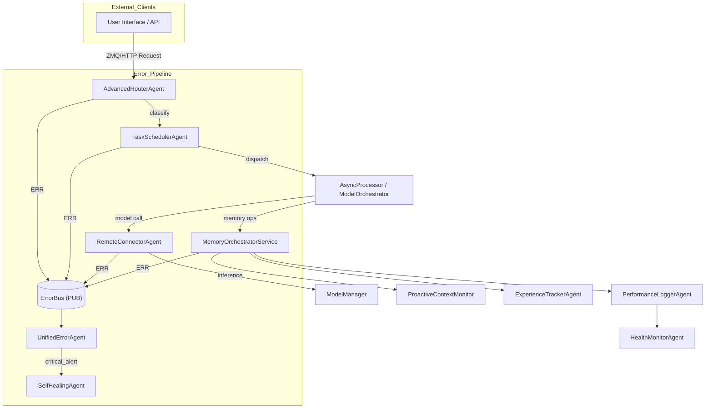

# Per Group Communication Summary

### 🔄 Group: Task Processing & Response

- **TieredResponder**

  - 📌 Role: Multi-tier question-answering service that selects between canned, lightweight or heavy model pipelines based on regex patterns and current resource headroom.
  - 🔄 Communication Channels:
    - 📨 ZMQ **REP** on **port 7101** – accepts JSON `{ "text": str }` queries and `{ "action": "health_check" }` pings.
    - 📤 ZMQ **PUSH** on **port 7102** – streams back `{ "type": "thinking|response", "text": str, "tier": str, "timestamp": iso }` messages.
    - 📡 ZMQ **PUB** on **port 7103** – broadcasts health packets every 30 s.
    - 🆘 Emits structured error events to the central **ErrorBus**.
  - 🛠️ Core Internals:
    - `ResourceManager` gate-keeps CPU / RAM / GPU thresholds.
    - `_handle_query()` → tier detection, then dispatches to async coroutine (`_handle_instant_response`, `_handle_fast_response`, `_handle_deep_response`).
    - Uses pattern lists (e.g., greetings, “what is…”) and time budget constants (`MAX_RESPONSE_TIME`).
    - Pushes metrics (response_time, queue_size) to **PerformanceMonitor** via its logging helper.

- **AsyncProcessor**
  - 📌 Role: Priority-aware background worker that executes non-blocking tasks (logging, analysis, memory enrichment) to keep UI threads snappy.
  - 🔄 Communication Channels:
    - 📨 ZMQ **REP** on **port 7101** – receives task envelopes `{ "type": str, "data": any, "priority": str }` or health pings.
    - 📤 ZMQ **PUSH** on **port 7102** – optional fan-out of sub-tasks to other workers.
    - 📡 ZMQ **PUB** on **port 7103** – health snapshots.
    - 🆘 Error events via **ErrorBus**.
  - 🛠️ Core Internals:
    - `TaskQueue` maintains three `deque`s (`high|medium|low`) with max 1 000 entries.
    - `_start_task_processor()` spins a thread that pops next task respecting priority order, times execution, updates stats and responds.
    - `ResourceManager` + queue stats included in health payload.
    - Exposes decorator `@async_task` for other agents to enqueue fire-and-forget jobs.

### 📁 Group: System Monitoring & Utility

- **CacheManager**

  - 📌 Role: Redis-backed cache façade offering typed buckets (nlu_results, model_decisions, memory, …) with TTL, size caps and lazy eviction.
  - 🔄 Communication Channels:
    - 📨 ZMQ **REP** on **port 7102** – unified `action` API (`get|put|invalidate|flush`, plus `get_cached_memory`, etc.).
    - 📡 ZMQ **PUB** on **port 8102** – health broadcast.
    - Direct TCP to Redis **localhost:6379/db0** (configurable via env).
    - 🆘 Error events via **ErrorBus**.
  - 🛠️ Core Internals:
    - Validates Redis availability on start; flags `redis_available` for degraded mode.
    - Key format: `<cache_type>:<key>`, memories use `memory:<uuid>`.
    - `cache_config` dict encodes TTL / quota per bucket; background thread logs `INFO` stats and can implement smarter eviction.
    - Exposed to **MemoryOrchestratorService** for cache-aside read-through and write-invalidate pattern.

- **PerformanceMonitor**
  - 📌 Role: Central telemetry hub that ingests ad-hoc metric logs, computes rolling averages & alert thresholds, and publishes cluster-wide health.
  - 🔄 Communication Channels:
    - 📨 ZMQ **REP** on **port 7103** – query actions (`get_metrics`, `get_alerts`, `log_metric`).
    - 📡 ZMQ **PUB** metrics on **5619**, health on **5620** every 5 s.
    - 🆘 Error events via **ErrorBus**.
  - 🛠️ Core Internals:
    - `ResourceMonitor` keeps CPU/MEM histories; alerts when >80/85 %.
    - Maintains `metrics` dicts for response_times, error_counts, throughput, etc. keyed by service name.
    - `_calculate_metrics()` builds composite payloads; `_get_health_status()` merges resource + per-service alerts.

### 🌐 Group: I/O & External Communication

- **VisionProcessingAgent**
  - 📌 Role: Receives base64-encoded images, persists them for audit and returns placeholder descriptions (pluggable with future vision LLM).
  - 🔄 Communication Channels:
    - 📨 ZMQ **REP** on **port 7150** – request `{ "type": "describe_image", "image_base64": str, "prompt": str }`.
    - 📡 Health responded synchronously (`health_check` request) and via **PerformanceMonitor** logs.
    - Writes decoded images to `data/vision_output/` for debugging.
    - 🆘 Error events via **ErrorBus**.
  - 🛠️ Core Internals:
    - Fast PIL decode, optional write-to-disk; generates dimensions-based description.
    - Tracks uptime & system metrics in `health_check` reply.

### 🌌 Group: Simulation & Planning

- **DreamWorldAgent**
  - 📌 Role: Scenario and simulation engine that explores hypothetical “dream worlds” to evaluate strategies via Monte-Carlo rollout.
  - 🔄 Communication Channels:
    * 📨 ZMQ **ROUTER** on **port 7104** – accepts `{ "action": "simulate", "scenario": str, "iterations": int }` plus `health_check` pings.
    * 🩺 ZMQ **REP** health endpoint on **port 7105**.
    * 🔗 ZMQ **REQ** to **EnhancedModelRouter** (**5598**) and **EpisodicMemoryAgent** (**5629**) for model evaluation & memory writes.
    * 🆘 Error events via **ErrorBus**.
  - 🛠️ Core Internals:
    * SQLite `dream_world.db` with `scenarios`, `simulations`, and `simulation_states` tables.
    * Thread-pooled Monte-Carlo Tree Search implementation (`MCTSNode` with UCB scoring).
    * Scenario templates loaded at startup; simulation results persisted and surfaced via API.
    * Pushes timing & resource metrics to **PerformanceMonitor**.

### 🧠 Group: Memory & Knowledge Management

- **UnifiedMemoryReasoningAgent**
  - 📌 Role: Central memory hub that merges conversational context, error patterns, and digital twins while brokering requests to specialist memory agents.
  - 🔄 Communication Channels:
    * 📨 ZMQ **REP** on **port 7105** – unified `action` API (`get_context`, `update_twin`, …).
    * 🩺 ZMQ **REP** health on **port 7106**.
    * 🔗 ZMQ **REQ** to memory agents in its registry (e.g., **EpisodicMemoryAgent** 5597).
    * 🆘 Error events via **ErrorBus**.
  - 🛠️ Core Internals:
    * JSON stores for `context`, `error_patterns`, and `digital_twins` kept on disk.
    * Integrates `ContextManager` for importance-weighted sliding window.
    * Dynamic window sizing & conflict-safe writes guarded by threading lock.

- **ContextManagerAgent**
  - 📌 Role: Provides fine-grained context window operations for chat agents (add, prune, fetch, clear).
  - 🔄 Communication Channels:
    * 📨 ZMQ **REP** on **port 7111** – context commands.
    * 🩺 ZMQ **REP** health on **port 7112**.
    * 🆘 Error events via **ErrorBus**.
  - 🛠️ Core Internals:
    * `deque`-backed window (5-20 items) with keyword-based importance scoring.
    * Speaker-specific sub-contexts and automatic pruning of stale, low-value items.

- **ExperienceTrackerAgent**
  - 📌 Role: Captures episodic user experiences and forwards them to long-term memory.
  - 🔄 Communication Channels:
    * 📨 ZMQ **REP** on **port 7112** (`track_experience`, `get_experiences`).
    * 🩺 ZMQ **REP** health on **port 7113**.
    * 🔗 ZMQ **REQ** to **EpisodicMemoryAgent** (**7106**).
    * 🆘 Error events via **ErrorBus**.
  - 🛠️ Core Internals:
    * Adds default importance scores; maintains local counters and retry logic.

### 🎓 Group: Education & Tutoring

- **TutorAgent**
  - 📌 Role: AI tutor that adapts lesson difficulty, tracks progress, and generates actionable feedback.
  - 🔄 Communication Channels:
    * 📨 ZMQ **REP** on **port 5605** (configurable) for tutoring requests.
    * 🆘 Error events via **ErrorBus**.
  - 🛠️ Core Internals:
    * `AdaptiveLearningEngine` (PyTorch) + clustering for learning style.
    * `ProgressTracker`, `FeedbackGenerator`, and `ParentDashboard` utilities.

- **TutoringServiceAgent**
  - 📌 Role: Lightweight façade exposing Tutor-related functionality to external callers.
  - 🔄 Communication Channels:
    * 📨 ZMQ **REP** on **port 5604** (`tutor_request`, `health_check`).
    * 🆘 Error events via **ErrorBus**.
  - 🛠️ Core Internals:
    * Maintains in-memory `service_state`; delegates heavy work to **TutorAgent**.

### 🛠️ Group: System Monitoring & Utility (continued)

- **ResourceManager**
  - 📌 Role: Samples CPU, memory, disk (and GPU if present) usage and arbitrates resource allocations.
  - 🔄 Communication Channels:
    * 📨 ZMQ **REP** on **port 7113** – actions `get_stats`, `allocate_resources`, `release_resources`.
    * 🩺 ZMQ **REP** health on **port 7114**.
    * 🆘 Error events via **ErrorBus**.
  - 🛠️ Core Internals:
    * Utilises `psutil` (+ optional `torch`) for real-time metrics; keeps rolling `stats_history`.
    * Enforces configurable thresholds (default CPU/MEM 80 %) and maintains an allocation registry.

- **HealthMonitorAgent**
  - 📌 Role: Central health aggregator that consolidates heartbeat data from all PC2 agents.
  - 🔄 Communication Channels:
    * 📨 ZMQ **REP** on **port 7114** (`get_status`, `ping`).
    * 🩺 ZMQ **REP** health on **port 7115**.
    * 🆘 Error events via **ErrorBus**.
  - 🛠️ Core Internals:
    * Maintains `agent_status` dictionary; computes overall cluster health and forwards summaries to **PerformanceMonitor**.

### 🔄 Group: Task Processing & Response (continued)

- **TaskSchedulerAgent**
  - 📌 Role: Priority-aware dispatcher that forwards tasks to **AsyncProcessor** and tracks queue health.
  - 🔄 Communication Channels:
    * 📨 ZMQ **REP** on **port 7115** (`schedule_task`, `ping`).
    * 🩺 ZMQ **REP** health on **port 7116**.
    * 🔗 ZMQ **REQ** to **AsyncProcessor** (**5555**).
    * 🆘 Error events via **ErrorBus**.
  - 🛠️ Core Internals:
    * Background initialisation thread, uptime tracking, and integration with **ResourceManager** for overload protection.

### 🛡️ Group: Security & Identity

- **AuthenticationAgent**
  - 📌 Role: Central authentication service providing user registration, login/logout, and token validation for inter-agent requests.
  - 🔄 Communication Channels:
    * 📨 ZMQ **REP** on **port 7116** – actions `register`, `login`, `logout`, `validate_token`.
    * 🩺 ZMQ **REP** health on **port 8116`**.
    * 🆘 Error events via **ErrorBus**.
  - 🛠️ Core Internals:
    * In-memory `users` registry plus `sessions` dict secured with SHA-256 password hashing.
    * Generates 256-bit hex session tokens; background cleanup thread purges expired tokens every 5 min (`token_expiry` = 24 h).
    * Helper methods `_hash_password`, `_create_session`, `_validate_token`; structured error reporting to ErrorBus.

### 🛠️ Group: System Monitoring & Utility (continued)

- **SystemHealthManager**
  - 📌 Role: Cluster-wide health sentinel that polls critical services and exposes consolidated status.
  - 🔄 Communication Channels:
    * 📨 ZMQ **REP** on **port 7121** (`health_check`, `get_system_status`).
    * 🔗 ZMQ **REQ** to **MemoryOrchestratorService** (**7140**) and **MemoryScheduler** (**7142**).
    * 🆘 Error events via **ErrorBus**.
  - 🛠️ Core Internals:
    * Background thread (`health_check_interval` = 60 s) performs periodic polls with timeout handling.
    * Uses `_report_error` helper for structured error publication.
    * Aggregates subsystem statuses into unified payloads returned via API.

- **UnifiedUtilsAgent**
  - 📌 Role: House-keeping utility providing temp/log/cache cleanup and OS-specific maintenance operations.
  - 🔄 Communication Channels:
    * 📨 ZMQ **REP** on **port 7118** – actions `cleanup_temp_files`, `cleanup_logs`, `cleanup_cache`, `cleanup_browser_cache`, `run_windows_disk_cleanup`, `health_check`.
    * 🩺 ZMQ **REP** health on **port 8118**.
    * 🆘 Error events via **ErrorBus**.
  - 🛠️ Core Internals:
    * Thread-safe filesystem operations guarded by `report_error` with rich logging.
    * Detects OS to tailor browser cache removal and optional Windows disk cleanup.
    * Exposes detailed uptime, request-count, and thread-liveness metrics in `_get_health_status`.

- **AgentTrustScorer**
  - 📌 Role: Calculates dynamic trust scores for AI models based on success ratios and latency metrics, enabling routed decision-making.
  - 🔄 Communication Channels:
    * 📨 ZMQ **REP** on **port 5626** – actions `log_performance`, `get_trust_score`, `get_performance_history`, `health_check`.
    * 🆘 Error events via **ErrorBus**.
  - 🛠️ Core Internals:
    * SQLite `agent_trust_scores.db` with tables `model_scores` and `performance_logs`.
    * Trust score computed as `0.7*success_rate + 0.3*time_factor` (time_factor inversely proportional to latency).
    * Maintains rolling performance history and returns JSON summaries upon request.

### 🌐 Group: I/O & External Communication (continued)

- **FileSystemAssistantAgent**
  - 📌 Role: Provides secure, centralized file-system operations (list, read, write, copy, delete) to other agents across the cluster.
  - 🔄 Communication Channels:
    * 📨 ZMQ **REP** on **port 5606** – file operation actions.
    * 🩺 ZMQ **REP** health on **port 5607**.
    * 🆘 Error events via **ErrorBus**.
  - 🛠️ Core Internals:
    * Thread-locked IO to prevent race conditions; supports recursive deletes and binary writes.
    * Health thread exposes metrics via dedicated socket; tracks request, error, and uptime statistics.
    * Enforces basic path validation and returns rich metadata in `get_info` replies.

### 🧠 Group: Memory & Knowledge Management (continued)

- **ProactiveContextMonitor**
  - 📌 Role: Continuously observes conversational context to trigger proactive suggestions and actions.
  - 🔄 Communication Channels:
    * 📨 ZMQ **REP** on **port 7119** – actions `add_context`, `get_context_history`, `clear_context_history`, `health_check`.
    * 🩺 ZMQ **REP** health on **port 8119**.
    * 🆘 Error events via **ErrorBus**.
  - 🛠️ Core Internals:
    * Maintains rolling `context_history` buffer (max 100) with timestamped entries.
    * Background analysis thread executes every 10 s (placeholder for ML-driven triggers).
    * Provides convenient history limits, trimming, and aggregated stats in health status.

### 🌐 Group: I/O & External Communication (continued)

- **RemoteConnectorAgent**
  - 📌 Role: Gateway bridging local agents with external or co-located language models via a unified request/response interface.
  - 🔄 Communication Channels:
    * 📨 ZMQ **REP** on **port 5557** – actions `generate`, `model_status`, `health_check`.
    * 🩺 ZMQ **REP** health on **port 5558**.
    * 🔗 ZMQ **REQ** to **ModelManager** (**5555**) for inference requests.
    * 🔔 ZMQ **SUB** to **ModelManager** status PUB (**5556**) to receive model availability updates.
    * 🆘 Error events via **ErrorBus**.
  - 🛠️ Core Internals:
    * In-memory TTL cache (default 300 s) keyed by `(model, prompt_hash)`.
    * Automatic retry/back-off for transient errors.
    * Background health-check thread publishing metrics.
    * Structured error reporting helper `_report_error`.

- **UnifiedWebAgent**
  - 📌 Role: Headless browser automation agent that proactively gathers web content, snapshots pages, and fulfils scraping requests.
  - 🔄 Communication Channels:
    * 📨 ZMQ **REP** on **port 7126** – actions `browse`, `fetch_article`, `screenshot`, `health_check`.
    * 🩺 ZMQ **REP** health on **port 7127**.
    * 🔔 ZMQ **SUB** on **port 5576** for `interrupt` control messages.
    * 🆘 Error events via **ErrorBus**.
  - 🛠️ Core Internals:
    * Selenium WebDriver pool (headless Chrome) with safe-mode execution.
    * SQLite `web_cache.db` storing HTML snapshots & metadata (stale-while-revalidate policy).
    * Background threads: proactive crawler, interrupt listener, cache purger.
    * Optional Secure-ZMQ sockets when `SECURE_ZMQ=true`.

### 🌌 Group: Simulation & Planning (continued)

- **DreamingModeAgent**
  - 📌 Role: Orchestrates periodic “dreaming” sessions to simulate future conversation branches and pre-compute strategies.
  - 🔄 Communication Channels:
    * 📨 ZMQ **REP** on **port 7127** – actions `start_dream`, `stop_dream`, `get_status`, `health_check`.
    * 🩺 ZMQ **REP** health on **port 7128**.
    * 🔗 ZMQ **REQ** to **DreamWorldAgent** (**7104**) to run simulations.
    * 🆘 Error events via **ErrorBus**.
  - 🛠️ Core Internals:
    * Scheduler thread triggering dreaming cycles at configurable intervals.
    * Maintains `dream_cycle_state`; persists high-value insights to memory.
    * Load-aware pause/resume and graceful shutdown.
    * Integrated error reporting to ErrorBus.

### 🛠️ Group: System Monitoring & Utility (continued)

- **PerformanceLoggerAgent**
  - 📌 Role: Central collector logging latency, throughput, and resource usage for every PC2 agent.
  - 🔄 Communication Channels:
    * 📨 ZMQ **REP** on **port 5632** – actions `log_metric`, `query_metrics`, `health_check`.
    * 🩺 ZMQ **REP** health on **port 5633**.
    * 🆘 Error events via **ErrorBus**.
  - 🛠️ Core Internals:
    * SQLite `performance_metrics.db` tables `metrics` & `resource_usage`.
    * Cleanup thread removes stale rows (≥30 d metrics, ≥7 d resource).
    * Optional `psutil` sampler for CPU/MEM statistics.
    * Publishes summary statistics to **HealthMonitorAgent**.

### 🔄 Group: Task Processing & Response (continued)

- **AdvancedRouterAgent**
  - 📌 Role: NLP classifier that determines task type and routes requests to appropriate model pipelines.
  - 🔄 Communication Channels:
    * 📨 ZMQ **REP** on **port 5555** – actions `classify`, `health_check`.
    * 🩺 ZMQ **REP** health on **port 5556**.
    * 🆘 Error events via **ErrorBus**.
  - 🛠️ Core Internals:
    * Keyword & regex-based classifier covering code, reasoning, chat, creative, factual, math, etc.
    * Maintains per-type counters & usage statistics.
    * Maps task types to capability sets for **ModelOrchestrator** routing.
    * Background health thread and structured error emission.

### 🧠 Group: Memory & Knowledge Management (continued)

- **MemoryOrchestratorService**
  - 📌 Role: Unified memory authority combining Redis cache and SQLite long-term store; provides CRUD, semantic search, and lifecycle management.
  - 🔄 Communication Channels:
    * 📨 ZMQ **REP** on **port 7140** – actions `add_memory`, `get_memory`, `update_memory`, `delete_memory`, `semantic_search`, `health_check`.
    * 🩺 ZMQ **REP** health on **port 7141**.
    * 🆘 Error events via **ErrorBus**.
  - 🛠️ Core Internals:
    * SQLite `unified_memory.db` holding `memories`, `memory_relationships`, and `context_groups` tables.
    * Redis cache-aside layer (TTL 5 min) with invalidation on writes & deletes.
    * Lifecycle thread applying decay, tier promotion, and consolidation logic hourly.
    * Optional FAISS & Sentence-Transformers embedding backend for semantic search (auto-disabled if deps missing).
    * Publishes critical errors to ErrorBus with severity levels.

---

## 🗺️ PC2 System Architecture & Data Flow

Below is a concise, high-level view of how requests, data, and error events propagate through the PC2 cluster. The diagram is followed by an enumerated flow description for quick reference.

### Visual Diagram (Mermaid)

### Step-by-Step Flow
1. **Ingress:** External clients send a task request → `AdvancedRouterAgent` (ZMQ REP `5555`).  
2. **Classification:** `AdvancedRouterAgent` determines task type and forwards the normalized request → `TaskSchedulerAgent`.  
3. **Scheduling/Dispatch:** `TaskSchedulerAgent` enqueues and dispatches the work unit → `AsyncProcessor / ModelOrchestrator`.  
4. **Model Execution:** `ModelOrchestrator` requests inference via `RemoteConnectorAgent`, which bridges to the actual `ModelManager` / GPU hosts.  
5. **Memory Interaction:** For context retrieval or storage, `ModelOrchestrator` calls `MemoryOrchestratorService`; short-term context flows via `ProactiveContextMonitor` while long-term memories persist in SQLite and Redis.  
6. **Experience Logging:** User experiences or notable events are asynchronously sent to `ExperienceTrackerAgent` → eventually persisted through memory services.  
7. **Performance Metrics:** Each agent publishes metrics to `PerformanceLoggerAgent`, which stores them in SQLite and exposes summaries.  
8. **Health Aggregation:** `PerformanceLoggerAgent` feeds aggregated data to `HealthMonitorAgent` for cluster-wide health dashboards.  
9. **Error Handling Path:** Any agent encountering an exception publishes an error event (`ERROR` topic, ZMQ PUB) to the centralized **ErrorBus**.  
10. **Triage:** `UnifiedErrorAgent` subscribes to the ErrorBus, triages incoming `error_report`s, and—if severity is **critical**—emits a `critical_alert` to `SelfHealingAgent`.  
11. **Recovery:** `SelfHealingAgent` receives `critical_alert`s, initiates automated remediation (service restarts, circuit breakers, resource re-allocation), and updates status back to the bus.  
12. **Monitoring & Feedback:** All state transitions (successes, retries, failures) circulate back into metrics, logs, and memory for continuous improvement.

> **Note:** Ports indicated here are defaults; all can be overridden via environment variables or YAML configs. Secure-ZMQ can be enabled cluster-wide by setting `SECURE_ZMQ=true` in the configuration.

