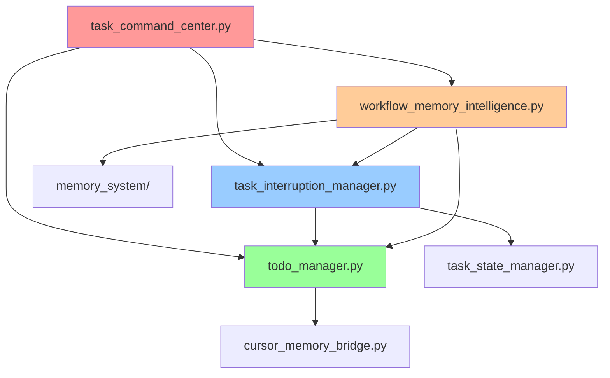
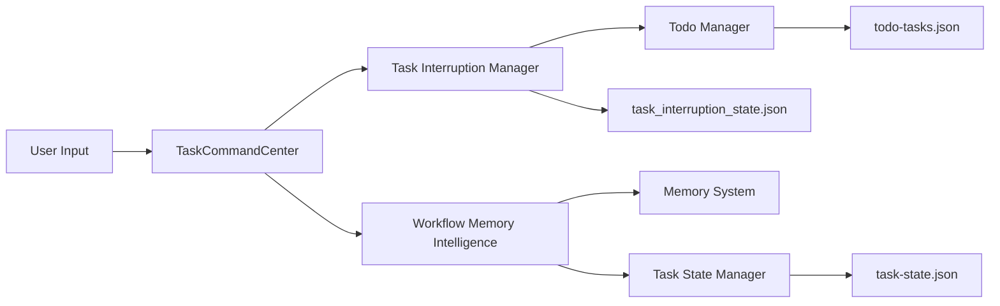
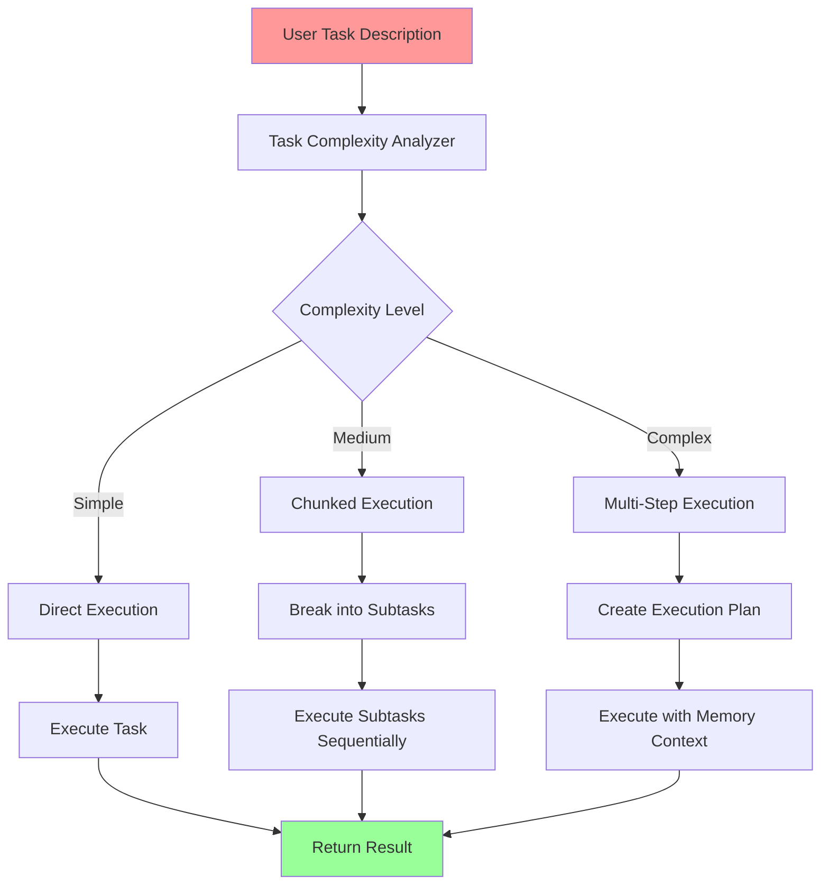

# 🎮 Task Command Center - Interaction Flow Analysis

**File:** `task_command_center.py`  
**Date:** 2025-07-28  
**Status:** Complete Analysis

---

## 📋 **SYSTEM OVERVIEW**

The Task Command Center is an interactive menu-driven system that provides comprehensive task management capabilities for the AI System Monorepo. It integrates multiple subsystems to create a unified task management experience.

---

## 🔗 **DEPENDENCY MAPPING**

### **Core Dependencies:**



### **External Dependencies:**
- `sys` - System operations
- `os` - Operating system interface
- `json` - JSON data handling
- `typing` - Type hints

---

## 🎯 **INTERACTION FLOW DIAGRAM**

```mermaid
flowchart TD
    Start([🚀 Start TaskCommandCenter]) --> Init[Initialize TaskCommandCenter]
    Init --> MainLoop{Main Menu Loop}
    
    MainLoop --> ShowHeader[Show Header & Status]
    ShowHeader --> ShowMenu[Display Menu Options]
    ShowMenu --> GetChoice[Get User Choice]
    
    GetChoice --> Choice1[1. View All Tasks]
    GetChoice --> Choice2[2. Start New Task]
    GetChoice --> Choice3[3. Interrupt Current Task]
    GetChoice --> Choice4[4. Resume Interrupted Tasks]
    GetChoice --> Choice5[5. Add TODO to Task]
    GetChoice --> Choice6[6. Mark TODO as Done]
    GetChoice --> Choice7[7. Delete TODO]
    GetChoice --> Choice8[8. Show Task Details]
    GetChoice --> Choice9[9. Delete Task]
    GetChoice --> Choice10[10. Intelligent Task Execution]
    GetChoice --> Choice0[0. Exit]
    
    %% Option 1: View All Tasks
    Choice1 --> ViewTasks[Call list_open_tasks()]
    ViewTasks --> DisplayTasks[Display Tasks with TODOs]
    DisplayTasks --> WaitInput[Wait for Enter]
    WaitInput --> MainLoop
    
    %% Option 2: Start New Task
    Choice2 --> ShowStatus[Show Current Status]
    ShowStatus --> GetTaskDesc[Get Task Description]
    GetTaskDesc --> ValidateDesc{Description Empty?}
    ValidateDesc -->|Yes| ErrorMsg[Show Error]
    ValidateDesc -->|No| CallAutoHandler[Call auto_task_handler()]
    CallAutoHandler --> ShowResult[Display Result]
    ErrorMsg --> WaitInput
    ShowResult --> WaitInput
    
    %% Option 3: Interrupt Current Task
    Choice3 --> CheckCurrentTask{Current Task Exists?}
    CheckCurrentTask -->|No| NoTaskMsg[Show No Task Message]
    CheckCurrentTask -->|Yes| ConfirmInterrupt[Confirm Interruption]
    ConfirmInterrupt -->|Yes| TriggerInterrupt[Start Dummy Task]
    ConfirmInterrupt -->|No| CancelMsg[Show Cancelled]
    NoTaskMsg --> WaitInput
    TriggerInterrupt --> ShowResult
    CancelMsg --> WaitInput
    
    %% Option 4: Resume Interrupted Tasks
    Choice4 --> CheckInterrupted{Interrupted Tasks Exist?}
    CheckInterrupted -->|No| NoInterruptedMsg[Show No Interrupted Tasks]
    CheckInterrupted -->|Yes| ShowInterrupted[Show Interrupted Tasks]
    ShowInterrupted --> ConfirmResume[Confirm Resume All]
    ConfirmResume -->|Yes| CallResumeAll[Call resume_all_interrupted_tasks()]
    ConfirmResume -->|No| CancelResume[Show Cancelled]
    NoInterruptedMsg --> WaitInput
    CallResumeAll --> ShowSuccess[Show Success Message]
    CancelResume --> WaitInput
    ShowSuccess --> WaitInput
    
    %% Option 5: Add TODO
    Choice5 --> CheckTasks{Tasks Available?}
    CheckTasks -->|No| NoTasksMsg[Show No Tasks]
    CheckTasks -->|Yes| ShowTaskList[Show Task List]
    ShowTaskList --> SelectTask[Select Task]
    SelectTask --> GetTodoText[Get TODO Text]
    GetTodoText --> ValidateTodo{TODO Empty?}
    ValidateTodo -->|Yes| TodoError[Show Error]
    ValidateTodo -->|No| CallAddTodo[Call add_todo()]
    NoTasksMsg --> WaitInput
    TodoError --> WaitInput
    CallAddTodo --> ShowSuccess
    ShowSuccess --> WaitInput
    
    %% Option 6: Mark TODO Done
    Choice6 --> CheckTodos{Tasks with TODOs?}
    CheckTodos -->|No| NoTodosMsg[Show No TODOs]
    CheckTodos -->|Yes| ShowTodoTasks[Show Tasks with TODOs]
    ShowTodoTasks --> SelectTodoTask[Select Task]
    SelectTodoTask --> ShowTodoList[Show TODO List]
    ShowTodoList --> SelectTodo[Select TODO]
    SelectTodo --> CallMarkDone[Call mark_done()]
    NoTodosMsg --> WaitInput
    CallMarkDone --> ShowSuccess
    ShowSuccess --> WaitInput
    
    %% Option 7: Delete TODO
    Choice7 --> CheckTodos2{Tasks with TODOs?}
    CheckTodos2 -->|No| NoTodosMsg2[Show No TODOs]
    CheckTodos2 -->|Yes| ShowTodoTasks2[Show Tasks with TODOs]
    ShowTodoTasks2 --> SelectTodoTask2[Select Task]
    SelectTodoTask2 --> ShowTodoList2[Show TODO List]
    ShowTodoList2 --> SelectTodo2[Select TODO]
    SelectTodo2 --> CallDeleteTodo[Call delete_todo()]
    NoTodosMsg2 --> WaitInput
    CallDeleteTodo --> ShowSuccess
    ShowSuccess --> WaitInput
    
    %% Option 8: Show Task Details
    Choice8 --> CheckTasks2{Tasks Available?}
    CheckTasks2 -->|No| NoTasksMsg2[Show No Tasks]
    CheckTasks2 -->|Yes| ShowTaskList2[Show Task List]
    ShowTaskList2 --> SelectTask2[Select Task]
    SelectTask2 --> CallShowDetails[Call show_task_details()]
    NoTasksMsg2 --> WaitInput
    CallShowDetails --> WaitInput
    
    %% Option 9: Delete Task
    Choice9 --> CheckTasks3{Tasks Available?}
    CheckTasks3 -->|No| NoTasksMsg3[Show No Tasks]
    CheckTasks3 -->|Yes| ShowTaskList3[Show Task List]
    ShowTaskList3 --> SelectTask3[Select Task]
    SelectTask3 --> ConfirmDelete[Confirm Deletion]
    ConfirmDelete -->|Yes| CallDeleteTask[Call hard_delete_task()]
    ConfirmDelete -->|No| CancelDelete[Show Cancelled]
    NoTasksMsg3 --> WaitInput
    CallDeleteTask --> ShowSuccess
    CancelDelete --> WaitInput
    ShowSuccess --> WaitInput
    
    %% Option 10: Intelligent Task Execution
    Choice10 --> GetIntelligentTask[Get Task Description]
    GetIntelligentTask --> ValidateIntelligent{Description Empty?}
    ValidateIntelligent -->|Yes| IntelligentError[Show Error]
    ValidateIntelligent -->|No| CallIntelligent[Call execute_task_intelligently()]
    IntelligentError --> WaitInput
    CallIntelligent --> ShowIntelligentResult[Show JSON Result]
    ShowIntelligentResult --> WaitInput
    
    %% Option 0: Exit
    Choice0 --> Exit[Show Goodbye Message]
    Exit --> End([🏁 End])
    
    %% Error Handling
    ShowResult --> ErrorHandler{Error Occurred?}
    ErrorHandler -->|Yes| ShowError[Show Error Message]
    ErrorHandler -->|No| WaitInput
    ShowError --> WaitInput
    
    style Start fill:#ff9999
    style End fill:#ff9999
    style MainLoop fill:#99ccff
    style ErrorHandler fill:#ffcc99
```

---

## 🔧 **CORE COMPONENTS ANALYSIS**

### **1. TaskCommandCenter Class**
```python
class TaskCommandCenter:
    - __init__(): Initialize the command center
    - clear_screen(): Clear terminal screen
    - show_header(): Display header with status
    - show_main_menu(): Display menu options
    - get_user_choice(): Validate user input
    - run(): Main execution loop
```

### **2. Menu Options & Functions**

| Option | Function | Dependencies | Purpose |
|--------|----------|--------------|---------|
| 1 | `view_all_tasks()` | `todo_manager.list_open_tasks()` | Display all open tasks |
| 2 | `start_new_task()` | `task_interruption_manager.auto_task_handler()` | Start new task with interruption handling |
| 3 | `interrupt_current_task()` | `task_interruption_manager.get_interruption_status()` | Interrupt current task |
| 4 | `resume_interrupted_tasks()` | `task_interruption_manager.resume_all_interrupted_tasks()` | Resume all interrupted tasks |
| 5 | `add_todo_to_task()` | `todo_manager.add_todo()` | Add TODO to existing task |
| 6 | `mark_todo_done()` | `todo_manager.mark_done()` | Mark TODO as completed |
| 7 | `delete_todo_item()` | `todo_manager.delete_todo()` | Delete TODO item |
| 8 | `show_task_details()` | `todo_manager.show_task_details()` | Show detailed task info |
| 9 | `delete_task()` | `todo_manager.hard_delete_task()` | Permanently delete task |
| 10 | `intelligent_task_execution()` | `workflow_memory_intelligence.execute_task_intelligently()` | AI-powered task execution |

---

## 🔄 **DATA FLOW ANALYSIS**

### **Task State Management:**


### **File Dependencies:**
- `todo-tasks.json` - Main task storage
- `task_interruption_state.json` - Interruption state
- `task-state.json` - Current task state
- `memory-bank/` - Session memory storage

---

## 🚨 **ERROR HANDLING PATTERNS**

### **1. Input Validation**
```python
def get_user_choice(self, max_choice: int) -> int:
    while True:
        try:
            choice = int(input(f"Enter your choice (0-{max_choice}): "))
            if 0 <= choice <= max_choice:
                return choice
            else:
                print(f"❌ Please enter a number between 0 and {max_choice}")
        except ValueError:
            print("❌ Please enter a valid number")
```

### **2. File Operation Safety**
```python
try:
    with open(self.interruption_file, 'r') as f:
        data = json.load(f)
except Exception as e:
    print(f"⚠️  Error loading interruption state: {e}")
```

### **3. Task Operation Validation**
```python
if not task_description:
    print("❌ Task description cannot be empty")
    return
```

---

## 🎯 **INTELLIGENT WORKFLOW INTEGRATION**

### **Smart Task Execution Flow:**


### **Memory Integration:**
- **Adaptive Memory Management**: Retrieves relevant memories based on task context
- **Preloading**: Loads related memories before task execution
- **Context Preservation**: Maintains task context across interruptions

---

## 🔍 **SYSTEM HEALTH MONITORING**

### **Status Indicators:**
- ✅ **Active Task**: Currently running task
- ⏸️ **Interrupted Tasks**: Tasks waiting for resumption
- 📋 **Open Tasks**: Total number of pending tasks
- 🧠 **Memory Status**: Available memory context

### **Health Checks:**
```python
def show_current_status(self):
    status = get_interruption_status()
    
    if status['current_task']:
        print(f"🚀 ACTIVE TASK: {status['current_task']['description']}")
    
    if status['interrupted_tasks_count'] > 0:
        print(f"⏸️  INTERRUPTED TASKS ({status['interrupted_tasks_count']})")
```

---

## 🚀 **USAGE PATTERNS**

### **Typical Workflow:**
1. **Start Command Center**: `python task_command_center.py`
2. **View Current Status**: Option 1 to see all tasks
3. **Start New Task**: Option 2 for new task creation
4. **Manage TODOs**: Options 5-7 for TODO management
5. **Intelligent Execution**: Option 10 for AI-powered tasks
6. **Interrupt/Resume**: Options 3-4 for task flow control

### **Advanced Features:**
- **Automatic Task Interruption**: Seamless task switching
- **Memory-Aware Execution**: Context preservation across sessions
- **Intelligent Chunking**: Complex task breakdown
- **Error Recovery**: Graceful handling of failures

---

## 📊 **PERFORMANCE CONSIDERATIONS**

### **Memory Usage:**
- **Task Storage**: JSON-based, minimal memory footprint
- **Session Memory**: Adaptive loading based on context
- **Cache Management**: LRU cache for complexity analysis

### **Response Time:**
- **Menu Operations**: < 100ms
- **Task Creation**: < 500ms
- **Intelligent Execution**: 1-5 seconds (depending on complexity)
- **Memory Retrieval**: < 200ms

---

## 🔧 **MAINTENANCE & EXTENSIBILITY**

### **Adding New Menu Options:**
1. Add option to `show_main_menu()`
2. Create corresponding method
3. Add case in `run()` method
4. Update `get_user_choice()` max value

### **Extending Intelligence:**
- Modify `workflow_memory_intelligence.py`
- Add new complexity indicators
- Extend memory providers
- Enhance task chunking logic

---

## 🎯 **CONCLUSION**

The Task Command Center provides a comprehensive, intelligent task management system that integrates multiple subsystems into a unified interface. Its modular design allows for easy extension and maintenance while providing robust error handling and user experience.

**Key Strengths:**
- ✅ **Unified Interface**: Single point of control for all task operations
- ✅ **Intelligent Execution**: AI-powered task analysis and execution
- ✅ **Robust Error Handling**: Graceful failure recovery
- ✅ **Memory Integration**: Context-aware task management
- ✅ **Extensible Design**: Easy to add new features

**Areas for Enhancement:**
- 🔄 **Real-time Updates**: WebSocket integration for live status
- 🔄 **Batch Operations**: Bulk task management capabilities
- 🔄 **Advanced Analytics**: Task performance metrics
- 🔄 **Integration APIs**: REST API for external tools 